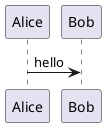

# Blog Research Log

This repository is a research-oriented blog for optimization work, especially around vAI, GPU systems, and compute/render APIs.

## Structure

- `posts/`: publish-ready blog entries, organized as directories per post
  - Each post is a directory containing `en.md` (English) and/or `ko.md` (Korean)
  - Optional `code/` and `build/` subdirectories for related code and build artifacts
  - `worklog/`
  - `comparison/api-language/`
  - `comparison/gpu-architecture/`
- `worklog/`: date-based experiment logs (WIP-friendly)
- `comparisons/`: stable comparison notes (concept and performance oriented)
  - `gpu-architecture/`: architecture-level comparisons (e.g., NVIDIA vs AMD generations)
  - `api-language/`: Vulkan/CUDA/HIP/GLSL model comparisons
  - `runtime-framework/`: runtime and framework behavior comparisons
  - `tooling/`: profiler/debugger workflow comparisons
- `notes/`: raw notes and idea capture
- `assets/`: images, charts, benchmark captures
- `templates/`: writing templates
- `docs/`: process docs and indexes

## Writing Flow

1. Capture ideas in `notes/`.
2. Promote validated experiments to `worklog/` entries.
3. Merge stable findings into `comparisons/` pages.
4. Keep indexes current in `docs/`.

## Naming Conventions

- Post directory: `YYYY-MM-DD-<type>-<NN>-<topic>/` containing `en.md` and/or `ko.md`
- Comparison: `comparison-<domain>-<topic>.md`
- Notes: `note-YYYY-MM-DD-<topic>.md`

## Frontmatter Baseline

Use this baseline at the top of each publish-ready document:

```yaml
---
title: ""
date: "YYYY-MM-DD"
status: "wip" # wip | stable
project: "vAI"
category: "worklog" # worklog | comparison
track: "api-language" # api-language | gpu-architecture | runtime-framework | tooling
series: "gpu" # compiler | gpu | other
tags: ["gpu", "optimization"]
---
```

## Weekly Maintenance

Run the checklist in `docs/weekly-review-checklist.md` once per week.

## Browse Posts

- Main index: `docs/post-index.md`
- Post template: `docs/post-template.md`

## GitHub Pages

- Site source: `site/`
- Data build script: `scripts/build_site.py`
- Unreal audit script: `scripts/audit_unreal_summary.py`
- Deploy workflow: `.github/workflows/deploy-pages.yml`
- Public Unreal toggle: `UNREAL_PUBLIC_ENABLED` (`true` | `false`)

When `main` is updated, GitHub Actions builds `site/posts.json` from `posts/` and deploys the static page.
The deploy workflow sets `UNREAL_PUBLIC_ENABLED=false`.

Local examples:

```bash
# Unreal excluded (default)
python scripts/build_site.py

# Unreal included
UNREAL_PUBLIC_ENABLED=true python scripts/build_site.py
```

## Unreal Summary Maintenance

Use this command before publishing Unreal summary updates:

```bash
python scripts/audit_unreal_summary.py
```

This validates frontmatter consistency (`track/category`) and checks internal markdown links against the current viewer resolution rules.

## Diagram Blocks (PlantUML)

`site/post.js` supports PlantUML fenced code blocks:

````markdown

````

At render time, the blog requests SVG from Kroki (`https://kroki.io/plantuml/svg`).
If rendering fails, the original code block remains visible.

## Comparison Document Policy

Every file under `comparisons/` must include:

1. `# Code to Inspect` with repository path(s), commit/branch, and key symbols.
2. `# Reference Materials` with direct links to specs/docs/articles.
3. `# Evidence Mapping` connecting claims to code paths and references.
