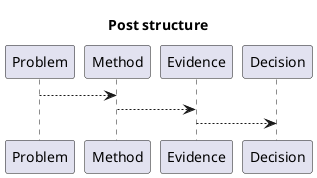

# 1. Executive Summary

- Core claim:
- Main number (before -> after):
- Confidence:
- Caveat:

# 2. Problem and Goal

- Problem statement:
- Why this matters:
- Numeric success criteria:

# 3. Method and Setup

- Environment summary:
- Reproducibility details:
- Experimental/analysis method:

# 4. Evidence and Results

- Key findings:
- Metrics table:

| Metric | Baseline | Current | Delta | Delta % |
|---|---:|---:|---:|---:|
|  |  |  |  |  |

# 5. Analysis

- Why the result happened:
- Tradeoffs:
- Limits of this result:

# 6. Decision and Next Actions

- Decision:
- Immediate next action:
- Follow-up validation:

# 7. Code to Inspect

- Repo:
- Branch/Commit:
- Paths:
  - ``
- Key symbols:
  - ``

# 8. Reference Materials

| Type | Title | Link | Why it matters |
|---|---|---|---|
| spec |  |  |  |
| doc |  |  |  |
| article |  |  |  |

# 9. Diagram (Optional)



# 10. Appendix (Optional)

## 10.1 Commands

```bash
# build / run / profile commands
```

## 10.2 Raw Logs

```text
paste key raw output here
```
