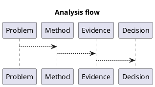

# 1. Executive Summary

- Core claim: Initialization complexity and first execution behavior on NVIDIA GPU.
- Primary metric: `kernel time (ms) or throughput (ops/s)`
- Baseline -> current: `TBD -> TBD` (delta `TBD%`)
- Evidence status: `in progress (wip)`; attach profiler/IR/benchmark logs before marking stable.

# 2. Problem and Scope

- Problem statement: this post documents a concrete issue and the reasoning path used to analyze it.
- In scope: the key mechanism, evidence path, and practical implications.
- Out of scope: exhaustive architecture-wide benchmarking unless explicitly included below.

# 3. Method and Setup

- Category/Track/Series: `comparison` / `api-language` / `gpu`
- Validation approach: tie claims to code, metrics, and profiler or compiler evidence where available.
- Reproducibility target: make each major claim testable with explicit setup and follow-up actions.

# 4. Detailed Notes

# Scope

Initialization complexity and first execution behavior on NVIDIA GPU.

# Quick Comparison

| Axis | CUDA | Vulkan | vAI note |
|---|---|---|---|
| Setup verbosity | lower | higher | Vulkan has explicit object lifecycle overhead |
| Resource control | medium | high | Vulkan can express ownership transitions precisely |
| First-call behavior | lazy init effects | pipeline/build effects | both require warm-up-aware benchmarking |

# Code to Inspect

- `src/compute/cuda/`
- `src/compute/vulkan/`
- `benchmarks/`

# Reference Materials

- Vulkan 1.3 spec: https://registry.khronos.org/vulkan/specs/1.3-extensions/html/
- CUDA C++ Programming Guide: https://docs.nvidia.com/cuda/cuda-c-programming-guide/
- CUDA Runtime API: https://docs.nvidia.com/cuda/cuda-runtime-api/

# Evidence Mapping

| Claim | Code path | Reference |
|---|---|---|
| CUDA init path is shorter in host code | `src/compute/cuda/` | CUDA Runtime API |
| Vulkan sync/resource control is more explicit | `src/compute/vulkan/` | Vulkan 1.3 spec |

# 5. Decision and Next Actions

- Decision: keep this post as `wip` until all major claims are backed by explicit measurable evidence.

1. Convert the key claims above into a compact metric or evidence table.
2. Add at least one reproducible command sequence (build/run/profile).
3. Add one explicit follow-up experiment with pass/fail criteria.

# 6. Diagram (Optional)

