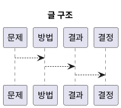

# 1. Executive Summary

- 핵심 주장: NVIDIA GPU 기준으로 초기화 복잡도와 첫 실행 특성을 비교한다.
- 주요 수치: `측정 전(ms) / 처리량(ops/s)`
- 변화량: `TBD -> TBD` (변화 `TBD%`)
- 주의점: `현재 측정 전(wip)`; stable 표기를 위해 수치/IR/로그 검증이 더 필요하다.

# 2. Problem and Scope

- 문제 정의: NVIDIA GPU 기준으로 CUDA와 Vulkan의 초기화 복잡도와 첫 실행 특성을 비교한다.
- 중요성: 구현 복잡도와 초기 응답성 차이를 정리하면 선택 기준이 명확해진다.
- 성공 기준: 초기화 단계의 차이를 비교 관점으로 정리하고 후속 측정 항목으로 연결한다.

# 3. Method and Setup

- Category/Track/Series: `comparison` / `api-language` / `gpu`
- 환경 요약: 하드웨어, 드라이버, 런타임, 비교 범위를 함께 기록한다.
- 재현 방법: 같은 워크로드와 동일한 초기화 절차 기준으로 비교한다.

# 4. Detailed Notes

# 범위

NVIDIA GPU 기준으로 초기화 복잡도와 첫 실행 특성을 비교한다.

# 핵심 비교

| 항목 | CUDA | Vulkan | vAI 메모 |
|---|---|---|---|
| 설정 복잡도 | 낮음 | 높음 | Vulkan은 객체 생명주기 관리가 명시적 |
| 리소스 제어 | 중간 | 높음 | 메모리/동기화 제어 세밀함 |
| 첫 실행 특성 | lazy init 영향 | pipeline 생성 영향 | warm-up 분리 측정 필요 |

# 코드 열람

- `src/compute/cuda/`
- `src/compute/vulkan/`
- `benchmarks/`

# 참고 자료

- Vulkan 1.3 Spec
- CUDA Programming Guide
- CUDA Runtime API

# 5. Decision and Next Actions

- 결정: 현재 결론은 `wip` 상태이며, 후속 측정으로 확정한다.

1. 핵심 가설을 수치와 로그로 검증한다.
2. 최소 1회 이상 빌드/실행/프로파일 절차를 기록한다.
3. pass/fail 기준을 정하고 다음 실험 1건을 연결한다.

# 6. Diagram (Optional)

