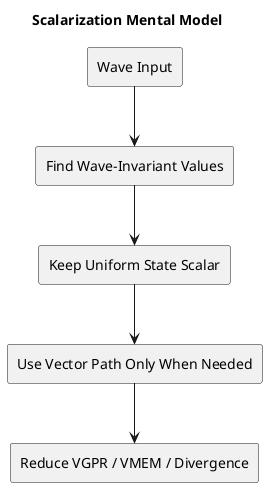

# 1. Executive Summary

- Core claim: the essence of `scalarization` is to identify what is truly wave-invariant, then exploit that uniformity all the way through register allocation, memory path selection, and control-flow structure.
- Biggest correction to common lore: on `GCN/Vega`, a uniform `float` does not automatically imply FP32 arithmetic on `SALU`. The primary floating-point arithmetic path is still `VALU`.
- Architecture split: AMD exposes `SGPR/VGPR`, `SALU/VALU`, and `SMEM/VMEM` very explicitly, while NVIDIA traditionally pushes developers toward a `warp coherence` mental model. However, modern NVIDIA architectures also expose `uniform register` and `uniform datapath` concepts in official documentation.
- Bottom line: moving from `Vega -> RDNA`, the real change is not "FP math moved to scalar ALU", but that uniform operands can remain scalar for longer and feed vector execution more flexibly. NVIDIA still rewards warp-wide uniformity first, but it is no longer accurate to say that all uniform values are handled only as ordinary per-thread registers.

# 2. Problem and Scope

This article answers three closely related questions:

- How do `Vega(GCN)`, `RDNA`, and `NVIDIA` differ in how they exploit `scalarization`?
- What do `SGPR/VGPR` and `SALU/VALU` actually buy you in practice?
- When shader code looks "uniform", what is each architecture really doing underneath?

The starting point is three well-known references:

- Francesco Cifariello Ciardi's `Intro to GPU Scalarization - Part 1`
- `Intro to GPU Scalarization - Part 2 - Scalarize all the lights`
- the Korean write-up at `scahp.tistory.com/41`

Those posts are excellent intuition builders, but they are also very `GCN-centric`. This article keeps that intuition and then tightens it against AMD and NVIDIA primary documentation.

# 3. What Scalarization Actually Means

A very common first explanation goes like this:

- if every lane in a wave has the same value, it is scalar
- if each lane has a different value, it is vector
- scalar values live in `SGPR`
- vector values live in `VGPR`

That is a good starting point, but it is too narrow for performance work. A more accurate definition is:

1. identify `wave-invariant` values
2. keep those values on scalar paths for as long as possible
3. turn address generation, branching, loop progression, and resource fetches into wave-level common work
4. only drop into vector execution when per-lane computation is genuinely required

So the real point of scalarization is not "force everything onto SALU." It is **use uniformity to reduce register pressure, take better memory paths, and avoid redundant divergent work.**

This is exactly why FlashyPixels Part 1 focuses on:

- reducing `VGPR pressure`
- leveraging `SMEM`
- improving wave coherence and lowering divergence cost

Those ideas show up most clearly on AMD, but the optimization principle itself is broader than one vendor.

# 4. GCN/Vega: Why Scalarization Feels So Central on AMD

On GCN, and by extension on Vega, scalar vs vector is presented very explicitly:

- `SGPR` and `VGPR` are distinct register classes
- `SALU` and `VALU` are distinct execution paths
- `SMEM` and `VMEM` are distinct memory paths
- control flow is strongly tied to architectural state such as `EXEC`, `VCC`, and `SCC`

AMD's Southern Islands documentation lays out the model clearly:

- work that is invariant across a wave belongs naturally to the scalar unit
- work that differs per lane belongs to the vector unit
- resource descriptors are commonly fetched through scalar operations first
- texture samples and per-pixel values naturally live on the vector side

That structure leads to a very direct optimization mindset:

- constant-buffer values are strong scalar candidates
- pixel coordinates, barycentrics, and texture results are vector values
- uniform address generation should stay scalar if possible
- divergent loops and branches should be reorganized into wave-level common work whenever possible

This is why scalarization on GCN/Vega feels less like a minor compiler optimization and more like an architecture-level programming technique.

## 4.1 The Most Common Mistake: "Uniform Float Means SALU"

This is where many summaries go wrong.

Take this example:

```hlsl
float s_someModifier = s_value + s_someData.someField;
```

At first glance, it is tempting to think:

- both operands are uniform
- therefore both live in `SGPR`
- therefore the add runs on `SALU`
- and the result stays in `SGPR`

That is not an accurate description of public `GCN/Vega` ISA behavior.

FlashyPixels Part 1 explicitly corrects this in the note section. The key point is:

- on public GCN/Vega ISA, `SALU` is primarily an integer, bitwise, and control-flow machine
- general scalar FP32 arithmetic is not what the public scalar ISA is built around
- so uniform `float` addition or multiplication is still typically executed through `VALU`

So "uniform float -> SALU" is not the right model.

## 4.2 But Does That Mean Uniform Float Must First Be Copied to VGPR?

That opposite conclusion is also too strong.

GCN ISA allows vector instructions to source operands from `SGPR`. Southern Islands ISA explicitly lists `SGPR0..103` in VOP source encoding ranges. What GCN does impose is a limit on how many scalar sources a vector instruction can read.

That leads to a more precise model:

- a uniform `float` can remain resident in `SGPR`
- the actual FP32 arithmetic is still generally performed by `VALU`
- but the operand does not always need to be materialized into `VGPR` first
- `VALU` can consume `SGPR` operands directly under operand-encoding rules

This distinction matters a lot. The real gain from scalarization on GCN/Vega is not "all uniform float math becomes SALU math." It is that:

- address calculation
- descriptor fetch
- loop steering
- branch conditions
- wave-wide vote/min/ballot results

can stay scalar, while floating-point math only moves into vector execution at the point where that is actually needed.

## 4.3 What Scalarization Really Buys on GCN/Vega

Once the model is stated correctly, the practical benefits become clearer.

### Lower VGPR Pressure

In many shaders, `VGPR` usage is the occupancy limiter. If uniform values do not have to be replicated as per-lane vector state, wave residency improves or at least becomes easier to preserve.

### Better Use of SMEM

Uniform addresses can route loads through `SMEM`. On GCN, scalar and vector memory paths are meaningfully distinct, so steering uniform data toward scalar loads is a real architectural win.

### Less Divergent Redundant Work

If each lane advances loops or branches independently, the wave pays for multiple paths because execution is still lockstep-oriented. If you reorganize that work into a common wave-level progression, duplicate execution drops.

In other words, scalarization on GCN/Vega is not just about ALU choice. It is **a register, memory, and control-flow strategy all at once.**

# 5. RDNA: Same Philosophy, More Operand Flexibility

RDNA keeps the same broad philosophy:

- `SGPR` and `VGPR` still exist
- scalar and vector paths still exist
- uniform values, descriptors, addresses, and control state are still prime scalarization targets

But RDNA makes scalar operand use more flexible from the vector side. Public RDNA ISA documentation states that vector ALU instructions can read **up to two scalar values**. That is a real step up from the older mental model many developers carry over from GCN.

What this means in practice:

- compilers can keep uniform operands in `SGPR` longer
- scalarized state can survive closer to the point of actual FP execution
- "hold uniform data scalar until the last responsible moment" becomes a more natural optimization pattern

## 5.1 Why It Is Still Wrong to Say "RDNA Does Float on SALU"

This is the next common overstatement.

It is tempting to reason as follows:

- RDNA strengthened scalar handling
- therefore scalar FP32 arithmetic must have become a major SALU use case

That is not what the public ISA suggests.

- RDNA still relies on vector hardware for mainstream FP32 arithmetic throughput
- public ISA references do not present ordinary scalar FP32 arithmetic as the core scalar story

So the right framing is:

> RDNA did not mainly change by moving floating-point arithmetic onto SALU.  
> RDNA changed by allowing uniform state to stay scalar longer and connect into vector execution more naturally.

## 5.2 The Best Way to Think About Vega vs RDNA

The cleanest comparison is this:

> Vega is the strong baseline where scalar/vector separation is explicit and important.  
> RDNA keeps the same design philosophy but improves how long scalarized state can remain scalar and how flexibly vector instructions can consume it.

So when you look at a uniform `float` expression on RDNA, the mental model should be:

- keep it in `SGPR` if possible
- keep control and addressing scalar
- use vector execution for the actual mainstream FP32 math
- benefit from a more flexible scalar-operand model than classic GCN

# 6. NVIDIA: How Accurate Is "There Is No SGPR Concept"?

The answer depends on which level of abstraction you mean.

Historically, developers often summarized NVIDIA like this:

- registers are fundamentally per-thread
- a warp is 32 threads
- the key optimization model is `warp coherence`, not an exposed `SGPR/VGPR` split
- constant memory is highly effective when a warp reads the same address
- the main concerns are divergence and memory coalescing

That model has been useful for a long time, and as a programming intuition it is still useful now.

## 6.1 Modern NVIDIA Clearly Exposes Uniform Paths

Where the old summary becomes incomplete is modern documentation.

Official NVIDIA docs now show:

- `Uniform` and `Uniform Predicate` registers in Nsight for Turing and later
- `UR` and `UP` concepts in low-level tooling
- uniform instructions such as `ULDC`, `LDCU`, `UIADD3`
- and, in newer instruction tables, floating-point uniform instructions such as `UFADD`, `UFMUL`, and `UFFMA`

That means it is no longer accurate to say:

> "NVIDIA handles all uniform values only as ordinary per-thread register state."

Modern NVIDIA clearly has an explicit uniform datapath model as well.

## 6.2 Why NVIDIA Still Feels Different from AMD

Even though modern NVIDIA exposes uniform datapaths, the tuning mindset still feels different from AMD.

On AMD, the optimization conversation naturally becomes:

- can this live in `SGPR`?
- can this use `SMEM`?
- can this branch be scalar-driven?

On NVIDIA, the more natural questions are often:

- does the warp read the same address?
- does the warp stay on the same control-flow path?
- is this value warp-uniform?
- are memory accesses coalesced and coherent?

So the most accurate summary is:

> historically, NVIDIA was best explained through a per-thread register + warp-coherence model;  
> on modern architectures, that model still matters, but explicit uniform registers and datapaths also exist.

# 7. Putting the Same Code Through All Three Mental Models

Consider:

```cpp
float a = uniformValue;
float b = a + uniformField;
float4 out = b * textureSample;
```

## 7.1 Vega(GCN)

- `uniformValue` and `uniformField` are good `SGPR` candidates
- the FP32 add that creates `b` is still typically a `VALU` operation
- `VALU` may consume `SGPR` operands directly
- `out` is obviously vector data and therefore lives on the vector side

The key point is not "uniform float -> SALU."  
It is "keep uniform operands scalar until actual vector FP work is necessary."

## 7.2 RDNA

- same broad model
- better ability to preserve scalar operands deeper into the pipeline
- more flexible vector use of scalar values
- but still no reason to pretend mainstream FP32 arithmetic moved wholesale to a scalar FP ALU

## 7.3 NVIDIA

- at the source-level tuning mindset, you still think in terms of warp-uniform values
- if the warp sees the same value or same address, constant/uniform paths and coherent execution help
- at the backend/SASS level, newer architectures can explicitly map such cases onto uniform registers/datapaths

So while AMD makes register classes visible in the programmer's conceptual model, NVIDIA still emphasizes warp-wide uniformity first, even if the hardware now includes explicit uniform machinery underneath.

# 8. Why FlashyPixels Part 2 Still Matters

Part 2 is especially valuable because it shows scalarization as an **algorithmic restructuring technique**, not just a register allocation story.

## 8.1 Cell-Level Scalarization

The first strategy uses wave intrinsics to detect when a wave is effectively operating on the same cell:

- use `WaveReadLaneFirst`
- use `WaveBallot`
- detect whether the wave is coherent enough to process a cell as common work
- if yes, fetch the cell's light list through scalar-friendly addressing

This is relatively simple and works well when neighboring pixels tend to land in the same clustered-lighting cell.

## 8.2 Light-Index Scalarization

The second strategy is more aggressive:

- each lane tracks its next pending light index
- `WaveActiveMin` selects the minimum light index across the wave
- that light is loaded once through scalar-friendly addressing
- only lanes that need that light actually shade with it
- only those lanes advance their local offset

This reduces redundant work and makes the loop behave more like a wave-level merged traversal of per-lane light lists.

That is an important insight: scalarization is not just about register classes. It can become **a wave-level algorithm design technique**.

## 8.3 The Practical Trap: Helper Lanes and WQM

Part 2 is also strong because it calls out a real correctness hazard.

In pixel shaders, helper lanes and whole-quad mode (`WQM`) complicate wave operations. If you scalarize a loop with wave intrinsics and ignore helper-lane behavior, it is possible to build a loop that never makes forward progress for some lanes.

This is not just a performance caveat. It can become:

- an infinite loop
- a hang
- or a very subtle shader correctness bug

That note is easy to skip when reading summaries, but it is exactly the kind of detail that matters when turning wave-level ideas into production shader code.

# 9. The Common Misconceptions, Corrected

## Misconception 1: "On GCN/Vega, uniform float means SALU"

More accurate version:

- uniform `float` values can remain in `SGPR`
- mainstream FP32 arithmetic still runs primarily through `VALU`
- what matters is that `VALU` can consume scalar operands under the ISA rules

## Misconception 2: "RDNA mostly moved float work to scalar ALU"

More accurate version:

- RDNA improved scalarization retention and scalar operand flexibility
- but ordinary FP32 arithmetic is still fundamentally a vector-centered story

## Misconception 3: "NVIDIA has no SGPR-like concept, so uniform data is just vector"

More accurate version:

- that old mental model was directionally useful
- but modern NVIDIA documentation clearly exposes uniform registers and uniform datapaths
- so describing the architecture as purely per-thread register handling is now incomplete

# 10. What to Look for in Real Shader Code

The practical checklist becomes:

## On AMD Targets

- can this address stay in `SGPR`?
- can this resource fetch go through `SMEM`?
- can loop progression become wave-common state?
- can I reduce needless `VGPR` replication?
- if I use wave ops in pixel shaders, have I accounted for helper lanes and WQM?

## On NVIDIA Targets

- does the warp read the same address?
- is divergence controlled?
- is the value truly warp-uniform?
- are memory accesses coherent enough to benefit constant/uniform paths?

## On All Architectures

- is this value really identical across the wave?
- am I redundantly recomputing the same thing per lane?
- am I redundantly fetching the same data per lane?
- can the loop be reformulated as wave-level common progression instead of per-lane independent progression?

# 11. Conclusion

The most important thing to understand in `Vega(GCN) vs RDNA vs NVIDIA` is not the vocabulary. It is **where uniformity is discovered, and how each architecture turns that uniformity into lower-cost execution.**

Summarized:

- `GCN/Vega`: scalar/vector separation is explicit and foundational. Scalarization matters a lot. But uniform floating-point expressions do not automatically become SALU arithmetic.
- `RDNA`: the same philosophy remains, but scalarized state can be preserved and consumed more flexibly. The real improvement is in how scalar and vector paths cooperate.
- `NVIDIA`: historically, the best mental model was warp coherence and per-thread execution state; modern docs show that explicit uniform datapaths now belong in the picture too.

The cleanest one-line takeaway is:

> AMD exposes uniformity as an explicit register-class and memory-path story,  
> while NVIDIA historically centered execution coherence, and now also documents explicit uniform execution machinery on top of that.

# 12. Code to Inspect

- Repo: `D:\blog\techblog`
- Branch/Commit: current local working tree
- Paths:
  - `posts/worklog/2026-03-03-worklog-09-gpu-sm-architecture-and-warp-scheduling/en.md`
  - `posts/worklog/2026-02-20-worklog-05-cuda-vulkan-sass-memory-coalescing/en.md`
  - `posts/worklog/2026-02-18-worklog-03-cuda-vulkan-sass-toolchain/en.md`
  - `posts/comparison/gpu-architecture/2026-03-26-comparison-vega-gcn-rdna-vs-nvidia-scalarization/en.md`
- Key symbols / topics:
  - `SM`
  - `warp`
  - `constant memory`
  - `uniform register`
  - `SASS`
  - `scalarization`

# 13. Reference Materials

| Type | Title | Link | Why it matters |
|---|---|---|---|
| article | Intro to GPU Scalarization - Part 1 | https://flashypixels.wordpress.com/2018/11/10/intro-to-gpu-scalarization-part-1/ | Core GCN-centric scalarization intuition, VGPR pressure, wave invariance |
| article | Intro to GPU Scalarization - Part 2 - Scalarize all the lights | https://flashypixels.wordpress.com/2018/11/10/intro-to-gpu-scalarization-part-2-scalarize-all-the-lights/ | Wave-level light-loop scalarization plus helper-lane caveats |
| article | Korean write-up / translation | https://scahp.tistory.com/41 | Korean-language restatement of the Part 1 intuition |
| spec | AMD Southern Islands Instruction Set Architecture | https://docs.amd.com/v/u/en-US/southern-islands-instruction-set-architecture | Baseline GCN documentation for SGPR/VGPR and scalar/vector execution model |
| spec | AMD Southern Islands ISA PDF | https://docs.amd.com/api/khub/documents/J4foK5jvufN9rTHf_DlCPw/content | Useful to verify that VOP source operands can come from SGPR |
| spec | AMD RDNA Shader Instruction Set Architecture | https://docs.amd.com/v/u/en-US/rdna-shader-instruction-set-architecture | RDNA scalar operand model and wave32/wave64 context |
| spec | AMD RDNA ISA PDF | https://docs.amd.com/api/khub/documents/mU0vhV4IgdmIWSgRqlt70g/content | Useful for checking the "up to two scalar values" operand rule |
| doc | NVIDIA CUDA Binary Utilities | https://docs.nvidia.com/cuda/pdf/CUDA_Binary_Utilities.pdf | Shows `UR/UP`, `ULDC`, `UFADD`, `UFFMA`, and other uniform datapath instructions |
| doc | NVIDIA Nsight Visual Studio Edition - Inspect State | https://docs.nvidia.com/nsight-visual-studio-edition/2025.5/cuda-inspect-state/index.html | Confirms visible Uniform and Uniform Predicate registers on newer NVIDIA GPUs |
| doc | NVIDIA CUDA Programming Guide | https://docs.nvidia.com/cuda/cuda-programming-guide/ | Baseline execution and memory model for warp behavior and constant memory |

# 14. Evidence Mapping

| Claim | Code / Concept Anchor | Reference |
|---|---|---|
| GCN/Vega makes scalar/vector separation explicit | `SGPR`, `VGPR`, `SALU`, `VALU`, `SMEM`, `VMEM` | AMD Southern Islands ISA |
| "uniform float -> SALU" is inaccurate for GCN/Vega | Note section and correction in FlashyPixels Part 1 | FlashyPixels Part 1 |
| GCN vector instructions can source from SGPR | VOP source operand model | AMD Southern Islands ISA PDF |
| RDNA vector instructions can read up to two scalar values | scalar operand flexibility | AMD RDNA ISA PDF |
| Modern NVIDIA exposes uniform registers and datapaths | `UR`, `UP`, `ULDC`, `UFADD`, `UFFMA` | CUDA Binary Utilities, Nsight docs |
| Scalarization is also an algorithmic restructuring tool | `WaveReadLaneFirst`, `WaveBallot`, `WaveActiveMin` lighting examples | FlashyPixels Part 2 |
| Helper lanes and WQM affect correctness | pixel-shader wave-loop caveat | FlashyPixels Part 2 |

# 15. Diagram


