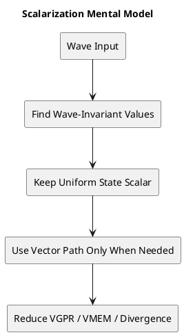

# 1. Executive Summary

- 핵심 주장: `scalarization`의 본질은 "값이 wave 안에서 정말 동일한가"를 찾아서, 그 uniformity를 레지스터, 메모리 경로, 제어 흐름 차원에서 끝까지 활용하는 것이다.
- 가장 큰 오해 바로잡기: `GCN/Vega`에서 uniform `float`가 있다고 해서 곧바로 `SALU`에서 FP32 산술을 수행하는 것은 아니다. FP 산술의 주력은 여전히 `VALU`다.
- 아키텍처 차이: AMD는 `SGPR/VGPR`, `SALU/VALU`, `SMEM/VMEM` 구분을 노골적으로 드러내고, NVIDIA는 전통적으로 `warp coherence` 관점이 더 강했지만 최신 세대에는 `uniform register`와 `uniform datapath`도 공식 문서에 등장한다.
- 결론: `Vega -> RDNA`로 오면서 scalar path의 존재 자체보다, uniform operand를 scalar로 오래 유지하고 vector path에 더 유연하게 연결하는 능력이 강화되었다. NVIDIA는 여전히 `warp-wide uniformity`가 핵심 사고 모델이지만, 이제는 "uniform도 전부 per-thread register만 쓴다"라고 단정하면 부정확하다.

# 2. Problem and Scope

이 글의 질문은 단순하다.

- `Vega(GCN)`, `RDNA`, `NVIDIA`는 `scalarization`을 어떻게 다르게 다루는가?
- `SGPR/VGPR`와 `SALU/VALU`라는 분리가 실제로 어디까지 의미가 있는가?
- 셰이더에서 "uniform 코드"를 썼을 때, 세 아키텍처는 어떤 식으로 최적화하는가?

이 글은 다음 자료를 출발점으로 삼는다.

- Francesco Cifariello Ciardi의 `Intro to GPU Scalarization - Part 1`
- `Intro to GPU Scalarization - Part 2 - Scalarize all the lights`
- 위 글의 국내 번역/요약 성격인 `scahp.tistory.com/41`

다만 이 세 글은 기본적으로 `GCN-centric`한 직관 위에 서 있다. 그래서 이 글에서는 그 직관을 유지하되, AMD/NVIDIA 공식 문서 기준으로 어디까지가 정확한 설명인지 분리해서 정리한다.

# 3. Scalarization을 어떻게 이해해야 하는가

많은 설명이 scalarization을 다음처럼 요약한다.

- wave 안의 모든 lane에서 값이 같으면 scalar
- lane마다 값이 다르면 vector
- scalar 값은 `SGPR`
- vector 값은 `VGPR`

이 설명은 출발점으로는 좋지만, 실제 최적화에서는 너무 좁다. 더 정확한 정의는 다음과 같다.

1. wave 안에서 동일한 값을 가지는 `wave-invariant` 데이터를 찾는다.
2. 그 값을 가능한 오래 scalar path에 남겨둔다.
3. 주소 계산, 분기, 루프 진행, 리소스 fetch를 wave 단위 공통 작업으로 바꾼다.
4. 정말 lane별 계산이 필요한 순간에만 vector path를 쓴다.

즉 scalarization의 핵심은 "모든 걸 SALU로 계산한다"가 아니라, **uniformity를 발굴해서 register pressure, memory path, divergence를 줄이는 것**이다.

FlashyPixels Part 1이 강조하는 장점도 정확히 여기에 있다.

- `VGPR pressure` 감소
- `SMEM` 경로 활용
- divergence 및 coherency 개선

이 세 축은 AMD 쪽에서 특히 강하게 드러나지만, 사실 개념 자체는 벤더를 넘어선다.

# 4. GCN/Vega: 왜 scalarization이 AMD에서 특히 중요하게 보이는가

GCN 계열, 그리고 그 연장선상의 Vega는 scalar/vector 구분이 매우 노골적이다.

- `SGPR`와 `VGPR`가 분리된다.
- `SALU`와 `VALU`가 분리된다.
- `SMEM`과 `VMEM`이 분리된다.
- 제어 흐름은 `EXEC`, `VCC`, `SCC` 같은 상태와 강하게 연결된다.

AMD Southern Islands 문서는 GCN의 기본 철학을 이렇게 보여준다.

- wave 전체에서 같은 값을 가지는 작업은 scalar unit이 담당한다.
- lane마다 다른 값은 vector unit이 담당한다.
- resource descriptor 같은 것은 보통 scalar op로 먼저 읽는다.
- texture sample이나 per-pixel 값은 vector 쪽에서 처리한다.

그래서 GCN을 보면 자연스럽게 다음 같은 사고방식이 생긴다.

- constant buffer에서 읽은 값은 scalar일 가능성이 높다.
- pixel coordinate, barycentric, texture fetch 결과는 vector다.
- uniform 주소 계산은 scalar path로 밀 수 있다.
- divergent loop나 branch는 wave 단위 공통 작업으로 재구성할수록 좋다.

이 구조 때문에 GCN/Vega에서는 scalarization이 단순한 "컴파일러 최적화 하나"가 아니라, 아키텍처를 정면으로 활용하는 전략처럼 느껴진다.

## 4.1 그런데 uniform float는 정말 SALU에서 계산될까

여기서 가장 흔한 오해가 나온다.

예를 들어 다음 코드가 있다고 하자.

```hlsl
float s_someModifier = s_value + s_someData.someField;
```

둘 다 uniform 값이라면 직관적으로는 이렇게 생각하기 쉽다.

- 둘 다 `SGPR`
- 그러면 `SALU`
- 결과도 `SGPR`

하지만 이 설명은 `GCN/Vega` 기준으로 정확하지 않다.

FlashyPixels Part 1도 글 마지막 note에서 이 부분을 정정한다. 핵심은 다음이다.

- GCN/Vega의 공개 ISA 기준으로 `SALU`는 기본적으로 정수, 비트, 제어 중심이다.
- 일반적인 scalar FP32 산술 ISA가 전면에 드러나지 않는다.
- 따라서 uniform `float`끼리의 덧셈/곱셈은 보통 `VALU`에서 수행된다.

즉, "uniform float니까 SALU"는 틀린 설명이다.

## 4.2 그렇다면 uniform float는 결국 VGPR로 복사해야만 하나

여기서 또 반대쪽 오해가 생긴다.

"SALU FP가 아니면 결국 SGPR의 의미가 없고, uniform float도 어차피 VGPR로 옮겨야 하는 것 아닌가?"

이것도 과도한 단순화다.

GCN ISA를 보면 vector instruction의 source operand에 `SGPR`가 들어갈 수 있다. Southern Islands ISA는 VOP source operand 범위에 `SGPR0..103`를 명시한다. 대신 GCN 계열에서는 한 vector instruction이 읽을 수 있는 scalar source 수에 제약이 있다.

이 점을 반영하면 GCN/Vega의 더 정확한 모델은 다음과 같다.

- uniform float 값은 `SGPR`에 유지될 수 있다.
- 실제 FP32 arithmetic은 대개 `VALU`에서 수행된다.
- 하지만 그 operand가 반드시 먼저 `VGPR`로 materialize되어야만 하는 것은 아니다.
- `VALU`가 `SGPR` source를 직접 읽는 경우가 있다.

즉 GCN/Vega에서 scalarization의 의미는 "모든 산술이 SALU로 간다"가 아니라,

- 주소 계산
- descriptor load
- loop steering
- branch condition
- wave-wide ballot/min/any/all 같은 결과

이런 것들을 scalar 쪽에 남겨두고, 필요한 순간에만 vector FP 경로로 연결하는 데 있다.

## 4.3 GCN/Vega에서 scalarization의 실제 이득

이제 왜 이런 구조가 중요한지 다시 정리할 수 있다.

### VGPR pressure 감소

셰이더에서 occupancy를 제한하는 가장 흔한 자원은 `VGPR`다. uniform 값을 scalar 경로에 오래 남겨둘수록 lane마다 복제되는 vector state가 줄어든다. 이는 더 많은 wave를 동시에 올릴 여지를 만든다.

### SMEM path 활용

uniform 주소에서 읽는 데이터는 `SMEM`을 탈 수 있다. GCN은 scalar load와 vector load의 경로가 다르기 때문에, uniform 데이터를 scalar 쪽으로 밀어 넣는 것 자체가 유효한 최적화다.

### Divergence 완화

branch나 loop를 lane마다 제각각 돌리면 wave는 lockstep 때문에 결국 여러 경로를 순차 실행하게 된다. 반면 wave 차원의 공통 작업으로 묶을 수 있으면, 같은 일을 여러 lane이 중복해서 진행하는 비용을 줄일 수 있다.

정리하면 GCN/Vega에서 scalarization은 "산술 유닛 선택" 하나의 문제가 아니라, **레지스터, 메모리, 제어 흐름 전체를 재구성하는 방식**이다.

# 5. RDNA: 같은 철학, 더 유연한 operand model

RDNA로 오면 기본 철학은 유지된다.

- 여전히 `SGPR`와 `VGPR`가 있다.
- 여전히 scalar path와 vector path가 있다.
- uniform 값, 주소, descriptor, control flow는 여전히 scalarization의 핵심 대상이다.

하지만 공개 ISA 기준으로 보면 RDNA는 GCN보다 scalar operand 활용 쪽이 더 유연하다.

RDNA ISA는 vector ALU instruction이 **최대 두 개의 scalar value를 읽을 수 있다**고 설명한다. 이건 GCN에서 흔히 떠올리는 "vector op는 scalar source 제약이 강하다"는 감각보다 한 단계 완화된 모델이다.

이 변화가 뜻하는 것은 다음과 같다.

- compiler가 uniform operand를 `SGPR`에 더 오래 유지하기 쉽다.
- scalarized state를 vector 계산 직전까지 끌고 가기 쉽다.
- "uniform 값을 scalar로 들고 있다가 마지막에 vector FP에 먹인다"는 패턴이 더 자연스럽다.

## 5.1 RDNA에서 scalar ALU가 float를 많이 담당한다고 보면 안 되는 이유

여기서도 흔한 오해가 있다.

"RDNA는 scalar path가 강해졌으니 float 연산도 많이 SALU로 가는 것 아닌가?"

공개 문서 기준으로는 그렇게 말하기 어렵다.

- RDNA에서도 일반적인 FP32 연산의 주력은 여전히 vector path다.
- 공개 ISA에서 `S_ADD_F32`, `S_MUL_F32` 같은 일반 scalar FP32 산술이 전면에 보이지 않는다.

즉 RDNA의 핵심 진보는 "float arithmetic를 SALU로 대거 보낸다"보다,

- uniform state를 scalar로 오래 유지하고
- vector instruction이 scalar operand를 더 유연하게 받아들이며
- compiler가 aggressive하게 scalarization하기 좋은 환경을 갖춘다

는 쪽에 있다.

## 5.2 Vega와 RDNA의 가장 정확한 차이

이 차이를 한 문장으로 줄이면 다음과 같다.

> Vega는 scalar/vector 분리가 강하게 드러나는 기준점이고,  
> RDNA는 그 철학을 유지하면서 scalar operand를 더 오래, 더 유연하게 끌고 가도록 다듬은 구조다.

그래서 RDNA에서 uniform `float` 코드를 봤을 때의 가장 정확한 mental model은 이렇다.

- 가능하면 `SGPR`에 유지한다.
- 주소와 제어는 계속 scalar path에 둔다.
- 일반 FP32 arithmetic은 여전히 vector path가 주력이다.
- 단, operand 연결은 GCN보다 유연하다.

# 6. NVIDIA: "SGPR가 없다"는 설명이 어디까지 맞는가

NVIDIA를 설명할 때 오래된 직관은 대체로 이랬다.

- 모든 register는 기본적으로 per-thread register다.
- warp는 32 thread이고, lockstep에 가깝게 움직인다.
- uniform 최적화의 핵심은 `SGPR` 같은 register class보다 `warp coherence`다.
- constant memory는 warp가 같은 주소를 읽을 때 효율적이다.
- 진짜 중요한 것은 divergence 제거와 memory coalescing이다.

이 설명은 오랫동안 충분히 유용했다. 실제로 셰이더/커널 작성자의 사고 모델도 지금까지 많이 이 틀을 따른다.

하지만 최신 세대까지 포함해 정확히 설명하려면 여기서 한 단계 더 가야 한다.

## 6.1 현대 NVIDIA에는 explicit uniform path가 있다

NVIDIA 공식 문서를 보면 `Turing` 이후부터는 다음 같은 사실이 명확하다.

- Nsight 디버거에서 `Uniform` register와 `Uniform Predicate` register를 볼 수 있다.
- CUDA Binary Utilities 문서에 `UR`, `UP` 개념이 등장한다.
- `ULDC`, `LDCU`, `UIADD3` 같은 uniform integer op가 있다.
- 최신 instruction table에는 `UFADD`, `UFMUL`, `UFFMA` 같은 uniform FP32 op도 등장한다.

이건 아주 중요한 포인트다. 즉 현대 NVIDIA를 두고

> "uniform도 전부 per-thread register로 복사해서 vector처럼만 처리한다"

라고 말하면 더 이상 정확하지 않다.

## 6.2 그렇다면 NVIDIA도 AMD처럼 SGPR/VGPR 모델로 이해하면 되나

그렇게까지 단순화하는 것도 맞지 않다.

왜냐하면 프로그래머가 NVIDIA를 튜닝할 때의 주된 사고 모델은 여전히 다음 쪽에 더 가깝기 때문이다.

- warp 전체에서 같은 주소를 읽는가
- warp 전체에서 같은 경로로 분기하는가
- warp 전체에서 동일한 값을 유지하는가
- global/shared/constant memory 접근이 coherent한가

즉 NVIDIA는 현대 문서상 explicit uniform datapath를 갖고 있지만, 실전 튜닝 관점에서는 여전히 `warp-wide uniformity`와 `execution coherence`가 더 앞에 나온다.

이 점에서 AMD와 NVIDIA의 분위기 차이가 생긴다.

- AMD는 `SGPR/VGPR`, `SALU/VALU`, `SMEM/VMEM`이 구조적으로 눈에 띈다.
- NVIDIA는 전통적으로 `warp`, `constant memory`, `broadcast`, `coalescing`, `divergence` 관점이 먼저 떠오른다.

그래서 NVIDIA에 대한 가장 정확한 설명은 다음이다.

> 역사적으로는 "per-thread register + warp-wide 최적화" 모델이 전면에 있었고,  
> 현대 아키텍처에서는 여기에 explicit uniform register/datapath가 추가되어 있다.

# 7. 세 아키텍처를 같은 코드로 놓고 보면

다음과 같은 코드가 있다고 하자.

```cpp
float a = uniformValue;
float b = a + uniformField;
float4 out = b * textureSample;
```

이 코드를 세 아키텍처 관점에서 보면 미묘하게 다르게 읽힌다.

## 7.1 Vega(GCN)

- `uniformValue`, `uniformField`는 `SGPR`에 머물 가능성이 높다.
- `b`를 만드는 FP32 add는 대체로 `VALU`에서 수행된다.
- 다만 `VALU`는 `SGPR` operand를 직접 읽을 수 있다.
- `out`은 당연히 vector 결과이므로 `VGPR/VALU` 쪽이다.

여기서 핵심은 "uniform float라서 SALU"가 아니라, **uniform operand를 SGPR에 오래 유지한 채 FP 연산 직전까지만 scalar 상태를 보존한다**는 데 있다.

## 7.2 RDNA

- 기본 그림은 같다.
- uniform operand를 scalar로 오래 유지하는 유연성이 더 좋아졌다.
- vector instruction이 scalar operand를 더 자연스럽게 받아들인다.
- 하지만 일반 FP32 arithmetic의 중심은 여전히 vector path다.

즉 RDNA는 Vega보다 "더 똑똑하게 scalarization을 이어간다"라고 이해하는 편이 맞다.

## 7.3 NVIDIA

- 전통적인 mental model에서는 `a`, `b`를 warp-wide uniform 값으로 유지하는 것이 중요하다.
- 같은 값이면 constant/uniform path와 warp execution coherence의 이득을 받는다.
- 최신 backend/SASS 수준에서는 uniform register/datapath로 내려갈 수 있다.

즉 NVIDIA는 "SGPR라는 이름으로 사고하지는 않지만", uniformity 자체를 활용하지 않는 구조가 아니다.

# 8. FlashyPixels Part 2가 좋은 이유: scalarization을 알고리즘으로 보여준다

Part 1이 기본 철학을 설명했다면, Part 2의 진짜 가치는 **scalarization을 알고리즘 재구성으로 보여준다**는 데 있다.

## 8.1 Cell 단위 scalarization

첫 번째 접근은 wave 안의 lane들이 같은 cell을 보고 있는 경우를 이용한다.

- `WaveReadLaneFirst`로 첫 active lane의 cell index를 뽑는다.
- `WaveBallot`으로 다른 lane들이 같은 cell인지 검사한다.
- wave 전체가 같은 cell이라면 그 cell의 light list를 scalar 주소로 처리한다.

이 방식은 구현이 비교적 단순하고, 공간적으로 인접한 픽셀이 같은 cluster/cell을 보는 상황에서 잘 먹힌다.

## 8.2 Light index 단위 scalarization

두 번째 접근은 더 공격적이다.

- 각 lane은 자기 light list에서 "다음에 처리할 light index"를 하나 가진다.
- `WaveActiveMin`으로 wave 전체의 최소 light index를 고른다.
- 그 light 하나를 scalar로 load한다.
- 그 light를 필요로 하는 lane만 처리하고, 해당 lane만 offset을 증가시킨다.

이 방식의 장점은 명확하다.

- 중복 light 처리 감소
- wave 차원의 공통 작업 증가
- 더 강한 scalar load 기회 확보

즉 단순히 register class를 바꾸는 것이 아니라, **light loop 자체를 wave-level merge 형태로 바꾸는 것**이다.

## 8.3 실전 구현에서 정말 중요한 함정: helper lane과 WQM

Part 2가 특히 좋은 이유는 끝부분의 correctness note 때문이다.

pixel shader에서는 `ddx`, `ddy`, mip selection 등을 위해 `2x2 quad`와 `WQM`이 얽힌다. 이때 helper lane이 존재할 수 있고, 이 lane들은 결과는 버려져도 실행에는 참여한다.

문제는 `WaveActiveMin` 같은 연산이 helper lane과 active lane을 다루는 방식 때문에, 잘못 구현하면 일부 lane이 루프를 빠져나오지 못하는 상황이 생길 수 있다는 것이다.

즉 scalarization은 단순히 "좀 더 빠른 코드"의 문제가 아니라, **잘못 쓰면 infinite loop나 GPU hang까지 만들 수 있는 wave-level 알고리즘 설계 문제**다.

이 포인트는 단순 요약 글에서는 자주 빠지지만, 실제 셰이더 구현에서는 반드시 같이 기억해야 한다.

# 9. 자주 나오는 오해를 한 번에 정리

이제 자주 나오는 문장을 정확한 표현으로 바꿔보자.

## 오해 1: "GCN/Vega는 uniform float면 SALU다"

정확한 표현:

- GCN/Vega에서 uniform `float`가 `SGPR`에 머무를 수는 있다.
- 하지만 일반 FP32 산술의 주력은 여전히 `VALU`다.
- `SGPR` operand를 `VALU`가 직접 소비할 수 있다는 점이 중요하다.

## 오해 2: "RDNA는 float scalar ALU가 강해졌다"

정확한 표현:

- RDNA는 scalarization 유지와 scalar operand 활용이 더 유연해졌다.
- 하지만 일반 FP32 산술의 중심이 scalar path로 옮겨갔다고 보기는 어렵다.

## 오해 3: "NVIDIA는 SGPR 개념이 없으니 uniform도 다 vector다"

정확한 표현:

- 전통적인 프로그래밍 모델에선 그렇게 이해해도 직관적으로는 맞는 부분이 있다.
- 하지만 최신 공식 문서 기준으로는 uniform register와 uniform datapath가 명시되어 있다.
- 따라서 현대 NVIDIA를 완전히 "all per-thread only"로 설명하면 부정확하다.

# 10. 실전 셰이더에서 무엇을 봐야 하는가

이 글의 결론을 실전 체크리스트로 바꾸면 다음과 같다.

## AMD 타겟에서 볼 것

- 주소 계산을 `SGPR`로 유지할 수 있는가
- descriptor/resource access를 `SMEM` 경로로 보낼 수 있는가
- loop progression을 wave 공통 상태로 바꿀 수 있는가
- 불필요한 `VGPR` 복제를 줄일 수 있는가
- wave op를 쓸 때 helper lane/WQM까지 고려했는가

## NVIDIA 타겟에서 볼 것

- warp가 같은 주소를 읽는가
- divergence가 얼마나 큰가
- constant/uniform path의 이점을 받을 정도로 warp-wide uniformity가 있는가
- shared/global/constant memory 접근이 얼마나 coherent한가

## 공통적으로 볼 것

- 이 값은 정말 wave 안에서 동일한가
- 동일한 값을 lane마다 따로 계산하고 있지 않은가
- 같은 메모리 fetch를 lane마다 중복 수행하고 있지 않은가
- loop를 per-lane iteration이 아니라 wave-level progression으로 바꿀 수 없는가

# 11. 결론

`Vega(GCN) vs RDNA vs NVIDIA`를 이 주제로 비교할 때 가장 중요한 것은, 각 벤더의 용어를 외우는 것이 아니다. 진짜 중요한 것은 **uniformity를 어디서 발견하고, 그 uniformity를 어떤 구조로 끝까지 활용하느냐**다.

정리하면:

- `GCN/Vega`: scalar/vector 구분이 매우 강하게 드러나는 기준점이다. scalarization의 이득이 구조적으로 분명하다. 다만 uniform `float` 산술이 곧바로 `SALU`라는 뜻은 아니다.
- `RDNA`: 같은 철학을 유지하면서 scalar operand 활용을 더 유연하게 만들었다. 핵심은 "float를 scalar로 계산한다"보다 "uniform state를 scalar로 오래 유지한다"에 있다.
- `NVIDIA`: 전통적으로는 warp-wide coherence 중심 설명이 강했지만, 현대 문서 기준으로는 explicit uniform register/datapath도 존재한다.

가장 정확한 한 줄 요약은 이렇다.

> AMD는 uniformity를 `register class`와 `memory path` 차원에서 노골적으로 드러내고,  
> NVIDIA는 역사적으로 `warp coherence` 관점이 강했지만 최신 세대에서는 별도의 uniform path도 분명히 존재한다.

# 12. Code to Inspect

- Repo: `D:\blog\techblog`
- Branch/Commit: 현재 로컬 작업 트리
- Paths:
  - `posts/worklog/2026-03-03-worklog-09-gpu-sm-architecture-and-warp-scheduling/ko.md`
  - `posts/worklog/2026-02-20-worklog-05-cuda-vulkan-sass-memory-coalescing/ko.md`
  - `posts/worklog/2026-02-18-worklog-03-cuda-vulkan-sass-toolchain/ko.md`
  - `posts/comparison/gpu-architecture/2026-03-26-comparison-vega-gcn-rdna-vs-nvidia-scalarization/ko.md`
- Key symbols / topics:
  - `SM`
  - `warp`
  - `constant memory`
  - `uniform register`
  - `SASS`
  - `scalarization`

# 13. Reference Materials

| Type | Title | Link | Why it matters |
|---|---|---|---|
| article | Intro to GPU Scalarization - Part 1 | https://flashypixels.wordpress.com/2018/11/10/intro-to-gpu-scalarization-part-1/ | GCN-centric scalarization intuition, VGPR pressure, wave invariance |
| article | Intro to GPU Scalarization - Part 2 - Scalarize all the lights | https://flashypixels.wordpress.com/2018/11/10/intro-to-gpu-scalarization-part-2-scalarize-all-the-lights/ | Wave-level light loop scalarization and helper-lane caveat |
| article | GPU 스칼라화 번역/정리 | https://scahp.tistory.com/41 | 국내어 설명용 reference, Part 1의 직관을 한국어로 풀어낸 글 |
| spec | AMD Southern Islands Instruction Set Architecture | https://docs.amd.com/v/u/en-US/southern-islands-instruction-set-architecture | GCN의 SGPR/VGPR, scalar/vector instruction 모델의 기준점 |
| spec | AMD Southern Islands ISA PDF | https://docs.amd.com/api/khub/documents/J4foK5jvufN9rTHf_DlCPw/content | VOP source operand에 SGPR가 들어갈 수 있다는 점을 직접 확인하기 좋음 |
| spec | AMD RDNA Shader Instruction Set Architecture | https://docs.amd.com/v/u/en-US/rdna-shader-instruction-set-architecture | RDNA의 scalar operand 모델과 wave32/wave64 기본 설명 |
| spec | AMD RDNA ISA PDF | https://docs.amd.com/api/khub/documents/mU0vhV4IgdmIWSgRqlt70g/content | RDNA에서 vector instruction이 최대 두 scalar values를 읽는 규칙 확인용 |
| doc | NVIDIA CUDA Binary Utilities | https://docs.nvidia.com/cuda/pdf/CUDA_Binary_Utilities.pdf | `UR/UP`, `ULDC`, `UFADD`, `UFFMA` 등 uniform datapath instruction 확인용 |
| doc | NVIDIA Nsight Visual Studio Edition - Inspect State | https://docs.nvidia.com/nsight-visual-studio-edition/2025.5/cuda-inspect-state/index.html | Turing 이후 Uniform/Uniform Predicate register 표시 확인용 |
| doc | NVIDIA CUDA Programming Guide | https://docs.nvidia.com/cuda/cuda-programming-guide/ | warp execution model, register state, constant memory semantics의 기준 문서 |

# 14. Evidence Mapping

| Claim | Code / Concept Anchor | Reference |
|---|---|---|
| GCN/Vega에서 scalar/vector 분리가 강하게 드러난다 | `SGPR`, `VGPR`, `SALU`, `VALU`, `SMEM`, `VMEM` | AMD Southern Islands ISA |
| uniform float arithmetic가 곧바로 SALU라는 설명은 부정확하다 | FlashyPixels Part 1 note와 Andy Robbins 댓글 내용 | FlashyPixels Part 1 |
| GCN vector instruction은 SGPR source를 받을 수 있다 | VOP source operand model | AMD Southern Islands ISA PDF |
| RDNA는 vector instruction이 최대 두 scalar values를 읽을 수 있다 | scalar operand flexibility | AMD RDNA ISA PDF |
| NVIDIA는 최신 세대에서 uniform register/datapath를 가진다 | `UR`, `UP`, `ULDC`, `UFADD`, `UFFMA` | CUDA Binary Utilities, Nsight docs |
| scalarization은 register 최적화가 아니라 wave-level 알고리즘 재구성까지 포함한다 | `WaveReadLaneFirst`, `WaveBallot`, `WaveActiveMin` 기반 조명 루프 | FlashyPixels Part 2 |
| helper lane/WQM을 무시하면 correctness 문제가 생길 수 있다 | pixel shader light loop caveat | FlashyPixels Part 2 |

# 15. Diagram


