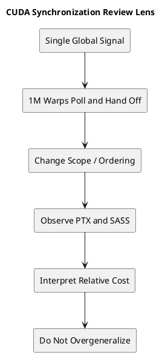

# 1. Executive Summary

- `HydraQYH/CUDASynchronizePrimitives` is a strong microbenchmark. It compares `cta`, `gpu`, `sys`, `volatile + fence`, and `atomic_ref` on the same hot-potato pattern, and it strongly reinforces a real engineering rule: use the narrowest correct scope.
- The best part of the write-up is that it ties `PTX -> SASS -> timing` together. It does not just say one method is slower. It shows which `LD/ST` scope and which `MEMBAR` scope actually showed up.
- The main limitation is also clear: this is **a single-global-flag handoff benchmark across one million warps**. That makes it excellent for amplifying relative synchronization cost, but not a complete model of "general CUDA synchronization cost."
- The practical takeaway is still strong. Use `cta/block` for block-local communication, `device/gpu` for inter-block communication, and `system/sys` only when CPU or peer visibility is truly required. At the CUDA C++ level, prefer `cuda::atomic_ref` before reaching for inline PTX.

# 2. What This Repository Actually Benchmarks

The target repository is:

- GitHub: [HydraQYH/CUDASynchronizePrimitives](https://github.com/HydraQYH/CUDASynchronizePrimitives)

The layout is intentionally simple:

- `hot_potato.cu`: "safe" synchronization experiments based on `acquire/release`
- `hot_potato_unsafe.cu`: comparison experiments based on `relaxed`

The core idea is to pass a single `signal` value from warp to warp:

1. each warp polls until `signal == warp_id`
2. once its turn arrives, it stores `signal = warp_id + 1`
3. the next warp takes over

This is effectively a long serialized relay. That means polling cost, store cost, and ordering cost all accumulate into a highly visible total runtime.

The benchmark setup is also intentionally aggressive:

- warp count: `1 << 20` = 1,048,576 warps
- block size: `1024 threads` = 32 warps per block

So even small differences in synchronization cost get magnified into large timing deltas.

# 3. The Synchronization Variants Being Compared

The repository compares five broad implementation styles.

## 3.1 PTX-based CTA scope

This uses `ld.acquire.cta.global.u32` and `st.release.cta.global.u32`.  
But the implementation is not purely CTA-only. It is a **hybrid optimization**:

- use `cta` inside a block
- use `gpu` at block boundaries

That is a very natural optimization for this benchmark because the signal usually moves to the next warp in the same block.

## 3.2 PTX-based GPU scope

This uses `ld.acquire.gpu.global.u32` and `st.release.gpu.global.u32`.  
Every handoff is treated as a device-wide visibility event.

## 3.3 PTX-based SYS scope

This uses `ld.acquire.sys.global.u32` and `st.release.sys.global.u32`.  
That widens the visibility domain to the broader system level.

## 3.4 volatile + fence

This uses `volatile` load/store plus `__threadfence()` or `__threadfence_system()`.  
This pattern still appears in older CUDA codebases, so it is useful to include.

## 3.5 atomic_ref

This uses `cuda::atomic_ref<unsigned int, cuda::thread_scope_device>` with `load(memory_order_acquire)` and `store(memory_order_release)`.

This is the most practical modern baseline in the whole set.

# 4. Why This Benchmark Is Good

The benchmark is valuable because it does more than print timing numbers.

## 4.1 It compares scopes on the same core algorithm

The underlying relay structure stays the same, so the broad comparisons are meaningful:

- larger scope costs more
- stronger ordering costs more
- `atomic_ref(device, acquire/release)` ends up very close to the GPU-scope PTX version

Those are all plausible and useful conclusions.

## 4.2 It connects timing back to SASS

This is the strongest part of the article.

Instead of stopping at timing, it shows instruction-level differences such as:

- `LDG.E.STRONG.SM`, `MEMBAR.ALL.CTA`, `STG.E.STRONG.SM`
- `LDG.E.STRONG.GPU`, `MEMBAR.ALL.GPU`
- `LDG.E.STRONG.SYS`, `MEMBAR.ALL.SYS`

That makes the results far more interpretable than a black-box benchmark.

## 4.3 The relaxed comparison is genuinely useful

`hot_potato_unsafe.cu` replaces `acquire/release` with `relaxed`.

That gives the benchmark a second axis:

- scope cost
- ordering cost

So the article is not just comparing APIs. It is also teasing apart why the costs differ.

# 5. Which Conclusions Are Strong, and Which Need Caution

This is the most important part.

## 5.1 Strong conclusions

These conclusions are solid.

### The narrowest correct scope matters a lot

This is the real headline.

If communication never leaves a block, paying `sys` or even `gpu` scope is unnecessary. If communication crosses blocks, using only `cta` risks incorrect behavior.

So the hierarchy matters:

- `cta/block` for block-local handoff
- `device/gpu` for inter-block handoff
- `system/sys` only when system-wide visibility is actually required

### atomic_ref is a very practical default

The fact that `atomic_ref` lands near the GPU-scope PTX variant is meaningful.

That strongly suggests a sensible engineering order:

- first try `cuda::atomic_ref`
- only drop to inline PTX when you truly need codegen control or an unsupported semantic

### volatile + __threadfence is no longer an ideal default pattern

This style still appears in real CUDA code, but it is harder to reason about and often more expensive than people expect. The write-up does a good job showing that its lowering is not especially elegant, and that the resulting scope/ordering mix is not as transparent as an atomic API.

## 5.2 Conclusions that need more caution

These are directionally useful, but should be stated more carefully.

### "This is the general cost of CUDA synchronization"

Not really.

This benchmark uses one shared flag and a nearly serialized relay across one million warps. That makes it a strong stress test for this specific handoff pattern, not a universal model of all synchronization costs.

Real applications often differ in major ways:

- they exchange actual payload data
- they use multiple synchronization points
- contention is more distributed
- the execution graph is not one long relay

So the absolute timings should not be generalized too far. The relative ordering is the more trustworthy signal.

### "CTA uses L1, GPU uses only L2"

That explanation is directionally intuitive, but it is too strong if stated as a hard hardware fact without stronger documentation.

A safer interpretation is:

- broader visibility domains require broader ordering and invalidation work
- that tends to increase cost
- the exact timing depends on the memory hierarchy and implementation details

That framing stays aligned with the measurements without overcommitting to undocumented internals.

### "CTA is faster than GPU scope"

Yes, but the most accurate reading is:

> the topology-aware hybrid optimization is faster than using GPU scope everywhere

The CTA version is not just a direct instruction swap. It uses:

- `cta` inside the block
- `gpu` only at block boundaries

That is exactly why it is interesting. It shows that mixing scopes according to communication topology can be a large win. But it should not be described as a completely apples-to-apples one-line scope comparison.

# 6. The Three Things I Found Most Valuable

## 6.1 The SASS-driven interpretation

Many performance posts stop at timing.

This one maintains the full chain:

- which PTX semantic/scope was written
- which SASS instructions appeared
- what runtime followed

That is a very good habit.

## 6.2 The unsafe comparison deepens the interpretation

The `relaxed` benchmark is not a correctness-preserving message-passing implementation in the general case, but it is very useful as a comparison tool.

It helps separate:

- visibility scope cost
- ordering/fence cost

That makes the benchmark much more informative.

## 6.3 Recommending atomic_ref is the right practical ending

I agree with the article here. Inline PTX is valuable for research and verification, but it carries maintenance and portability cost. If `atomic_ref` gives comparable codegen and comparable performance, it is the better default for production-oriented CUDA code.

# 7. What Would Make the Study Even Stronger

The benchmark is already useful, but a few additions would make it much stronger.

## 7.1 A real payload + flag message-passing test

Right now the relay mostly passes a token. That means ordering is present, but its role is reduced.

A stronger experiment would be:

1. producer writes payload
2. producer release-stores the flag
3. consumer acquire-loads the flag
4. consumer verifies payload visibility and measures cost

That would connect the benchmark much more directly to real message passing.

## 7.2 Cross-generation results

The current write-up centers on H20 `sm_90`. That is already interesting, but it would be much stronger with:

- Ampere
- Ada
- Hopper/H20

Then readers could see whether the same scope/fence relationships remain stable across generations.

## 7.3 Sensitivity to block size and topology

The benchmark uses a large and intentionally amplifying setup. That is fine, but it would be useful to vary:

- 4 warps per block
- 8 warps per block
- 16 warps per block
- 32 warps per block

That would make it easier to see when the hybrid CTA/GPU optimization becomes especially valuable.

# 8. Practical Engineering Takeaways

For production CUDA work, the takeaway is fairly simple.

## 8.1 Basic rules

- use the narrowest correct scope
- use the weakest correct ordering
- prefer high-level CUDA atomics first
- reserve inline PTX for research, verification, or cases where codegen control really matters

## 8.2 Suggested default choices

For block-local handoff:

- start with block/CTA scope primitives

For inter-block handoff:

- use `thread_scope_device`
- pair it with `memory_order_acquire/release`

For CPU or peer visibility:

- escalate to `thread_scope_system` only when necessary

## 8.3 Avoid treating volatile as the default habit

It was common in older code, but today it is a weaker default. It is harder to document, harder to reason about, and often less direct than using explicit atomic APIs.

# 9. Conclusion

My overall assessment is straightforward.

**This is a good benchmark, and the main conclusions are useful.**  
In particular, it does a strong job showing that scope and ordering decisions materially affect cost, and it backs that claim with PTX and SASS evidence.

What it does *not* do is define a universal law of CUDA synchronization performance.

The most accurate reading is:

> this benchmark very clearly measures the relative cost of `cta`, `gpu`, `sys`, `fence`, and `atomic_ref` in a single-global-flag hot-potato handoff pattern.

That is already a valuable result. And for practical CUDA engineering, the lessons are very actionable:

- minimize scope
- do not over-strengthen ordering
- exploit block locality when it exists
- prefer `atomic_ref` and modern CUDA atomics when they express the required semantics

That is enough to make the repository well worth reading, especially for developers trying to connect CUDA memory-model concepts to real measured cost.

# 10. Code to Inspect

- External repo:
  - `https://github.com/HydraQYH/CUDASynchronizePrimitives`
- Key files:
  - `hot_potato.cu`
  - `hot_potato_unsafe.cu`
- Key symbols / topics:
  - `ld.acquire.cta.global.u32`
  - `ld.acquire.gpu.global.u32`
  - `ld.acquire.sys.global.u32`
  - `st.release.*`
  - `__threadfence`
  - `__threadfence_system`
  - `cuda::atomic_ref`
  - `cuda::thread_scope_device`

# 11. Reference Materials

| Type | Title | Link | Why it matters |
|---|---|---|---|
| repo | CUDA Synchronize Primitives | https://github.com/HydraQYH/CUDASynchronizePrimitives | Source benchmark code |
| doc | CUDA C++ Programming Guide | https://docs.nvidia.com/cuda/cuda-c-programming-guide/ | Baseline CUDA memory model, thread scope, and fence semantics |
| doc | CUDA Binary Utilities | https://docs.nvidia.com/cuda/cuda-binary-utilities/ | Useful for PTX/SASS inspection context |
| doc | libcu++ extended API: atomic_ref | https://nvidia.github.io/cccl/libcudacxx/extended_api/synchronization_primitives/atomic_ref.html | Meaning and usage of `cuda::atomic_ref` |
| article | Memory fence functions | https://docs.nvidia.com/cuda/cuda-c-programming-guide/#memory-fence-functions | Concrete fence semantics reference |

# 12. Evidence Mapping

| Claim | Code / Concept Anchor | Reference |
|---|---|---|
| CTA/GPU/SYS scope comparison is the center of the benchmark | `ld.acquire.cta/gpu/sys`, `st.release.cta/gpu/sys` | repo `hot_potato.cu` |
| Relaxed variants help isolate ordering cost | `ld.relaxed.*`, `st.relaxed.*` | repo `hot_potato_unsafe.cu` |
| volatile + fence is less direct semantically and often less appealing practically | `volatile`, `__threadfence`, `__threadfence_system` | repo `hot_potato.cu`, CUDA Programming Guide |
| atomic_ref is a modern and practical default | `cuda::atomic_ref<unsigned int, cuda::thread_scope_device>` | repo `hot_potato.cu`, libcu++ docs |
| The CTA result is also a topology-aware optimization result | intra-block `cta`, boundary `gpu` | repo `hot_potato.cu` |

# 13. Diagram

