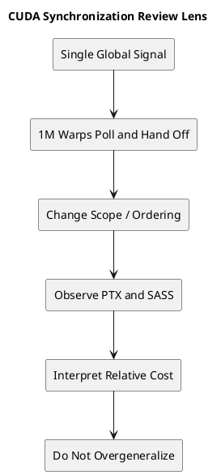

# 1. Executive Summary

- `HydraQYH/CUDASynchronizePrimitives`는 꽤 잘 만든 마이크로벤치마크다. `cta`, `gpu`, `sys` 스코프와 `volatile + fence`, `atomic_ref`를 같은 패턴 위에서 비교해, "가장 좁은 올바른 스코프를 써라"는 실무 원칙을 강하게 뒷받침한다.
- 이 실험의 가장 큰 장점은 `PTX -> SASS -> 시간`을 한 축으로 묶어 보여준다는 점이다. 단순히 "느리다"가 아니라, 어떤 범위의 `LD/ST`와 어떤 `MEMBAR`가 나왔는지를 같이 보게 만든다.
- 다만 이 결과를 "CUDA 동기화 일반론"으로 받아들이면 과하다. 이 벤치마크는 **단일 글로벌 플래그를 100만 워프가 릴레이하는 hot-potato 패턴**을 측정한다. 즉, 동기화의 절대 비용보다는 이 패턴에서의 상대 순서를 보는 실험에 가깝다.
- 실전 권장 사항은 분명하다. 블록 내부 통신이면 `cta/block`, 블록 간 통신이면 `device/gpu`, CPU나 peer 가시성이 필요할 때만 `system/sys`를 써야 한다. CUDA C++ 레벨에서는 가능하면 인라인 PTX보다 `cuda::atomic_ref` 같은 고수준 API를 먼저 고려하는 편이 낫다.

# 2. 무엇을 실험한 레포인가

대상 레포는 다음이다.

- GitHub: [HydraQYH/CUDASynchronizePrimitives](https://github.com/HydraQYH/CUDASynchronizePrimitives)

레포 구조는 매우 단순하다.

- `hot_potato.cu`: `acquire/release` 기반 안전한 동기화 실험
- `hot_potato_unsafe.cu`: `relaxed` 기반 비교 실험

핵심 아이디어는 하나의 `signal` 값을 워프들이 릴레이처럼 넘기는 것이다.

1. 각 워프는 자기 차례가 올 때까지 `signal == warp_id`를 폴링한다.
2. 자기 차례가 오면 `signal = warp_id + 1`로 갱신한다.
3. 다음 워프가 이어받는다.

이 구조는 사실상 워프들을 길게 직렬 연결한 것과 비슷하다. 그래서 각 워프의 폴링 비용과 store 비용, 그리고 그 사이의 ordering 비용이 전체 실행 시간에 크게 누적된다.

실험 코드를 보면 설정도 상당히 공격적이다.

- 워프 수: `1 << 20` = 1,048,576 워프
- 블록 크기: `1024 threads` = 32 warps per block

즉, 아주 작은 동기화 차이도 전체 시간에 크게 확대되어 관측되도록 설계되어 있다.

# 3. 코드 구현은 어떻게 나뉘는가

레포는 대체로 다섯 가지 구현을 비교한다.

## 3.1 PTX 기반 CTA scope

`ld.acquire.cta.global.u32`, `st.release.cta.global.u32`를 사용한다.  
다만 구현은 완전한 CTA-only가 아니라, **블록 경계에서는 GPU scope를 쓰고 블록 내부에서는 CTA scope를 쓰는 하이브리드 최적화**다.

이 선택은 실험 패턴에 아주 잘 맞는다. 워프는 항상 `warp_id + 1`로 넘기기 때문에, 같은 블록 내부에서 이어지는 구간이 길다. 그 구간에서는 굳이 `gpu`까지 갈 필요가 없다.

## 3.2 PTX 기반 GPU scope

`ld.acquire.gpu.global.u32`, `st.release.gpu.global.u32`를 사용한다.  
이 구현은 블록 경계를 따지지 않고 모든 handoff를 device-wide visibility 기준으로 처리한다.

## 3.3 PTX 기반 SYS scope

`ld.acquire.sys.global.u32`, `st.release.sys.global.u32`를 사용한다.  
CPU나 더 넓은 시스템 가시성을 요구하는 수준으로 범위를 넓힌 셈이다.

## 3.4 volatile + fence

`volatile` load/store와 `__threadfence()` 또는 `__threadfence_system()` 조합이다.  
CUDA를 조금 오래 써온 코드베이스에서는 여전히 자주 보이는 패턴이기도 하다.

## 3.5 atomic_ref

`cuda::atomic_ref<unsigned int, cuda::thread_scope_device>`에 `load(memory_order_acquire)`와 `store(memory_order_release)`를 적용한 방식이다.

이 구현은 글에서도 강조하듯이, 실전에서 가장 먼저 고려할 만한 현대적인 선택지다.

# 4. 이 실험이 좋은 이유

이 글과 레포의 가장 좋은 점은, 단순히 숫자를 찍고 끝내지 않는다는 점이다.

## 4.1 같은 알고리즘 위에서 스코프만 비교한다

실험의 기본 구조가 동일하기 때문에, 대략적인 비교 기준은 분명하다.

- 범위를 넓히면 더 느려진다
- fence/order가 강해지면 더 느려진다
- `atomic_ref(device, acquire/release)`는 GPU-scope PTX와 비슷한 codegen과 비슷한 비용을 낸다

이 세 가지는 실무 감각과도 잘 맞는다.

## 4.2 SASS와 연결해서 해석한다

글에서 특히 좋았던 부분은 SASS를 같이 가져온 점이다.

- CTA 쪽에서는 `LDG.E.STRONG.SM`, `MEMBAR.ALL.CTA`, `STG.E.STRONG.SM`
- GPU 쪽에서는 `LDG.E.STRONG.GPU`, `MEMBAR.ALL.GPU`
- SYS 쪽에서는 `LDG.E.STRONG.SYS`, `MEMBAR.ALL.SYS`

이렇게 범위가 실제로 instruction 수준에서 어떻게 내려가는지 같이 보여주기 때문에, 단순한 블랙박스 벤치마크보다 훨씬 설득력이 있다.

## 4.3 relaxed 실험을 따로 둔 점이 좋다

`hot_potato_unsafe.cu`에서는 `acquire/release` 대신 `relaxed`를 써서 fence 성격의 비용을 줄인 비교군을 만든다.

이건 꽤 중요한 설계다. 왜냐하면 여기서 최소한 다음 둘을 분리해서 볼 수 있기 때문이다.

- 스코프 자체의 비용
- ordering 제약의 비용

실제로 글에 적힌 결과처럼, 범위가 커질수록 ordering과 invalidate 계열 비용이 더 크게 보이는 건 충분히 납득 가능하다.

# 5. 어디까지는 강한 결론이고, 어디서부터는 조심해야 하나

여기서부터가 이 글의 핵심이다.  
이 실험은 유익하지만, 해석은 선을 잘 그어야 한다.

## 5.1 강하게 믿어도 되는 결론

다음 결론들은 꽤 강하다.

### 가장 좁은 올바른 scope를 쓰는 것이 중요하다

이건 사실상 이 실험의 핵심 메시지다.  
블록 내부 통신인데 `sys`나 `gpu`를 쓰면 당연히 비싸다. 반대로 블록 간 handoff가 실제로 발생하는데 `cta`만 쓰면 correctness가 깨질 수 있다.

즉 성능과 correctness를 같이 만족하려면,

- 블록 내부면 `cta/block`
- 블록 간이면 `device/gpu`
- CPU 또는 peer visibility면 `system/sys`

라는 계층적 사고가 필요하다.

### atomic_ref는 실전 기본값으로 충분히 강하다

이 레포에서 `atomic_ref`가 GPU-scope PTX 실험과 거의 같은 성능을 보였다는 점은 꽤 중요하다.

이 말은 곧,

- 실무 코드에서는 먼저 `cuda::atomic_ref`
- 정말 특별한 codegen 제어가 필요할 때만 인라인 PTX

라는 우선순위가 합리적이라는 뜻이다.

### volatile + __threadfence는 더 이상 "가벼운 기본기"가 아니다

이 패턴은 여전히 많이 보이지만, 의미가 덜 직접적이고 성능도 생각보다 좋지 않다. 특히 글에서 관찰한 것처럼 `volatile` load/store가 강한 시스템 범위 메모리 연산으로 내려가고, fence가 별도로 붙는 식이면 비용과 의미를 한꺼번에 추론하기가 더 어려워진다.

## 5.2 조심해서 읽어야 하는 결론

반면 다음은 조금 더 조심해서 봐야 한다.

### "이 수치가 곧 일반적인 CUDA 동기화 비용이다"

이건 아니다.

이 벤치마크는 단일 플래그를 공유하고, 100만 워프가 사실상 직렬 릴레이를 한다. 즉 측정 대상은 일반적인 producer-consumer 파이프라인 전체가 아니라, **이 특정 handoff 패턴이 scope/order 차이에 얼마나 민감한가**에 더 가깝다.

현실의 코드는 보통 다음과 다르다.

- payload 데이터가 있다
- 여러 신호가 동시에 존재한다
- contention pattern이 분산된다
- 워프가 이렇게 길게 직렬 연결되지 않는다

그래서 절대 시간은 일반화하면 안 되고, 상대적 경향을 읽는 데 집중하는 편이 맞다.

### "CTA는 L1, GPU는 L2만 쓴다"

글의 설명 방향은 이해되지만, 이건 너무 단정하면 곤란하다.  
공개 문서가 충분하지 않은 부분까지 하드웨어 내부 동작을 고정해서 서술하면 과잉 해석이 되기 쉽다.

더 안전한 표현은 이 정도다.

- 범위가 넓어질수록 더 넓은 visibility domain을 맞춰야 한다
- 그에 따라 invalidate, ordering, flush 계열 비용이 커질 수 있다
- 실제 시간 차이는 cache hierarchy와 memory system의 세부 구현에 영향을 받는다

이렇게 말하면 실험 결과와도 잘 맞고, 불필요한 과단정도 피할 수 있다.

### "CTA 최적화가 GPU scope보다 빠르다"

맞는 말이지만, 정확하게는 **이 실험 토폴로지에 맞춘 알고리즘 최적화가 더 빠르다**고 읽는 편이 좋다.

왜냐하면 CTA 버전은 scope만 바꾼 게 아니라,

- 블록 내부 handoff는 `cta`
- 블록 경계 handoff만 `gpu`

라는 구조적 최적화를 하고 있기 때문이다.

즉 이건 단순한 instruction-for-instruction 비교가 아니라, "통신 토폴로지에 맞게 scope를 섞어 쓰면 얼마나 이득이 큰가"를 보여주는 사례다. 그 점에서 오히려 더 실전적이지만, 공정한 일대일 비교라고 쓰면 약간 어긋난다.

# 6. 내가 가장 중요하게 본 포인트

이 레포를 보면서 가장 좋다고 느낀 포인트는 세 가지다.

## 6.1 SASS 중심 해석이 살아 있다

요즘 벤치마크 글 중에는 결과 수치만 있고 codegen이 없는 글이 많다.  
그런 글은 "왜 이런 결과가 나왔는가"를 검증하기 어렵다.

반면 이 글은 최소한 다음 연결고리를 유지한다.

- PTX에서 어떤 메모리 semantic과 scope를 썼는가
- SASS에서 어떤 `LD/ST`와 `MEMBAR`로 내려갔는가
- 그 결과 시간은 어떻게 나왔는가

이건 아주 좋은 습관이다.

## 6.2 unsafe 실험이 오히려 해석을 더 풍부하게 만든다

`relaxed` 실험은 이름 그대로 실제 message passing correctness를 보장하는 코드는 아니지만, 비교군으로는 매우 유용하다.

이 비교를 통해 "이 차이가 단순히 load/store scope 차이인지, 아니면 ordering 차이까지 포함한 것인지"를 더 잘 감으로 잡을 수 있다.

## 6.3 atomic_ref를 권장한 결론이 실용적이다

이건 개인적으로도 동의한다.  
인라인 PTX는 연구와 검증에는 좋지만, 유지보수성과 이식성 면에서는 늘 비용이 있다. 반면 `atomic_ref`는 의도가 분명하고, 최신 툴체인에서 적절한 codegen이 나온다면 실무 기본값으로 두기 좋다.

# 7. 아쉬운 점과 추가되면 더 좋을 실험

좋은 글이지만, 다음 실험이 붙으면 훨씬 더 강해진다.

## 7.1 payload + flag 메시지 전달 실험

지금 실험은 사실상 플래그만 주고받는다.  
그래서 ordering의 의미가 축소되어 있다.

다음 같은 실험이 추가되면 더 좋다.

1. producer가 payload를 먼저 쓴다
2. 그 다음 flag를 release-store 한다
3. consumer가 acquire-load로 flag를 확인한다
4. payload가 올바르게 관측되는지와 비용을 같이 본다

이렇게 해야 `acquire/release`의 의미가 단순한 flag handoff를 넘어서 실제 message passing으로 연결된다.

## 7.2 아키텍처 세대 비교

현재 글은 H20 `sm_90` 기준 결과가 핵심이다.  
이건 좋지만, 다음 비교가 있으면 훨씬 강해진다.

- Ampere
- Ada
- Hopper/H20

세대마다 `MEMBAR`, cache, invalidation cost가 어느 정도 같은 방향인지 보면 결론의 범용성이 커진다.

## 7.3 블록 크기와 warp 수 변화

지금은 `1024 threads/block`, `32 warps/block`, `1<<20 warps`처럼 매우 큰 설정이다.  
이건 차이를 확대해서 보기엔 좋지만, 민감도 분석도 있으면 좋다.

- block당 4 warps
- block당 8 warps
- block당 16 warps
- block당 32 warps

이렇게 바꾸면 CTA hybrid 최적화가 어디서부터 큰 의미를 갖는지도 더 잘 보인다.

# 8. 실무적으로는 어떻게 받아들이면 좋을까

실무에서는 다음 정도로 정리하면 충분하다.

## 8.1 기본 원칙

- 가장 좁은 올바른 scope를 써라
- 가장 약한 올바른 ordering을 써라
- 가능하면 고수준 CUDA atomic API를 먼저 써라
- 인라인 PTX는 검증용, 연구용, 또는 정말 필요한 codegen 제어용으로 남겨라

## 8.2 추천 우선순위

블록 내부 handoff라면:

- `thread_scope_block` 또는 block/CTA 수준 primitive를 먼저 본다

블록 간 handoff라면:

- `thread_scope_device`
- `memory_order_acquire/release`

CPU와의 공유나 peer visibility가 필요하다면:

- 그때만 `thread_scope_system`

## 8.3 volatile는 습관적으로 집지 않는 편이 낫다

과거 코드에서는 흔하지만, 오늘 기준으로는 의도와 성능을 동시에 명확하게 가져가기 어렵다.  
특히 메모리 모델을 문서화하고 팀 단위로 유지보수하려면, `atomic_ref`나 명시적 atomics가 훨씬 읽기 쉽다.

# 9. 결론

이 레포와 글에 대한 내 평가는 이렇다.

**실험 설계는 좋고, 핵심 결론도 유효하다.**  
특히 `scope`와 `ordering`의 비용 차이를 실제 코드와 SASS로 연결해 보여준 점은 아주 좋다.

다만 이 결과를 "CUDA 동기화 전체의 보편 법칙"처럼 읽으면 과하다.  
가장 정확한 해석은 이렇다.

> 이 벤치마크는 단일 글로벌 플래그를 이용한 hot-potato handoff 패턴에서,  
> `cta`, `gpu`, `sys`, `fence`, `atomic_ref`가 어떤 상대 비용을 보이는지를 매우 선명하게 보여준다.

그리고 그 위에서 실무자가 가져가야 할 결론은 분명하다.

- scope는 반드시 최소화하라
- ordering도 필요 이상으로 세게 잡지 마라
- block-locality가 있으면 적극적으로 활용하라
- 가능하면 `atomic_ref` 같은 현대적인 API를 먼저 써라

이 정도면 읽을 가치가 충분한 글이고, 특히 CUDA 메모리 모델을 성능 관점에서 이해하고 싶은 사람에게는 꽤 좋은 출발점이다.

# 10. Code to Inspect

- External repo:
  - `https://github.com/HydraQYH/CUDASynchronizePrimitives`
- Key files:
  - `hot_potato.cu`
  - `hot_potato_unsafe.cu`
- Key symbols / topics:
  - `ld.acquire.cta.global.u32`
  - `ld.acquire.gpu.global.u32`
  - `ld.acquire.sys.global.u32`
  - `st.release.*`
  - `__threadfence`
  - `__threadfence_system`
  - `cuda::atomic_ref`
  - `cuda::thread_scope_device`

# 11. Reference Materials

| Type | Title | Link | Why it matters |
|---|---|---|---|
| repo | CUDA Synchronize Primitives | https://github.com/HydraQYH/CUDASynchronizePrimitives | 실험 코드 원본 |
| doc | CUDA C++ Programming Guide | https://docs.nvidia.com/cuda/cuda-c-programming-guide/ | CUDA memory model, thread scope, fence 기본 문서 |
| doc | CUDA Binary Utilities | https://docs.nvidia.com/cuda/cuda-binary-utilities/ | PTX/SASS 관찰과 instruction-level 해석 참고 |
| doc | libcu++ extended API: atomic_ref | https://nvidia.github.io/cccl/libcudacxx/extended_api/synchronization_primitives/atomic_ref.html | `cuda::atomic_ref`의 의미와 사용법 |
| article | Message Passing and Memory Ordering discussion | https://docs.nvidia.com/cuda/cuda-c-programming-guide/#memory-fence-functions | fence와 ordering을 읽을 때 함께 참고할 기본 문맥 |

# 12. Evidence Mapping

| Claim | Code / Concept Anchor | Reference |
|---|---|---|
| CTA/GPU/SYS scope 비교가 실험의 중심이다 | `ld.acquire.cta/gpu/sys`, `st.release.cta/gpu/sys` | repo `hot_potato.cu` |
| fence 없는 비교군이 ordering 비용 해석에 도움을 준다 | `ld.relaxed.*`, `st.relaxed.*` | repo `hot_potato_unsafe.cu` |
| volatile + fence는 의미와 비용이 덜 직접적이다 | `volatile`, `__threadfence`, `__threadfence_system` | repo `hot_potato.cu`, CUDA Programming Guide |
| atomic_ref는 현대 CUDA에서 우선 고려할 만하다 | `cuda::atomic_ref<unsigned int, cuda::thread_scope_device>` | repo `hot_potato.cu`, libcu++ docs |
| CTA hybrid는 scope 자체 비교가 아니라 topology-aware optimization이기도 하다 | block 내부 `cta`, block 경계 `gpu` | repo `hot_potato.cu` |

# 13. Diagram

