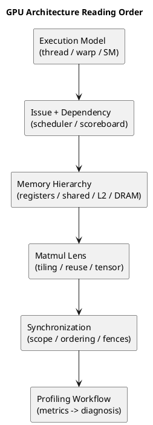

# 1. Executive Summary

- This post is the anchor map for the GPU architecture track in this blog.
- The main idea is simple: do not study GPU architecture as a list of blocks. Study it in the order that explains real performance behavior.
- The three most useful source families for this roadmap are:
  - `Streaming Multiprocessor` summary post for the execution lens
  - Aleksa Gordić's matmul article for the modern NVIDIA kernel lens
  - `General-Purpose Graphics Processor Architecture` for the structural baseline

# 2. Why This Series Exists

GPU architecture material often splits into two extremes.

- one side stays too high-level and stops at "many cores, many threads"
- the other side jumps straight into vendor-specific micro-details without giving a stable mental model

That is not a great way to learn if the goal is performance debugging.

For real optimization work, the useful order is:

1. understand execution granularity
2. understand issue and dependency control
3. understand memory movement and reuse
4. understand matmul as the best practical case study
5. understand synchronization and ordering as the consistency layer
6. connect all of that back to profiler signals

# 3. The Source Triangle

## 3.1 Execution Lens

- Reference post: [Streaming Multiprocessor](https://gkseofla7.tistory.com/4)

Why it matters:

- it is useful for building intuition around `SM`, `subcore`, `warp scheduling`, `dependency`, `fetch/decode/issue`, and the difference between active vs eligible work

Caution:

- some stage naming and micro-policy interpretation should be treated as inference, not public architectural contract

## 3.2 Kernel Lens

- Reference post: [Inside NVIDIA GPUs: Anatomy of high performance matmul kernels](https://www.aleksagordic.com/blog/matmul)

Why it matters:

- it is one of the best practical explanations of how modern high-performance GPU kernels actually exploit the architecture
- it naturally connects `tiling`, `shared memory`, `Tensor Cores`, `register pressure`, `TMA`, `persistent kernels`, and `cluster` execution

## 3.3 Baseline Architecture Lens

- Book: `General-Purpose Graphics Processor Architecture`

Why it matters:

- it gives the stable architectural skeleton: SIMT execution, control divergence, memory hierarchy, latency hiding, throughput orientation, and the basic tension between execution resources and data movement

This book is best used here as the baseline model, not as a chapter-by-chapter publishing template.

# 4. Recommended Learning Order

## 4.1 Stage 1: Execution Model

Start with:

- thread
- warp
- CTA/block
- SM
- subcore / scheduler view

Questions to answer first:

- what unit actually gets scheduled?
- what does "many threads in flight" really mean?
- why can high occupancy still produce low throughput?

## 4.2 Stage 2: Dependency and Issue

Then move to:

- instruction issue
- scoreboard / dependency handling
- fixed vs variable latency
- eligible warp vs resident warp

## 4.3 Stage 3: Memory Hierarchy and Data Movement

Then study:

- registers
- shared memory / L1
- L2
- DRAM
- coalescing
- reuse

## 4.4 Stage 4: Matmul as the Architecture Lens

Matmul is the best bridge between abstract architecture and real kernels because it exposes:

- tiling
- reuse
- shared memory staging
- register footprint
- Tensor Core pipelines
- producer/consumer specialization

## 4.5 Stage 5: Synchronization and Memory Ordering

Once the execution and memory models are clear, synchronization makes more sense:

- scope
- fence strength
- acquire/release
- block vs device vs system visibility

## 4.6 Stage 6: Profiling and Performance Diagnosis

Only after the above does the profiler become readable in a non-superficial way.

# 5. Proposed Post Structure for This Blog

## 5.1 Anchor Post

- this post

## 5.2 Series Entry: SM and Warp Scheduling

- existing post: `Worklog #09 - Practical Model of GPU SM and Warp Scheduling`

## 5.3 Series Entry: Systolic Arrays and Tensor Dataflow

- existing post: `Worklog #10 - Systolic Array: From Fundamentals to Production Mapping`

## 5.4 New Series Entry: Memory Hierarchy and Data Movement

- bridge between SM scheduling and kernel design

## 5.5 New Series Entry: Matmul as a GPU Architecture Lens

- architecture ideas through one concrete kernel family

## 5.6 New Series Entry: Hopper Matmul Kernel Anatomy

- TMA, warp specialization, persistent kernels, clusters

## 5.7 Series Entry: Synchronization Costs

- existing post: `Comparison - CUDA Synchronization Primitives: Scope, Fence, atomic_ref`

## 5.8 New Series Entry: Performance Debugging Checklist

- turn the whole series into a diagnosis workflow

# 6. Reading Paths by Goal

## 6.1 CUDA Kernel Tuning

1. this roadmap
2. SM scheduling
3. memory hierarchy
4. matmul lens
5. Hopper kernel anatomy
6. synchronization
7. performance checklist

## 6.2 Shader / Rendering Mental Models

1. this roadmap
2. SM scheduling
3. memory hierarchy
4. scalarization comparison
5. synchronization

## 6.3 Compiler / Codegen Thinking

1. this roadmap
2. systolic / tensor dataflow
3. matmul lens
4. Hopper kernel anatomy
5. synchronization

# 7. Diagram

# 8. Code to Inspect

- Repo: `D:\blog\techblog`
- Related posts:
  - `posts/worklog/2026-03-03-worklog-09-gpu-sm-architecture-and-warp-scheduling/`
  - `posts/worklog/2026-03-08-worklog-10-systolic-array-fundamentals/`
  - `posts/comparison/gpu-architecture/2026-04-04-comparison-cuda-synchronization-primitives-scope-fence-atomic-ref/`
  - `posts/comparison/gpu-architecture/2026-03-26-comparison-vega-gcn-rdna-vs-nvidia-scalarization/`

# 9. Reference Materials

| Type | Title | Link | Why it matters |
|---|---|---|---|
| article | Streaming Multiprocessor | https://gkseofla7.tistory.com/4 | Practical SM/subcore/warp scheduling intuition |
| article | Inside NVIDIA GPUs: Anatomy of high performance matmul kernels | https://www.aleksagordic.com/blog/matmul | Modern kernel design view of NVIDIA GPUs |
| book | General-Purpose Graphics Processor Architecture | print / book reference | Stable baseline architecture lens |
| doc | CUDA C++ Programming Guide | https://docs.nvidia.com/cuda/cuda-c-programming-guide/ | CUDA execution and memory model baseline |
| doc | CUDA Best Practices Guide | https://docs.nvidia.com/cuda/cuda-c-best-practices-guide/ | Practical optimization guidance |

# 10. Evidence Mapping

| Claim | Anchor | Source |
|---|---|---|
| Execution should be studied before kernel micro-optimization | SM and scheduling first | book + SM summary post |
| Memory movement explains more performance behavior than raw ALU counts | hierarchy before matmul tuning | book + matmul article |
| Matmul is the best practical architecture case study | tiling / reuse / Tensor Core / TMA | matmul article |
| Synchronization should be taught after execution and memory | scope and ordering rely on visibility model | CUDA docs + sync article |
