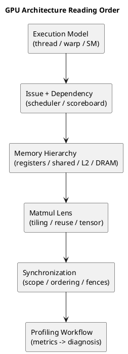

# 1. Executive Summary

- 이 글은 블로그의 GPU 아키텍처 트랙을 위한 앵커 글이다.
- 핵심 생각은 단순하다. GPU 아키텍처를 블록 이름 암기처럼 배우지 말고, 실제 성능이 왜 그렇게 나오는지를 설명하는 순서로 공부하자는 것이다.
- 이 시리즈의 중심 소스는 세 갈래다.
  - `Streaming Multiprocessor` 글은 실행 모델 관점
  - Aleksa Gordić의 matmul 글은 현대 NVIDIA 커널 관점
  - `General-Purpose Graphics Processor Architecture` 책은 기본 골격 관점

# 2. 왜 이런 시리즈가 필요한가

GPU 아키텍처 자료는 자주 두 극단으로 갈린다.

- 하나는 너무 개괄적이라서 "코어가 많고 스레드가 많다" 수준에서 멈춘다.
- 다른 하나는 특정 세대의 미세구조 디테일로 바로 뛰어들어, 안정적인 사고 틀 없이 세부사항만 남긴다.

실무적으로는 다음 순서가 가장 유용하다.

1. 실행 단위를 이해한다
2. issue와 dependency를 이해한다
3. 메모리 이동과 reuse를 이해한다
4. matmul을 통해 실제 커널로 연결한다
5. synchronization과 memory ordering을 일관성 계층으로 이해한다
6. 마지막으로 profiler 지표와 연결한다

# 3. 이 시리즈의 세 가지 축

## 3.1 실행 모델 축

- 참고 글: [Streaming Multiprocessor](https://gkseofla7.tistory.com/4)

이 글이 좋은 이유:

- `SM`, `subcore`, `warp scheduling`, `dependency`, `fetch/decode/issue`, `active vs eligible` 같은 개념을 실제 성능 해석과 연결해준다.

## 3.2 커널 설계 축

- 참고 글: [Inside NVIDIA GPUs: Anatomy of high performance matmul kernels](https://www.aleksagordic.com/blog/matmul)

이 글이 좋은 이유:

- 현대 NVIDIA GPU에서 고성능 커널이 실제로 어떤 방식으로 아키텍처를 활용하는지 보여준다.
- `tiling`, `shared memory`, `Tensor Core`, `register pressure`, `TMA`, `persistent kernel`, `cluster`가 어떻게 하나의 설계로 묶이는지 볼 수 있다.

## 3.3 기본 골격 축

- 책: `General-Purpose Graphics Processor Architecture`

이 책이 좋은 이유:

- SIMT 실행, divergence, memory hierarchy, latency hiding, throughput-oriented design 같은 기본 구조를 안정적으로 잡아준다.

# 4. 추천 학습 순서

## 4.1 1단계: 실행 모델

- thread
- warp
- CTA/block
- SM
- subcore / scheduler 관점

## 4.2 2단계: dependency와 issue

- instruction issue
- scoreboard / dependency
- fixed latency vs variable latency
- resident warp vs eligible warp

## 4.3 3단계: 메모리 계층과 데이터 이동

- register
- shared memory / L1
- L2
- DRAM
- coalescing
- reuse

## 4.4 4단계: Matmul을 아키텍처 렌즈로 보기

- tiling
- reuse
- shared memory staging
- register footprint
- Tensor Core pipeline
- producer/consumer specialization

## 4.5 5단계: synchronization과 memory ordering

- scope
- fence strength
- acquire/release
- block vs device vs system visibility

## 4.6 6단계: profiling과 성능 진단

- `Eligible Warps per Scheduler`
- `Long Scoreboard`
- `Memory Dependency`
- pipeline saturation
- register pressure
- occupancy limit

# 5. 블로그용 구성 제안

## 5.1 앵커 글

- 이 글

## 5.2 시리즈 앞부분: SM과 warp scheduling

- 기존 글: `Worklog #09 - GPU SM 구조와 워프 스케줄링 실전 정리`

## 5.3 시리즈 앞부분: Systolic Array와 tensor dataflow

- 기존 글: `Worklog #10 - Systolic Array: 기초부터 실전 매핑까지`

## 5.4 새 글: Memory hierarchy와 data movement

- SM scheduling과 커널 설계 사이를 연결한다

## 5.5 새 글: Matmul로 보는 GPU 아키텍처

- 아키텍처 개념을 하나의 대표 커널군으로 묶는다

## 5.6 새 글: Hopper matmul kernel anatomy

- TMA, warp specialization, persistent kernel, cluster

## 5.7 시리즈 후반부: synchronization cost

- 기존 글: `Comparison - CUDA Synchronization Primitives: Scope, Fence, atomic_ref`

## 5.8 새 글: Performance debugging checklist

- 시리즈 전체를 진단 루프로 마무리한다

# 6. 목적별 추천 읽기 순서

## 6.1 CUDA 커널 튜닝

1. 이 로드맵
2. SM scheduling
3. memory hierarchy
4. matmul lens
5. Hopper kernel anatomy
6. synchronization
7. performance checklist

## 6.2 셰이더 / 렌더링 관점

1. 이 로드맵
2. SM scheduling
3. memory hierarchy
4. scalarization 비교
5. synchronization

## 6.3 컴파일러 / codegen 관점

1. 이 로드맵
2. systolic / tensor dataflow
3. matmul lens
4. Hopper kernel anatomy
5. synchronization

# 7. Diagram

# 8. Code to Inspect

- Repo: `D:\blog\techblog`
- 관련 글:
  - `posts/worklog/2026-03-03-worklog-09-gpu-sm-architecture-and-warp-scheduling/`
  - `posts/worklog/2026-03-08-worklog-10-systolic-array-fundamentals/`
  - `posts/comparison/gpu-architecture/2026-04-04-comparison-cuda-synchronization-primitives-scope-fence-atomic-ref/`
  - `posts/comparison/gpu-architecture/2026-03-26-comparison-vega-gcn-rdna-vs-nvidia-scalarization/`

# 9. Reference Materials

| Type | Title | Link | Why it matters |
|---|---|---|---|
| article | Streaming Multiprocessor | https://gkseofla7.tistory.com/4 | SM/subcore/warp scheduling 직관 |
| article | Inside NVIDIA GPUs: Anatomy of high performance matmul kernels | https://www.aleksagordic.com/blog/matmul | 현대 NVIDIA 커널 설계 관점 |
| book | General-Purpose Graphics Processor Architecture | print / book reference | 안정적인 기본 골격 |
| doc | CUDA C++ Programming Guide | https://docs.nvidia.com/cuda/cuda-c-programming-guide/ | CUDA 실행/메모리 모델 기본 문서 |
| doc | CUDA Best Practices Guide | https://docs.nvidia.com/cuda/cuda-c-best-practices-guide/ | 실무 최적화 기준 |

# 10. Evidence Mapping

| Claim | Anchor | Source |
|---|---|---|
| 실행 모델을 먼저 공부해야 한다 | SM and scheduling first | 책 + SM 글 |
| 메모리 이동이 raw ALU보다 더 많은 성능 현상을 설명한다 | hierarchy before matmul tuning | 책 + matmul 글 |
| matmul은 GPU 아키텍처를 설명하는 가장 좋은 사례다 | tiling / reuse / Tensor Core / TMA | matmul 글 |
| synchronization은 execution/memory 모델 뒤에 와야 한다 | visibility와 ordering이 선행 개념에 의존 | CUDA docs + sync 글 |
