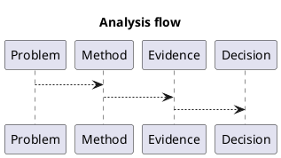

# 1. Executive Summary

- Core claim: vAI compute path starts with both CUDA and Vulkan backends. The immediate objective is to isolate one-time initialization cost and first-dispatch latency.
- Primary metric: `kernel time (ms) or throughput (ops/s)`
- Baseline -> current: `TBD -> TBD` (delta `TBD%`)
- Evidence status: `in progress (wip)`; attach profiler/IR/benchmark logs before marking stable.

# 2. Problem and Scope

- Problem statement: this post documents a concrete issue and the reasoning path used to analyze it.
- In scope: the key mechanism, evidence path, and practical implications.
- Out of scope: exhaustive architecture-wide benchmarking unless explicitly included below.

# 3. Method and Setup

- Category/Track/Series: `worklog` / `api-language` / `gpu`
- Validation approach: tie claims to code, metrics, and profiler or compiler evidence where available.
- Reproducibility target: make each major claim testable with explicit setup and follow-up actions.

# 4. Detailed Notes

# Context

vAI compute path starts with both CUDA and Vulkan backends. The immediate objective is to isolate one-time initialization cost and first-dispatch latency.

# Hypothesis

- CUDA should have shorter host-side setup code.
- Vulkan should require more explicit setup but offer cleaner control over resource and synchronization ownership.

# Initialization Flow

## CUDA (runtime API)

1. `cudaGetDeviceCount`
2. `cudaSetDevice`
3. warm-up call (e.g. `cudaFree(0)`)
4. `cudaStreamCreate`
5. `cudaMalloc` / `cudaMemcpyAsync`
6. kernel launch and `cudaStreamSynchronize`

## Vulkan (compute path)

1. `vkCreateInstance`
2. `vkEnumeratePhysicalDevices` and pick NVIDIA GPU
3. `vkCreateDevice` + compute queue
4. buffer creation and memory bind
5. descriptor set and compute pipeline creation
6. command buffer record with `vkCmdDispatch`
7. `vkQueueSubmit` + fence wait

# Result Snapshot

| Metric | CUDA | Vulkan |
|---|---:|---:|
| Host init LOC (rough) | 40 | 140 |
| First dispatch latency (ms) | TBD | TBD |
| Steady-state kernel time (ms) | TBD | TBD |

# Analysis

Both paths converge to the same NVIDIA hardware execution resources. Major performance differences are expected from kernel/data movement design rather than API label.

# Next

1. Measure first-dispatch latency with cold and warm driver states.
2. Add Nsight and RenderDoc captures for matching workloads.

# 5. Decision and Next Actions

- Decision: keep this post as `wip` until all major claims are backed by explicit measurable evidence.

1. Convert the key claims above into a compact metric or evidence table.
2. Add at least one reproducible command sequence (build/run/profile).
3. Add one explicit follow-up experiment with pass/fail criteria.

# 6. Diagram (Optional)

