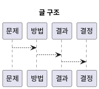

# 1. Executive Summary

- 핵심 주장: vAI의 CUDA/Vulkan 백엔드에서 첫 실행 지연과 초기화 비용을 분리해서 확인한다.
- 주요 수치: `측정 전(ms) / 처리량(ops/s)`
- 변화량: `TBD -> TBD` (변화 `TBD%`)
- 주의점: `현재 측정 전(wip)`; stable 표기를 위해 수치/IR/로그 검증이 더 필요하다.

# 2. Problem and Scope

- 문제 정의: CUDA와 Vulkan의 초기화 경로를 비교할 때 무엇이 첫 실행 지연을 만드는지 분리해서 본다.
- 중요성: 구현 복잡도, 유지보수, 초기 응답성 관점의 차이를 정리한다.
- 성공 기준: cold/warm 초기화 단계를 분리해 후속 측정 계획으로 연결한다.

# 3. Method and Setup

- Category/Track/Series: `worklog` / `api-language` / `gpu`
- 환경 요약: 하드웨어, 드라이버, 런타임, 측정 범위를 함께 기록한다.
- 재현 방법: 동일한 초기화 절차를 반복 확인할 수 있도록 단계별로 남긴다.

# 4. Detailed Notes

# 맥락

vAI의 CUDA/Vulkan 백엔드에서 첫 실행 지연과 초기화 비용을 분리해서 확인한다.

# 가설

- CUDA는 호스트 초기화 코드가 짧다.
- Vulkan은 설정이 길지만 리소스/동기화 제어가 더 명시적이다.

# 초기화 흐름 요약

## CUDA

1. `cudaGetDeviceCount`
2. `cudaSetDevice`
3. warm-up (`cudaFree(0)`)
4. `cudaStreamCreate`
5. `cudaMalloc`, `cudaMemcpyAsync`
6. kernel launch + sync

## Vulkan

1. `vkCreateInstance`
2. 물리 디바이스 선택
3. `vkCreateDevice`, queue 획득
4. buffer/memory 바인딩
5. pipeline + descriptor 생성
6. `vkCmdDispatch` 기록
7. `vkQueueSubmit` + fence wait

# 다음 액션

1. cold/warm 상태별 첫 dispatch 지연 측정
2. Nsight/RenderDoc으로 동일 워크로드 캡처

# 5. Decision and Next Actions

- 결정: 현재 결론은 `wip` 상태이며, 후속 측정으로 확정한다.

1. 핵심 가설을 수치와 로그로 검증한다.
2. 최소 1회 이상 빌드/실행/프로파일 절차를 기록한다.
3. pass/fail 기준을 정하고 다음 실험 1건을 연결한다.

# 6. Diagram (Optional)

