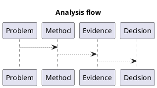

# 1. Executive Summary

- Core claim: Barrier placement in the Vulkan compute path may be over-conservative, reducing overlap opportunities.
- Primary metric: `kernel time (ms) or throughput (ops/s)`
- Baseline -> current: `TBD -> TBD` (delta `TBD%`)
- Evidence status: `in progress (wip)`; attach profiler/IR/benchmark logs before marking stable.

# 2. Problem and Scope

- Problem statement: this post documents a concrete issue and the reasoning path used to analyze it.
- In scope: the key mechanism, evidence path, and practical implications.
- Out of scope: exhaustive architecture-wide benchmarking unless explicitly included below.

# 3. Method and Setup

- Category/Track/Series: `worklog` / `api-language` / `gpu`
- Validation approach: tie claims to code, metrics, and profiler or compiler evidence where available.
- Reproducibility target: make each major claim testable with explicit setup and follow-up actions.

# 4. Detailed Notes

# Context

Barrier placement in the Vulkan compute path may be over-conservative, reducing overlap opportunities.

# Hypothesis

Narrower stage/access masks should preserve correctness while reducing synchronization overhead.

# Setup

- GPU: NVIDIA (target)
- API: Vulkan compute
- Capture: RenderDoc + timestamp queries

# Result Snapshot

| Scenario | Baseline (ms) | Updated (ms) | Delta |
|---|---:|---:|---:|
| Dispatch chain A | TBD | TBD | TBD |
| Dispatch chain B | TBD | TBD | TBD |

# Next

1. Cross-check correctness under stress frames.
2. Compare equivalent sync intent in CUDA stream/event model.

# 5. Decision and Next Actions

- Decision: keep this post as `wip` until all major claims are backed by explicit measurable evidence.

1. Convert the key claims above into a compact metric or evidence table.
2. Add at least one reproducible command sequence (build/run/profile).
3. Add one explicit follow-up experiment with pass/fail criteria.

# 6. Diagram (Optional)

