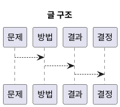

# 1. Executive Summary

- 핵심 주장: 현재 Vulkan compute 경로에서 배리어 범위가 과도할 가능성이 있다.
- 주요 수치: `측정 전(ms) / 처리량(ops/s)`
- 변화량: `TBD -> TBD` (변화 `TBD%`)
- 주의점: `현재 측정 전(wip)`; stable 표기를 위해 수치/IR/로그 검증이 더 필요하다.

# 2. Problem and Scope

- 문제 정의: Vulkan compute 경로의 배리어 범위가 실제 필요보다 넓은지 점검한다.
- 중요성: 불필요한 동기화는 GPU 유휴 시간과 파이프라인 정체를 만든다.
- 성공 기준: 현재 배리어 의도와 실제 필요한 범위를 분리해 후속 검증 항목으로 남긴다.

# 3. Method and Setup

- Category/Track/Series: `worklog` / `api-language` / `gpu`
- 환경 요약: 하드웨어, 드라이버, 런타임, 검토 대상을 함께 명시한다.
- 재현 방법: 현재 배리어 설정과 실행 경로를 추적할 수 있게 정리한다.

# 4. Detailed Notes

# 맥락

현재 Vulkan compute 경로에서 배리어 범위가 과도할 가능성이 있다.

# 가설

stage/access 범위를 줄이면 정확성을 유지하면서 지연을 낮출 수 있다.

# 결과 스냅샷

| 시나리오 | 기존(ms) | 변경(ms) | 변화 |
|---|---:|---:|---:|
| Dispatch chain A | TBD | TBD | TBD |
| Dispatch chain B | TBD | TBD | TBD |

# 다음 액션

1. stress frame에서 정확성 재검증
2. CUDA stream/event 동기화와 대응 비교

# 5. Decision and Next Actions

- 결정: 현재 결론은 `wip` 상태이며, 후속 측정으로 확정한다.

1. 핵심 가설을 수치와 로그로 검증한다.
2. 최소 1회 이상 빌드/실행/프로파일 절차를 기록한다.
3. pass/fail 기준을 정하고 다음 실험 1건을 연결한다.

# 6. Diagram (Optional)

