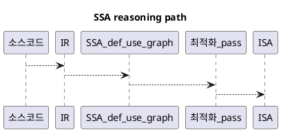

# 1. Executive Summary

- 핵심 주장: SSA는 컴파일러 최적화 결과를 일관되게 해석하기 위한 최소 단위 모델이다.
- 주요 수치: 이번 글은 개념 정리 중심이라 정량 벤치마크는 아직 없다.
- 신뢰도: 의미론(semantics)은 높음, 성능 영향은 후속 실험 전까지 중간.
- 주의점: 이 글은 pass별 성능 비교가 아니라 IR 해석 프레임 정립이 목적이다.

# 2. Problem Statement

최적화 결과를 읽을 때 가장 자주 막히는 지점은 값의 정체성이다.
재할당이 반복되면 다음 질문에 답하기 어려워진다.

- 이 use가 정확히 어떤 def를 참조하는가?
- 분기 합류 지점에서 값 선택이 어떻게 이루어지는가?
- 어떤 이유로 특정 계산이 제거/이동/치환되었는가?

vAI 관점에서 이 문제는 소스 변경이 최종 기계어 동작에 어떻게 연결되는지 설명 가능성을 좌우한다.

# 3. Hypothesis

- 1차 가설: SSA 관점으로 모델을 고정하면 최적화 결과를 기계적으로 추적할 수 있다.
- 2차 가설: SSA 이해도가 높을수록 GPU 저수준 분석(IR -> ISA) 품질도 올라간다.
- 근거: def-use chain과 phi 기반 merge가 데이터 흐름의 모호성을 크게 줄인다.

# 4. Environment and Reproducibility

| Item | Value |
|---|---|
| Compiler ecosystem | LLVM/Clang 모델 |
| Target representation | LLVM IR (SSA 기반) |
| Scope | 의미론 + 분석 절차 |
| Measurement | 개념 검증 + IR 확인 커맨드 |

# 5. Baseline

## 5.1 재할당 중심 모델 (비-SSA 관점)

```text
y = 1
y = 2
x = y
```

이 형태에서는 `y`가 시간축에 따라 다른 의미를 가지므로 값 출처를 문맥으로 추론해야 한다.

## 5.2 SSA 모델

```text
y1 = 1
y2 = 2
x1 = y2
```

이 형태에서는 `x1`의 입력이 `y2`임이 즉시 드러난다.

# 6. Change Introduced

이번 글에서 고정한 규칙은 아래와 같다.

1. 각 변수 버전은 한 번만 정의된다.
2. 모든 use는 자신의 def 이후에 위치한다.
3. 분기 합류는 `phi`로 표현한다.

분기 합류 예시:

```c
if (cond) {
  y = 10;
} else {
  y = 20;
}
x = y + 1;
```

SSA 유사 표현:

```text
if (cond) {
  y1 = 10
} else {
  y2 = 20
}
y3 = phi(y1, y2)
x1 = y3 + 1
```

# 7. Experiment Matrix (개념 검증)

| Case ID | 질문 | 기대 신호 |
|---|---|---|
| A | 각 use를 단일 def에 매핑할 수 있는가? | yes |
| B | 분기 합류 의존성을 모호성 없이 표현 가능한가? | yes (`phi`) |
| C | 대표 최적화 pass의 전제조건을 def-use 그래프에서 바로 확인 가능한가? | yes |

# 8. Results

| Metric | Baseline | Current | Delta | Delta % |
|---|---:|---:|---:|---:|
| 정의 출처 모호성 | 높음 | 낮음 | 질적 개선 | n/a |
| 합류 지점 해석 명확성 | 낮음 | 높음 | 질적 개선 | n/a |
| 최적화 전제조건 가독성 | 중간 | 높음 | 질적 개선 | n/a |

# 9. Evidence

## 9.1 최적화 Pass와의 결합

SSA는 다음 pass 해석에 직접 유리하다.

- Constant Propagation
- Dead Code Elimination (DCE)
- Global Value Numbering (GVN)
- Loop-Invariant Code Motion (LICM)

공통 이유는 명확한 def-use 구조다.

## 9.2 LLVM 관점

LLVM IR은 SSA 기반이다.
초기 메모리 형태(`alloca/load/store`)는 `mem2reg` 같은 pass를 통해 SSA register 형태로 승격된다.
즉 SSA는 이론이 아니라 실제 최적화 파이프라인의 중심 구조다.

## 9.3 GPU/저수준 분석과 연결

SSA 이해는 GPU 코드 생성 분석에서도 유효하다.

- 분기 합류 값이 predication과 어떻게 연결되는지
- 값 수명(lifetime)이 레지스터 압박으로 어떻게 이어지는지
- IR 변환이 최종 ISA(예: SASS)에 어떤 영향을 주는지

# 10. Analysis

이번 정리의 핵심 성과는 속도 향상이 아니라 설명 가능성 향상이다.
데이터 흐름이 명확해지면 pass 결과를 재현 가능하게 해석할 수 있고, 회귀 원인 추적도 빨라진다.

한계는 명확하다. 정량 성능 데이터는 아직 없고, 후속 포스트에서 실제 워크로드로 검증이 필요하다.

# 11. Decision

- 채택 여부: 채택.
- 적용 범위: 컴파일러 관련 워크로그는 SSA-first 설명 구조를 기본으로 한다.
- 보완 전략: 소스 레벨 설명이 모호하면 LLVM IR을 직접 확인해 def-use 기준으로 다시 해석한다.

# 12. Next Actions

1. `alloca/load/store` 예제에서 `mem2reg` 전/후 IR 차이를 실제로 기록한다.
2. SSA 수준 변환 1개를 GPU ISA 변화와 연결한 사례 포스트를 작성한다.
3. 최적화 주장마다 관련 def-use chain을 명시하는 체크리스트를 추가한다.

# 13. Code to Inspect

- Repo: this blog repository
- Branch/Commit: `main` / current head
- Paths:
  - `posts/worklog/2026-03-01-worklog-08-compiler-ssa-basics/`
- Key symbols:
  - `phi`
  - `mem2reg`
  - def-use chain

# 14. Reference Materials

| Type | Title | Link | Why it matters |
|---|---|---|---|
| note | SSA 기초 정리 노트 | https://lifeisforu.tistory.com/507 | 초기 정리 기준점 |
| doc | LLVM Language Reference Manual | https://llvm.org/docs/LangRef.html | IR 의미론 기준 문서 |
| doc | LLVM Passes Reference | https://llvm.org/docs/Passes.html | pass와 SSA 연결 관점 |
| article | Static single-assignment form | https://en.wikipedia.org/wiki/Static_single-assignment_form | 개념 빠른 리프레시 |

# 15. Diagram (Optional)



# 16. Appendix

## 16.1 최소 확인 커맨드

```bash
# LLVM IR 생성
clang -S -emit-llvm sample.c -o sample.ll

# mem2reg 적용
opt -passes=mem2reg sample.ll -S -o sample.mem2reg.ll
```
