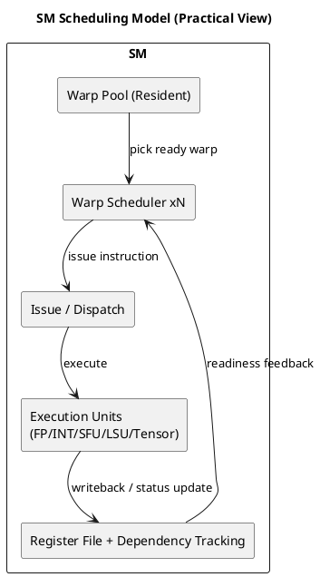

# 1. Executive Summary

- Core claim: for performance debugging, SM should be modeled as a **warp scheduling + dependency management** system, not just a "core count."
- Goal: connect SM internals to profiling signals you actually use in optimization loops.
- Scope: clearly separate documented facts from reverse-engineering style inference.

# 2. Why This Matters

Common mistakes in kernel tuning:

1. "Higher occupancy always means higher performance."
2. "Warp execution is straightforwardly sequential."
3. "Low SM utilization always means compute shortage."

In practice:

- active warps can be high while eligible warps stay low,
- resident warps can still be blocked by dependency or memory wait,
- throughput can be limited by issue readiness, not arithmetic peak.

# 3. Practical SM Model

| Block | Role | What to observe |
|---|---|---|
| Warp Scheduler | picks issue-eligible warp | Eligible Warps/Scheduler, Not Selected |
| Register/Dependency Tracking | readiness and hazards | scoreboard-related stalls |
| Execution Pipelines (FP/INT/SFU/LSU/Tensor) | actual execution | pipeline utilization |
| Shared/L1/L2/DRAM path | data delivery latency | memory dependency and cache behavior |

The fastest way to reason is:

- not "what is busy?" first,
- but "why issue is blocked?" first.

# 4. Warp Scheduling Facts and Interpretation

CUDA documentation explains that:

- warp context stays on chip,
- each issue opportunity selects an eligible warp for execution.

Public tuning guides (e.g., Volta/Ampere/Ada generation docs) support the practical view that:

- an SM uses multiple schedulers,
- schedulers continuously feed ready warps to hide latency.

So the robust mental model is:

- "multiple schedulers keep swapping ready warps," not "one warp linearly drives the SM."

# 5. Fetch/Decode/Issue: What to Keep, What to Mark as Inference

The referenced summary post is useful as a structural lens:

1. separate instruction fetch from issue decision,
2. treat dependency/control metadata as central in issue gating,
3. diagnose bottlenecks by eligibility, not just instruction presence.

Caution:

- some internal stage labels and handler names are not part of public architectural contracts,
- so writeups should explicitly label such pieces as inference.

# 6. Dependency-Centric Performance Debugging

Typical dependency forms:

- RAW
- WAR
- WAW

Even with short arithmetic latency, long dependency chains reduce issue eligibility.
Memory operations make this effect stronger due to much larger latency spread.

Key debugging questions:

1. why are active warps not eligible?
2. why are eligible warps not selected often enough?
3. if selected warps are high, which pipeline or memory level is now saturated?

# 7. Latency Hiding in Practice

From CUDA scheduling guidance:

- schedulers hide latency by switching to ready warps each issue opportunity.

Practical implications:

- occupancy is useful only if it increases the ready candidate pool,
- excessive register pressure can reduce resident warps and hurt hiding capacity,
- high occupancy alone cannot compensate when most warps are memory-stalled.

# 8. Nsight Compute Checklist

Use this order:

1. `SM Active`, `Achieved Occupancy`
2. `Eligible Warps per Scheduler`
3. warp stall breakdown:
   - `Long Scoreboard`
   - `Memory Dependency`
   - `Not Selected`
4. cross-check L1/L2/DRAM traffic and cache behavior

Example interpretation:

- high occupancy + low eligible + high long-scoreboard  
  -> likely memory-latency/dependency bottleneck
- medium occupancy + high eligible + saturated pipelines  
  -> approaching pipeline throughput limit

# 9. Applying This to Vector Add

Vector add is usually memory-dominant.
SM-side expectation:

- occupancy alone may not move performance much,
- coalescing quality, access regularity, and dependency shortening matter more.

The right interpretation is often:

- not "SM has spare cores,"
- but "warps are waiting, so issue opportunities are underutilized."

# 10. Diagram

# 11. References

- Reference summary post: https://gkseofla7.tistory.com/4
- CUDA C++ Programming Guide:  
  https://docs.nvidia.com/cuda/cuda-c-programming-guide/
- NVIDIA Volta Tuning Guide:  
  https://docs.nvidia.com/cuda/volta-tuning-guide/
- NVIDIA Ampere Tuning Guide:  
  https://docs.nvidia.com/cuda/ampere-tuning-guide/
- NVIDIA Ada Tuning Guide:  
  https://docs.nvidia.com/cuda/ada-tuning-guide/

# 12. Next Actions

1. pick one vAI kernel and collect warp stall breakdown in Nsight Compute,
2. compare `Eligible Warps per Scheduler` and `Long Scoreboard` before/after changes,
3. isolate optimization effects by separating memory-pattern, register-pressure, and ILP experiments.
