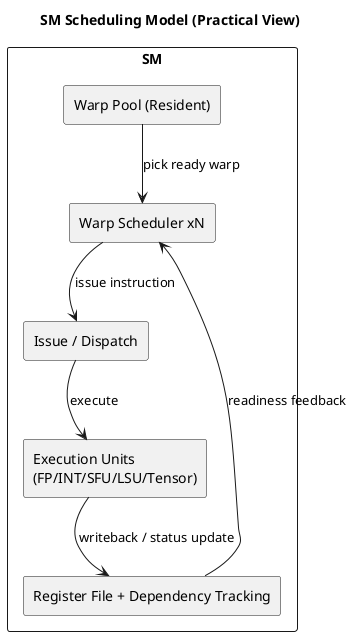

# 1. Executive Summary

- 핵심 주장: SM(Streaming Multiprocessor)은 단순한 "코어 수"가 아니라, **워프 스케줄링 + 의존성 관리 + 실행 자원 경쟁 제어** 관점으로 봐야 실제 성능 병목을 읽을 수 있다.
- 이 글의 목적: SM 내부 동작을 프로파일링 지표와 연결해서 실무에서 바로 쓰는 판단 프레임을 정리한다.
- 범위: NVIDIA CUDA 문서 기준의 공개 정보와, 공개 자료를 바탕으로 한 추론 모델을 구분해서 설명한다.

# 2. 왜 SM을 다시 봐야 하는가

커널 최적화에서 자주 생기는 오해는 다음과 같다.

1. "Occupancy만 높이면 성능도 오른다."
2. "워프는 순서대로 실행되니 코드 순서만 보면 된다."
3. "SM 사용률이 낮으면 계산 유닛이 부족한 것이다."

실제로는 그렇지 않다.

- `Active Warp`와 `Eligible Warp`는 다르다.
- 워프가 resident 상태라도 의존성이나 메모리 대기 때문에 issue가 불가능할 수 있다.
- 병목은 계산 자원 부족보다 scoreboard 대기나 memory dependency에서 더 자주 나온다.

# 3. SM을 보는 실무 모델

| 블록 | 역할 | 실무에서 볼 신호 |
|---|---|---|
| Warp Scheduler | 실행 가능한 워프 선택, 명령어 issue | Eligible Warps/Scheduler, Not Selected |
| Register / Dependency Tracking | readiness와 hazard 추적 | scoreboard 계열 stall |
| Execution Pipelines | FP/INT/SFU/LSU/Tensor 실행 | 파이프 utilization |
| Shared/L1/L2/DRAM 경로 | 데이터 공급 | memory dependency, cache behavior |

실무 요점은 단순하다.

- 먼저 "무엇이 바쁜가"보다
- "왜 issue가 막히는가"를 본다

# 4. 워프 스케줄링: 공개 사실과 해석 범위

CUDA 문서는 다음을 분명히 말한다.

- 워프 컨텍스트는 온칩에 유지된다.
- 각 issue 기회마다 scheduler가 실행 가능한 워프를 선택한다.

Volta/Ampere/Ada 세대 문서를 실무 관점으로 요약하면:

- 하나의 SM에는 여러 scheduler가 있다.
- scheduler는 ready 상태의 warp를 계속 교체하며 지연을 숨긴다.

즉 실무 모델은

- "한 워프가 SM을 선형으로 끌고 간다"가 아니라
- "여러 scheduler가 준비된 warp를 번갈아 issue한다"

에 가깝다.

# 5. Fetch / Decode / Issue를 어떻게 이해할 것인가

참고 글인 `Streaming Multiprocessor`는 다음 해석 틀을 주는 데 유용하다.

1. Fetch와 Issue를 분리해서 본다.
2. Decode 단계의 제어 정보와 의존성 정보가 중요하다.
3. 실제 병목은 "명령어가 존재하느냐"보다 "지금 issue 가능하냐"에서 결정된다.

다만 주의할 점도 있다.

- 세부 stage 이름
- 특정 dependence handler 명칭
- 구체적 micro-policy

이런 것들은 공개 스펙이 아니라 추론 모델일 수 있다.  
그래서 글을 쓸 때는 문서상 사실과 추론을 반드시 분리해야 한다.

# 6. 데이터 의존성과 성능 디버깅

GPU에서 자주 만나는 의존성 형태:

- RAW
- WAR
- WAW

연산 지연이 짧아도 의존성 체인이 길면 warp는 ready 상태가 아니다.  
메모리 로드처럼 지연 시간이 큰 연산은 이 문제를 더 심하게 만든다.

그래서 실무 디버깅 질문은 다음으로 정리된다.

1. 왜 warp가 active인데 eligible하지 않은가?
2. eligible한데 왜 selected되지 않는가?
3. selected가 충분한데도 처리량이 안 오르면 어떤 파이프나 메모리 단계가 포화됐는가?

# 7. Latency Hiding의 실전 해석

Programming Guide의 설명을 실무 감각으로 바꾸면 이렇다.

- scheduler는 매 issue 기회마다 ready warp를 골라 latency를 숨긴다.
- arithmetic latency가 짧아도 memory latency가 길면 충분한 warp 수나 ILP가 필요하다.

정리하면:

- occupancy를 올리는 이유는 숫자 자체가 아니라 ready 후보군을 늘리기 위해서다.
- register를 과도하게 쓰면 resident warp 수가 줄어 숨길 수 있는 지연도 줄어든다.
- occupancy가 높아도 대부분의 warp가 memory-stalled이면 큰 효과가 없다.

# 8. Nsight Compute 체크리스트

다음 순서로 보는 편이 안정적이다.

1. `SM Active`, `Achieved Occupancy`
2. `Eligible Warps per Scheduler`
3. warp stall breakdown
   - `Long Scoreboard`
   - `Memory Dependency`
   - `Not Selected`
4. L1/L2/DRAM traffic와 cache behavior

예시 해석:

- occupancy 높음 + eligible 낮음 + long scoreboard 높음  
  -> memory latency / dependency bottleneck 가능성 큼
- occupancy 중간 + eligible 높음 + pipeline utilization 포화  
  -> 계산 파이프 또는 issue 한계에 접근 중

# 9. Vector Add에 적용하면

vector add는 대개 메모리 지배적이다.  
SM 관점에서 기대되는 현상은 다음과 같다.

- occupancy를 조금 더 올려도 큰 차이가 없을 수 있다.
- coalescing 품질, 접근 규칙성, 의존성 단축이 더 중요하다.

즉 올바른 해석은

- "코어가 남는다"가 아니라
- "warp가 기다리고 있어서 issue 기회가 비어 있다"

에 가깝다.

# 10. Diagram

# 11. Series Context

이 글은 이제 GPU 아키텍처 시리즈의 첫 실행 모델 글 역할을 한다.

추천 읽기 순서:

1. `Comparison - GPU Architecture Reading Map: SM, Memory, Matmul, Synchronization`
2. 이 글
3. `Worklog #11 - GPU 메모리 계층과 데이터 이동`
4. `Worklog #12 - Matmul로 보는 GPU 아키텍처`

이 글의 역할:

- SM을 성능 디버깅 관점에서 다시 정의한다
- warp scheduling과 dependency를 profiler 지표와 연결한다
- memory hierarchy와 kernel design으로 넘어갈 준비를 만든다

# 12. References

- 참고 정리 글: https://gkseofla7.tistory.com/4
- General-Purpose Graphics Processor Architecture (book baseline)
- CUDA C++ Programming Guide:  
  https://docs.nvidia.com/cuda/cuda-c-programming-guide/
- NVIDIA Volta Tuning Guide:  
  https://docs.nvidia.com/cuda/volta-tuning-guide/
- NVIDIA Ampere Tuning Guide:  
  https://docs.nvidia.com/cuda/ampere-tuning-guide/
- NVIDIA Ada Tuning Guide:  
  https://docs.nvidia.com/cuda/ada-tuning-guide/

# 13. Next Actions

1. vAI 커널 하나를 골라 Nsight Compute에서 warp stall breakdown을 수집한다.
2. 변경 전후 `Eligible Warps per Scheduler`, `Long Scoreboard`를 비교한다.
3. 최적화 항목을 memory pattern, register pressure, ILP 실험으로 분리한다.
