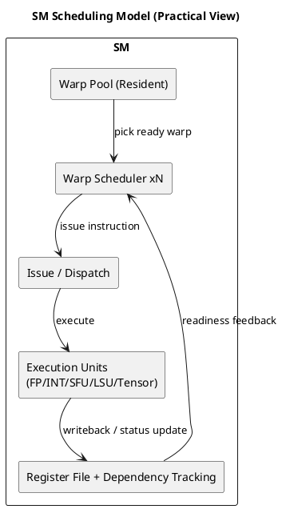

# 1. Executive Summary

- 핵심 주장: SM(Streaming Multiprocessor)을 "코어 개수"가 아니라 "워프 스케줄러 + 의존성 관리 + 자원 경합 제어" 관점으로 봐야 실제 성능 병목을 정확히 잡을 수 있습니다.
- 이 글의 목적: SM 내부 동작을 프로파일링 지표와 연결해, 실무에서 바로 쓰는 판단 프레임을 정리합니다.
- 범위: NVIDIA CUDA 문서 기준의 확정 정보 + 공개 자료 기반의 합리적 추론 모델을 구분해서 설명합니다.

# 2. 왜 SM을 다시 봐야 하는가

커널 최적화에서 자주 생기는 오해는 다음과 같습니다.

1. "Occupancy만 높이면 성능이 오른다."
2. "워프는 순서대로 실행되니 코드 순서만 보면 된다."
3. "SM 사용률이 낮으면 연산 유닛이 부족한 것이다."

실제로는,

- **Active Warp 수**와 **Eligible Warp 수**가 다를 수 있고,
- 워프는 동시에 resident 상태여도 **의존성/메모리 대기**로 Issue 불가 상태일 수 있으며,
- 병목은 연산 유닛이 아니라 **scoreboard 대기, 메모리 지연, 스케줄러 선택 실패**에서 나오는 경우가 많습니다.

# 3. SM을 보는 실무용 모델

| 블록 | 역할 | 실무에서 보는 신호 |
|---|---|---|
| Warp Scheduler | 실행 가능한 워프 선택, 명령어 Issue | Eligible Warps/Scheduler, Stall Not Selected |
| Register File + Scoreboard(개념) | 레지스터 의존성/준비 상태 추적 | Short/Long Scoreboard 계열 stall |
| LSU / SFU / FP32 / Tensor | 실제 연산/메모리 파이프 실행 | 파이프별 utilization, memory latency |
| Shared Memory / L1 / L2 경로 | 데이터 공급 | memory dependency, cache hit/miss 패턴 |

실무 포인트는 단순합니다.

- "무엇이 바쁜가?"보다 "왜 Issue를 못 하는가?"를 먼저 봅니다.

# 4. 워프 스케줄링: 핵심 사실과 해석 범위

CUDA Programming Guide의 핵심 문장은 다음 의미를 갖습니다.

- 워프 컨텍스트는 온칩에 유지되고,
- instruction issue 시점마다 warp scheduler가 "지금 실행 가능한 워프"를 고릅니다.

또한 Volta 계열 문서/가이드에서 확인되는 중요한 관찰은:

- SM 내 스케줄러가 여러 개이고,
- 각 스케줄러가 워프 집합을 담당해 Issue를 수행한다는 점입니다.

즉, SM은 "한 시점에 하나의 워프만 일한다"는 단순 모델보다,
"복수 스케줄러가 준비된 워프를 계속 교체하며 파이프를 채운다"는 모델이 더 실무적입니다.

# 5. Fetch/Decode/Issue를 어떻게 이해할 것인가

레퍼런스 글(Streaming Multiprocessor 정리 글)의 큰 흐름은 다음 해석에 유용합니다.

1. Fetch와 Issue는 논리적으로 분리해서 본다.
2. Decode 시점에 의존성 제어 정보(혹은 그에 준하는 제어 메타데이터)가 의미를 가진다.
3. 실제 병목은 "명령어가 존재하느냐"보다 "지금 Issue 가능한가"에서 결정된다.

주의할 점:

- 세부 단계 이름이나 내부 핸들러 명칭(CGGTY, 특정 dependence handler 등)은 공개 스펙이 아닌 경우가 많습니다.
- 따라서 문서화할 때는 "확정 사실"과 "합리적 추론 모델"을 구분해 써야 합니다.

# 6. 데이터 의존성: 성능 디버깅의 중심

GPU에서 가장 자주 만나는 의존성 형태:

- RAW(Read After Write)
- WAR(Write After Read)
- WAW(Write After Write)

연산 지연이 짧아도(예: ALU) 의존성 체인이 길면 워프는 ready가 아니게 됩니다.
메모리 로드처럼 지연이 큰 연산은 더 직접적으로 scoreboarding stall을 유발합니다.

결국 커널 튜닝은 다음 질문으로 귀결됩니다.

1. 워프가 active인데 왜 eligible이 아닌가?
2. eligible인데 왜 selected가 적은가?
3. selected가 높아도 왜 처리량이 안 오르는가? (메모리/파이프 포화 확인)

# 7. Latency Hiding의 실전 해석

Programming Guide의 설명을 실무식으로 줄이면:

- 스케줄러는 매 이슈 시점마다 ready 워프를 골라 지연을 숨깁니다.
- arithmetic latency가 짧아도, 메모리 지연은 훨씬 길어 더 많은 워프/ILP가 필요합니다.

간단한 실무 규칙:

- Occupancy를 올리는 이유는 "숫자 자체"가 아니라 **ready 후보 풀을 확보**하기 위해서입니다.
- 레지스터 과다 사용으로 resident warp가 줄면, 지연을 숨길 후보 자체가 감소합니다.
- 반대로 occupancy가 높아도 전부 메모리 대기면 효과는 제한적입니다.

# 8. Nsight Compute로 SM 병목 읽는 체크리스트

다음 순서로 보는 것이 빠릅니다.

1. `SM Active` / `Achieved Occupancy` 확인
2. `Eligible Warps per Scheduler` 확인
3. Warp stall breakdown에서:
   - `Long Scoreboard` 비중이 큰지
   - `Memory Dependency`가 큰지
   - `Not Selected` 비중이 과도한지
4. 메모리 트래픽(L1/L2/DRAM)과 함께 교차 확인

판단 예시:

- Occupancy 높음 + Eligible 낮음 + Long Scoreboard 높음  
  -> 메모리 지연/의존성 체인이 원인일 가능성 큼
- Occupancy 중간 + Eligible 높음 + 파이프 utilization 포화  
  -> 이미 연산/파이프 한계에 접근 중

# 9. 벡터 덧셈 커널에 적용하면

벡터 덧셈은 보통 계산량 대비 메모리 접근 비중이 큽니다.
이 경우 SM 관점에서 예상되는 전형 패턴은:

- 높은 occupancy를 확보해도 메모리 대기가 길면 issue 효율이 급격히 제한될 수 있음
- coalescing, 접근 패턴 정렬, 불필요한 의존성 체인 제거가 효과적

즉, "코어가 남는데 느리다"가 아니라 "워프가 기다리느라 issue를 못 한다"로 해석해야 맞습니다.

# 10. 구조 요약 다이어그램

# 11. 참고 자료

- 레퍼런스 정리 글: https://gkseofla7.tistory.com/4
- CUDA C++ Programming Guide (Hardware Multithreading):  
  https://docs.nvidia.com/cuda/cuda-c-programming-guide/
- NVIDIA Volta Tuning Guide (Instruction Scheduling):  
  https://docs.nvidia.com/cuda/volta-tuning-guide/
- NVIDIA Ampere Tuning Guide (SM/Occupancy):  
  https://docs.nvidia.com/cuda/ampere-tuning-guide/
- NVIDIA Ada Tuning Guide (SM/Occupancy):  
  https://docs.nvidia.com/cuda/ada-tuning-guide/

# 12. 다음 액션

1. 현재 vAI 커널 1개를 골라 Nsight Compute에서 warp stall breakdown을 수집합니다.
2. 변경 전/후로 `Eligible Warps per Scheduler`, `Long Scoreboard`를 비교합니다.
3. 최적화 항목(메모리 접근 패턴, register pressure, ILP)을 각각 독립 실험으로 분리합니다.
