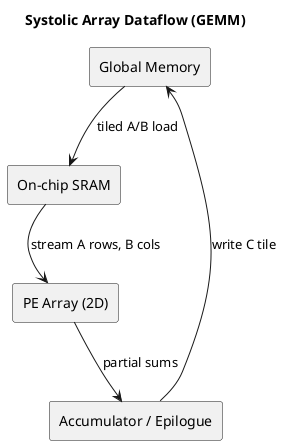
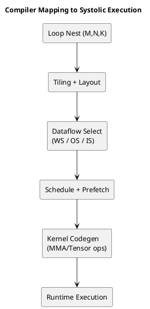

# 1. Executive Summary

- Core claim: a `Systolic Array` is not just "matrix-multiply hardware"; it is a **data-reuse architecture** that rhythmically schedules movement and compute.
- Production view: performance is usually decided by `tiling`, `dataflow policy (WS/OS/IS)`, and `on-chip residency`, more than raw MAC count.
- Compiler view: codegen quality depends on how loop nests are tiled and which tensor is kept stationary.

# 2. Intuition: Why It Is Called "Systolic"

The name comes from heartbeat (systole). The mental model is simple:

1. data moves one hop per cycle like a wave,
2. each PE (Processing Element) performs MAC on incoming values,
3. values are reused across neighboring PEs, reducing DRAM round-trips.

The objective is primarily **lower data movement cost**, not just more arithmetic units.

# 3. Core Equation and Execution Model

For `C = A x B`:

`C[i, j] = sum_k A[i, k] * B[k, j]`

A typical systolic mapping:

- `A` row stream moves horizontally,
- `B` column stream moves vertically,
- each PE accumulates partial sums for one `(i, j)` output location.

This turns temporal reuse into spatial reuse.

# 4. Three Dataflow Policies (Most Important in Practice)

| Policy | Stationary tensor | Strength | Risk | Typical use |
|---|---|---|---|---|
| Weight-Stationary (WS) | Weights | maximizes weight reuse | more activation movement | inference-heavy paths |
| Output-Stationary (OS) | output partial sums | minimizes psum writeback | higher input/weight feed demand | common GEMM baseline |
| Input-Stationary (IS) | input activations | strong input reuse | more weight/psum traffic | specific layer shapes |

There is no globally best policy; it is workload- and hardware-dependent.

# 5. Visuals and GIFs

The following visuals are useful to understand wavefront flow quickly.


# 6. Mapping the deep-math Explanation to Production Terms

Reference post: https://deep-math.tistory.com/29

That post is strong at showing why reuse appears when matrix multiply is "pushed" across space and time.
Converted to production language:

1. diagonal wavefronts traverse the PE mesh and accumulate MAC results,
2. execution has warm-up / steady-state / drain phases,
3. for short tiles, warm-up overhead can dominate,
4. tile size must be chosen with on-chip SRAM capacity, not in isolation.

# 7. Performance Model: Why Memory Becomes the First Bottleneck

Practical interpretation:

- compute scales with `M*N*K`,
- but with poor tiling, DRAM traffic scales almost as badly,
- then MAC units idle and memory wait dominates.

So the first optimization question is not "how many compute units do I have," but "how many times do I reuse a loaded tile?"

# 8. Hardware Realizations

- TPU-style accelerators: large 2D arrays with explicit on-chip buffer orchestration.
- GPU Tensor Cores: warp-level MMA operations backed by tiled dataflow that is systolic-like internally.
- NPUs / edge accelerators: WS/OS variants selected at compile-time or runtime.

Different names, same core principle: MAC array + reuse-oriented dataflow.

# 9. Compiler View: From Loop Nests to Systolic Execution

A typical compiler/scheduler flow:

1. tile `M/N/K`,
2. choose stationary tensor policy,
3. schedule data movement across hierarchy (DRAM -> L2 -> SRAM -> registers),
4. map tiles to PE/warp granularity,
5. overlap load and compute using double buffering.

Pseudo-flow:

```text
for mo in tile(M):
  for no in tile(N):
    C_tile = 0
    for ko in tile(K):
      A_tile = load(A[mo, ko])
      B_tile = load(B[ko, no])
      C_tile += systolic_mma(A_tile, B_tile)
    store(C[mo, no], C_tile)
```

In production, major differences come from layout transforms and prefetch schedule quality.

# 10. Advanced Topics Seen in Real Workloads

## 10.1 Boundary tiles

If dimensions are not tile multiples, padding/masking overhead can be substantial, especially for small batches.

## 10.2 Accumulation precision

FP16/BF16 input with FP32 accumulation is common. For INT8/FP8, scale-handling position can become a bottleneck.

## 10.3 SRAM bank conflicts and on-chip interconnect

If multiple accesses hit the same bank in the same cycle, reuse gains collapse quickly. Layout swizzle is often required.

## 10.4 Scheduling gaps

Even with correct tiling, poor overlap between prefetch and compute leaves pipeline bubbles.

# 11. Practical Debug Checklist

1. Is PE/Tensor utilization low?
2. Is DRAM bandwidth already saturated?
3. Do tiles fully fit on SRAM at target stage?
4. Is boundary tile ratio high?
5. Should WS/OS/IS policy be changed?
6. Is double buffering creating real overlap?
7. Does layout conversion cost exceed gains?

# 12. PlantUML: Dataflow Concept



# 13. PlantUML: Compiler Mapping Pipeline



# 14. Final Takeaway

- To use systolic execution effectively, hardware understanding is necessary but not sufficient; compiler tiling/scheduling decisions are equally critical.
- Most bottlenecks come from data movement and failed reuse, not lack of arithmetic units.
- A robust workflow is: choose dataflow policy and memory model first, then do kernel-level micro-optimization.

# 15. References

- deep-math summary post: https://deep-math.tistory.com/29
- Why Systolic Architectures? (H. T. Kung, 1982): https://www.eecs.harvard.edu/~htk/publication/1982-kung-why-systolic-architecture.pdf
- Systolic Arrays for VLSI (classic reference lineage): https://www.eecs.harvard.edu/~htk/publication/1980-sigmod-kung-lehman.pdf
- In-Datacenter Performance Analysis of a TPU (ISCA 2017): https://arxiv.org/abs/1704.04760
- Google Cloud TPU architecture: https://docs.cloud.google.com/tpu/docs/system-architecture-tpu-vm

# 16. Next Post Plan

1. Profile one GEMM kernel while switching WS vs OS and compare metrics.
2. Add a simple cost model for tile-size auto-tuning.
3. Connect compiler-loop transforms in the Compiler Series to tensor codegen behavior.
