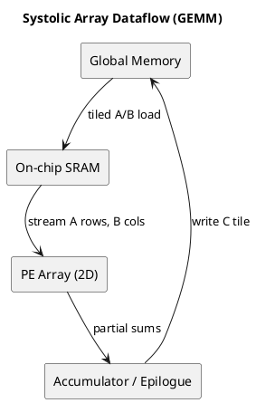
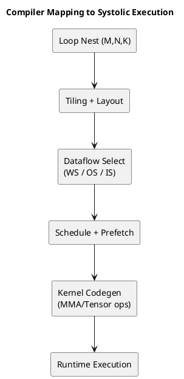

# 1. Executive Summary

- ?듭떖 二쇱옣: `Systolic Array`??"?됰젹怨??섎뱶?⑥뼱"媛€ ?꾨땲?? **?곗씠?곕? ?ъ궗?⑺븯湲??꾪빐 怨꾩궛怨??대룞??由щ벉?뷀븳 援ъ“**??
- ?ㅻТ 愿€?? ?깅뒫?€ MAC 媛쒖닔蹂대떎??`?€?쇰쭅`, `?곗씠?고뵆濡쒖슦(WS/OS/IS)`, `?⑥묩 踰꾪띁 泥대쪟?쒓컙`?먯꽌 媛덈┛??
- 而댄뙆?쇰윭 愿€?? loop nest瑜??€?쇰줈 履쇨컻怨? ?대뼡 ?먯꽌瑜?stationary濡??섏? 寃곗젙?섎뒗 寃껋씠 肄붾뱶 ?앹꽦 ?덉쭏???듭떖?대떎.

# 2. 吏곴?: ??"Systolic"?멸?

`Systolic`?대씪???대쫫?€ ?ъ옣 諛뺣룞(systole)?먯꽌 ?붾떎. ?듭떖 ?대?吏€???⑥닚?섎떎.

1. ?곗씠?곌? ?뚮룄泥섎읆 ??移몄뵫 ?대룞?쒕떎.
2. 媛?PE(Processing Element)???ㅼ뼱??媛믪쑝濡?怨??꾩궛(MAC) ??寃곌낵瑜??놁쑝濡?蹂대궦??
3. ?숈씪???곗씠?곌? ?щ윭 PE?먯꽌 ?ъ궗?⑸릺硫? DRAM ?뺣났??以꾩씤??

??援ъ“??紐⑹쟻?€ 怨꾩궛 洹??먯껜蹂대떎 **?곗씠???대룞 鍮꾩슜 ?덇컧**?대떎.

# 3. 湲곕낯 ?섏떇怨??ㅽ뻾 紐⑤뜽

?됰젹怨?`C = A x B`?먯꽌,

`C[i, j] = sum_k A[i, k] * B[k, j]`

Systolic Array??蹂댄넻 ?ㅼ쓬 ?앹쑝濡?留ㅽ븨?쒕떎.

- `A`?????ㅽ듃由쇱? 媛€濡?諛⑺뼢?쇰줈 ?대룞
- `B`?????ㅽ듃由쇱? ?몃줈 諛⑺뼢?쇰줈 ?대룞
- 媛?PE??`(i, j)` ?꾩튂??遺€遺꾪빀???꾩쟻

利? "??踰??ㅼ뼱???곗씠?곌? ?щ윭 踰??곗씠?꾨줉" 怨듦컙?곸쑝濡?諛곗뿴?쒕떎.

# 4. ?곗씠?고뵆濡쒖슦 ?뺤콉 3醫?(?ㅻТ?먯꽌 媛€??以묒슂)

| ?뺤콉 | 怨좎젙(Stationary) ?€??| ?μ젏 | 由ъ뒪??| 二??ъ슜泥?|
|---|---|---|---|---|
| Weight-Stationary (WS) | 媛€以묒튂(Weight) | 媛€以묒튂 ?ъ궗??洹밸???| ?쒖꽦媛??대룞??利앷? | 異붾줎(inference) |
| Output-Stationary (OS) | 異쒕젰 遺€遺꾪빀(psum) | ?꾩궛媛??ъ벐湲?理쒖냼??| ?낅젰/媛€以묒튂 ?€??룺 ?붽뎄 | ?쇰컲 GEMM |
| Input-Stationary (IS) | ?낅젰 ?쒖꽦媛?| ?낅젰 ?ъ궗???믪쓬 | 媛€以묒튂/psum ?대룞 遺€??| ?뱀젙 ?곗궛 ?⑦꽩 |

?ㅻТ?먯꽌??紐⑤뜽/諛곗튂/?쒗€€??湲몄씠???곕씪 理쒖쟻 ?뺤콉???щ씪吏꾨떎.

# 5. 洹몃┝怨?GIF濡?蹂대뒗 ?먮쫫

?꾨옒 GIF/?대?吏€??"?뚯씠?꾨씪???⑥씠釉?瑜?鍮좊Ⅴ寃??댄빐?섍린 醫뗫떎.


# 6. deep-math 湲€怨??곌껐???듭떖 ?ъ씤??
李멸퀬 湲€: https://deep-math.tistory.com/29

?대떦 湲€???μ젏?€ "?됰젹怨깆쓣 ?쒓컙異?怨듦컙異뺤쑝濡?諛€???ｌ쑝硫????ъ궗?⑹씠 ?앷린?붽?"瑜?吏곴??곸쑝濡?蹂댁뿬以€?ㅻ뒗 ?먯씠??
??湲€??愿€?먯쓣 ?ㅻТ ?⑹뼱濡?諛붽씀硫??ㅼ쓬怨?媛숇떎.

1. ?€媛곸꽑 ?⑥씠釉뚰봽濡좏듃媛€ PE瑜??듦낵?섎ʼn MAC???꾩쟻?쒕떎.
2. warm-up / steady-state / drain ?④퀎媛€ ?덇퀬, 吏㏃? ?€?쇱뿉?쒕뒗 warm-up ?먰빐媛€ 而ㅼ쭊??
3. ?곕씪?????€?쇱씠 ??긽 ?뺣떟???꾨땲?? on-chip SRAM ?⑸웾怨??④퍡 理쒖쟻?먯쓣 李얠븘???쒕떎.

# 7. ?깅뒫 紐⑤뜽: ??硫붾え由ш? 癒쇱? ?곗???
媛꾨떒???ㅻТ ?댁꽍:

- ?곗궛??FLOPs)?€ `M*N*K`濡?鍮좊Ⅴ寃?利앷??쒕떎.
- 洹몃윭???섎せ ?€?쇰쭅?섎㈃ DRAM ?몃옒?쎈룄 嫄곗쓽 媛숈씠 利앷??쒕떎.
- 寃곌낵?곸쑝濡?MAC ?좊떅?€ ?€怨? 硫붾え由??€湲?stall)媛€ 吏€諛고븳??

洹몃옒??Systolic 理쒖쟻?붿쓽 泥?吏덈Ц?€ "?곗궛湲?紐?媛쒕? ???멸퉴?"媛€ ?꾨땲??"??踰?遺덈윭???€?쇱쓣 紐?踰??ъ궗?⑺븯??"??

# 8. ?섎뱶?⑥뼱???대뼸寃??섑??섎굹

- TPU瑜? ?€??2D array + 紐낆떆???⑥묩 踰꾪띁 愿€由?- GPU Tensor Core: warp ?⑥쐞 MMA瑜??듯빐 ?대??곸쑝濡??€?쇳솕??systolic ?좎궗 ?곗씠??寃쎈줈瑜??ъ슜
- NPU/Edge Accelerator: WS/OS 蹂€?뺤쓣 ?고??꾩뿉???좏깮?섍굅??而댄뙆???€?꾩뿉 怨좎젙

利??대쫫?€ ?щ씪??蹂몄쭏?€ "MAC 諛곗뿴 + ?곗씠???ъ궗???뺤콉"?대떎.

# 9. 而댄뙆?쇰윭 愿€?? loop nest?먯꽌 Systolic?쇰줈

而댄뙆?쇰윭/?ㅼ?以꾨윭??蹂댄넻 ?꾨옒 ?쒖꽌濡?臾몄젣瑜??쇰떎.

1. `M/N/K`瑜??€?쇰줈 遺꾪빐
2. ?대뒓 ?먯꽌瑜?stationary濡??섏? ?좏깮
3. 硫붾え由?怨꾩링(DRAM -> L2 -> SRAM -> register) ?대룞 ?쒖꽌 寃곗젙
4. PE/warp ?⑥쐞濡?留ㅽ븨
5. double buffering?쇰줈 濡쒕뱶/?곗궛 以묒꺽

?덉떆 ?섏궗肄붾뱶:

```text
for mo in tile(M):
  for no in tile(N):
    C_tile = 0
    for ko in tile(K):
      A_tile = load(A[mo, ko])
      B_tile = load(B[ko, no])
      C_tile += systolic_mma(A_tile, B_tile)
    store(C[mo, no], C_tile)
```

?ㅻТ 李⑥씠??`systolic_mma` ?몄텧 ?꾪썑 ?곗씠??諛곗튂(layout)?€ prefetch ?뺤콉?먯꽌 ?섏삩??

# 10. 怨좉툒 二쇱젣: ?ㅻТ?먯꽌 ?먯＜ 留욌떏?⑤━??臾몄젣

## 10.1 寃쎄퀎 ?€??boundary tile)

?됰젹 ?ш린媛€ ?€??諛곗닔媛€ ?꾨땲硫??⑤뵫/留덉뒪??鍮꾩슜??而ㅼ쭊??
?묒? 諛곗튂?먯꽌?????ㅻ쾭?ㅻ뱶媛€ ?꾩껜 ?깅뒫???ш쾶 源롫뒗??

## 10.2 ?꾩궛 ?뺣???
FP16/BF16 ?낅젰 + FP32 ?꾩궛?€ ?쇰컲?곸씠?? INT8/FP8?먯꽌??quantization scale 泥섎━ ?꾩튂媛€ 蹂묐ぉ???????덈떎.

## 10.3 Bank conflict?€ on-chip ?ㅽ듃?뚰겕

媛숈? ?ъ씠?댁뿉 媛숈? SRAM bank瑜??먮뱶由щ㈃ ?ъ궗???대뱷??利됱떆 ?щ씪吏꾨떎.
layout transform(?? swizzle)???꾩슂???댁쑀??

## 10.4 而댄뙆?쇰윭 ?ㅼ?以??ㅽ뙣

?€?쇰쭅?€ 留욌뒗??prefetch?€ compute媛€ 寃뱀튂吏€ ?딆쑝硫? ?뚯씠?꾨씪??怨듬갚(bubble)??湲몄뼱吏꾨떎.

# 11. ?붾쾭源?泥댄겕由ъ뒪??(?ㅻТ??

1. PE/Tensor utilization?????媛€?
2. DRAM ?€??룺???대? ?ы솕?멸??
3. ?€?쇱씠 SRAM???꾩쟾???곸＜?섎뒗媛€?
4. boundary tile 鍮꾩쑉???믪?媛€?
5. stationary ?뺤콉(WS/OS/IS)??諛붽퓭蹂??ъ?媛€ ?덈뒗媛€?
6. double buffering???ㅼ젣濡?overlap??留뚮뱾怨??덈뒗媛€?
7. layout 蹂€??鍮꾩슜???대뱷蹂대떎 ?곌??

# 12. PlantUML: ?곗씠???대룞 媛쒕뀗??


# 13. PlantUML: 而댄뙆?쇰윭 留ㅽ븨 ?뚯씠?꾨씪??


# 14. ?붿빟 寃곕줎

- Systolic Array瑜??쒕?濡??곕젮硫??섎뱶?⑥뼱 ?댄빐留뚯쑝濡쒕뒗 遺€議깊븯怨? **而댄뙆?쇰윭???€?쇰쭅/?ㅼ?以꾨쭅 寃곗젙**源뚯? ?④퍡 遊먯빞 ?쒕떎.
- ?깅뒫 蹂묐ぉ?€ ?€遺€遺?"?곗궛 遺€議?蹂대떎 "?곗씠???대룞/?ъ궗???ㅽ뙣"?먯꽌 諛쒖깮?쒕떎.
- ?곕씪???ㅻТ?먯꽌???곗씠?고뵆濡쒖슦 ?뺤콉怨?硫붾え由?怨꾩링 紐⑤뜽??癒쇱? ?뺤젙???? 洹??ㅼ쓬??而ㅻ꼸 誘몄꽭 理쒖쟻?붾줈 ?ㅼ뼱媛€??寃껋씠 ?덉쟾?섎떎.

# 15. 李멸퀬 ?먮즺

- deep-math ?뺣━ 湲€: https://deep-math.tistory.com/29
- Why Systolic Architectures? (H. T. Kung, 1982): https://www.eecs.harvard.edu/~htk/publication/1982-kung-why-systolic-architecture.pdf
- Systolic Arrays for VLSI (Kung & Leiserson/Lohman 怨꾩뿴 怨좎쟾 ?먮즺): https://www.eecs.harvard.edu/~htk/publication/1980-sigmod-kung-lehman.pdf
- In-Datacenter Performance Analysis of a TPU (ISCA 2017): https://arxiv.org/abs/1704.04760
- Google Cloud TPU architecture: https://docs.cloud.google.com/tpu/docs/system-architecture-tpu-vm

# 16. ?ㅼ쓬 湲€ ?덇퀬

1. ?ㅼ젣 GEMM 而ㅻ꼸 ?섎굹瑜??≪븘??WS/OS瑜?諛붽엥???뚯쓽 硫뷀듃由?蹂€?붾? 鍮꾧탳
2. ?€???ш린 ?먮룞 ?먯깋(auto-tuning) 湲곗???媛꾨떒??鍮꾩슜 紐⑤뜽濡??뺣━
3. Compiler ?쒕━利덉? ?곌껐?? IR ?덈꺼 loop transform??tensor codegen??誘몄튂???곹뼢源뚯? ?뺤옣
