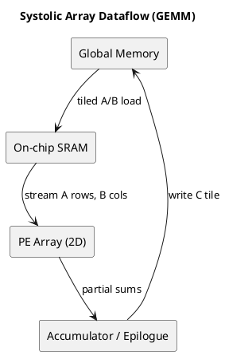
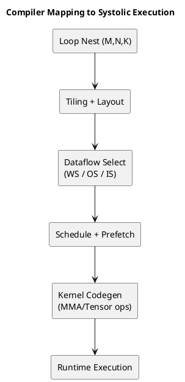

# 1. Executive Summary

- 핵심 주장: `Systolic Array`는 단순한 "행렬곱 하드웨어"가 아니라, **데이터 재사용을 극대화하기 위해 계산과 이동을 리듬감 있게 조직한 구조**다.
- 실전 관점: 성능은 보통 MAC 수보다 `타일링`, `데이터플로우 정책(WS/OS/IS)`, `온칩 데이터 체류 시간`에서 더 크게 결정된다.
- 컴파일러 관점: 코드 생성 품질은 loop nest를 어떻게 타일링하고 어떤 텐서를 stationary로 둘지에 따라 달라진다.

# 2. 직관: 왜 이름이 "Systolic"인가

`Systolic`이라는 이름은 심장의 수축 운동에서 왔다.  
핵심 이미지는 단순하다.

1. 데이터가 파동처럼 한 사이클에 한 칸씩 이동한다.
2. 각 PE(Processing Element)는 들어온 값으로 MAC를 수행한다.
3. 같은 값이 이웃한 PE에서 반복 재사용되면서 DRAM 왕복이 줄어든다.

즉 이 구조의 목적은 연산 유닛을 많이 두는 것보다 **데이터 이동 비용을 줄이는 것**에 있다.

# 3. 기본 수식과 실행 모델

행렬곱 `C = A x B`에서:

`C[i, j] = sum_k A[i, k] * B[k, j]`

전형적인 systolic 매핑은 다음과 같다.

- `A`의 row stream은 가로 방향으로 이동
- `B`의 column stream은 세로 방향으로 이동
- 각 PE는 하나의 `(i, j)` 출력 위치에 대한 partial sum을 누적

즉 시간축의 재사용을 공간축의 재사용으로 바꾸는 구조다.

# 4. 데이터플로우 정책 3종

| 정책 | 고정되는 것 | 장점 | 위험 | 대표 사용처 |
|---|---|---|---|---|
| Weight-Stationary (WS) | Weight | weight 재사용 극대화 | activation 이동 증가 | inference 중심 경로 |
| Output-Stationary (OS) | output partial sum | psum writeback 최소화 | 입력/weight 공급 부담 증가 | 일반 GEMM 기본형 |
| Input-Stationary (IS) | input activation | input 재사용 강화 | weight/psum 이동 증가 | 특정 shape |

전역적으로 항상 최선인 정책은 없다.  
워크로드와 하드웨어 제약에 따라 달라진다.

# 5. 그림과 GIF로 보는 흐름

이 자료들은 systolic dataflow를 빠르게 이해하는 데 좋다.


# 6. deep-math 설명을 실전 용어로 옮기기

참고 글: https://deep-math.tistory.com/29

이 글의 강점은 행렬곱을 공간축과 시간축으로 나눴을 때 왜 재사용이 생기는지를 직관적으로 보여준다는 점이다. 이를 실전 용어로 바꾸면 다음과 같다.

1. 대각선 wavefront가 PE mesh를 통과하며 MAC 결과를 누적한다.
2. 실행은 warm-up / steady-state / drain 단계로 나뉜다.
3. 타일이 작으면 warm-up overhead가 상대적으로 커진다.
4. 타일 크기는 온칩 SRAM 용량과 함께 봐야 한다.

# 7. 성능 모델: 왜 메모리가 먼저 병목이 되는가

실전 해석은 다음과 같다.

- compute량은 `M*N*K`로 빠르게 늘어난다.
- 하지만 타일링이 부실하면 DRAM traffic도 거의 같이 커진다.
- 그 결과 MAC 유닛은 놀고 메모리 대기가 지배적이 된다.

그래서 첫 번째 최적화 질문은

- "계산 유닛이 몇 개인가"가 아니라
- "한 번 읽은 타일을 몇 번 재사용하는가"

여야 한다.

# 8. 하드웨어 구현 예시

- TPU 계열 가속기: 큰 2D array와 명시적 on-chip buffer orchestration
- GPU Tensor Core: warp 단위 MMA를 제공하지만 내부적으로는 tiled, systolic-like dataflow를 활용
- NPU / edge accelerator: WS/OS/IS 변형을 컴파일 단계 또는 실행 단계에서 선택

이름은 달라도 본질은 같다.

- `MAC array`
- `reuse 중심 dataflow`

# 9. 컴파일러 관점: loop nest에서 systolic 실행으로

전형적인 compiler/scheduler 흐름:

1. `M/N/K`를 타일링한다.
2. 어떤 텐서를 stationary로 둘지 선택한다.
3. 계층별 데이터 이동(DRAM -> L2 -> SRAM -> registers)을 스케줄한다.
4. 타일을 PE/warp 단위에 매핑한다.
5. double buffering으로 load와 compute를 겹친다.

의사 코드는 다음과 같다.

```text
for mo in tile(M):
  for no in tile(N):
    C_tile = 0
    for ko in tile(K):
      A_tile = load(A[mo, ko])
      B_tile = load(B[ko, no])
      C_tile += systolic_mma(A_tile, B_tile)
    store(C[mo, no], C_tile)
```

실전에서는 `systolic_mma` 자체보다 layout transform과 prefetch 스케줄의 품질에서 차이가 크게 난다.

# 10. 실전에서 자주 마주치는 고급 이슈

## 10.1 Boundary tile

차원이 tile 배수가 아니면 padding/masking overhead가 커진다. 작은 batch에서는 이것이 전체 성능을 크게 갉아먹는다.

## 10.2 Accumulation precision

FP16/BF16 입력 + FP32 누적은 흔하다. INT8/FP8에서는 scale 처리 위치가 병목이 되기도 한다.

## 10.3 SRAM bank conflict와 온칩 interconnect

같은 cycle에 같은 bank를 여러 번 건드리면 reuse 이득이 금방 무너진다. layout swizzle이 필요한 경우가 많다.

## 10.4 Scheduling gap

타일링이 맞아도 prefetch와 compute overlap이 약하면 pipeline bubble이 길어진다.

# 11. 실전 체크리스트

1. PE/Tensor utilization이 낮은가?
2. DRAM bandwidth가 이미 포화됐는가?
3. 타일이 현재 단계에서 SRAM에 완전히 들어가는가?
4. boundary tile 비율이 높은가?
5. WS/OS/IS 정책을 바꿔볼 필요가 있는가?
6. double buffering이 실제 overlap을 만들고 있는가?
7. layout conversion 비용이 이득보다 큰가?

# 12. PlantUML: 데이터플로우 개념도



# 13. PlantUML: 컴파일러 매핑 파이프라인



# 14. Final Takeaway

- systolic 실행을 제대로 쓰려면 하드웨어 이해만으로는 부족하고 **컴파일러의 타일링/스케줄링 결정**까지 같이 봐야 한다.
- 대부분의 병목은 연산 유닛 부족보다 데이터 이동과 재사용 실패에서 나온다.
- 실전 워크플로는 "데이터플로우 정책과 메모리 모델을 먼저 정하고, 그 다음 커널 내부 미세 최적화로 들어가는 방식"이 안정적이다.

# 15. Series Context

이 글은 GPU 아키텍처 시리즈에서, 기본 실행 모델에서 실제 matmul 커널 설계로 넘어가는 중간 다리 역할을 한다.

추천 읽기 순서:

1. `Worklog #09 - GPU SM 구조와 워프 스케줄링 실전 정리`
2. `Worklog #11 - GPU 메모리 계층과 데이터 이동`
3. 이 글
4. `Worklog #12 - Matmul로 보는 GPU 아키텍처`
5. `Worklog #13 - Hopper Matmul: TMA, Warp Specialization, Persistent Kernel`

이 글의 역할:

- systolic thinking과 dataflow policy를 소개한다
- 왜 reuse가 throughput을 결정하는지 설명한다
- array 수준 직관에서 현대 GPU matmul 커널로 점프할 준비를 만든다

# 16. References

- deep-math 정리 글: https://deep-math.tistory.com/29
- General-Purpose Graphics Processor Architecture (book baseline)
- Why Systolic Architectures? (H. T. Kung, 1982): https://www.eecs.harvard.edu/~htk/publication/1982-kung-why-systolic-architecture.pdf
- Systolic Arrays for VLSI: https://www.eecs.harvard.edu/~htk/publication/1980-sigmod-kung-lehman.pdf
- In-Datacenter Performance Analysis of a TPU (ISCA 2017): https://arxiv.org/abs/1704.04760
- Google Cloud TPU architecture: https://docs.cloud.google.com/tpu/docs/system-architecture-tpu-vm

# 17. Next Post Plan

1. 실제 GEMM 커널 하나를 두고 WS vs OS를 바꿔가며 지표를 비교한다.
2. tile-size auto-tuning을 위한 간단한 cost model을 정리한다.
3. Compiler Series의 loop transform 이야기를 tensor codegen과 연결한다.
