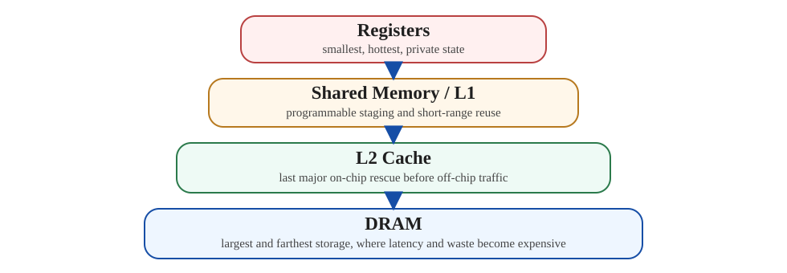
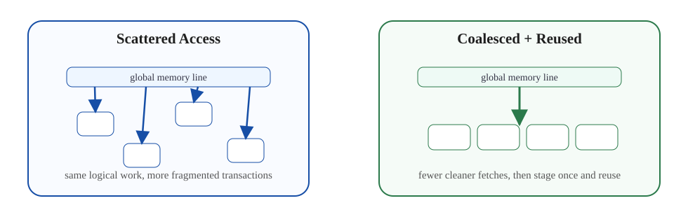

# 1. Executive Summary

- If `GPU Series 01` is about **who gets to run**, this post is about **who gets data on time**.
- The practical claim is that most GPU kernels fail to scale not because arithmetic units are missing, but because the kernel spends too much time moving data from expensive levels of the hierarchy.
- The right optimization question is usually not "how many FLOPs can this GPU do?" but "how many times do I force the same bytes to travel?"

# 2. Why Memory Comes Right After Scheduling

After learning about `warp scheduling`, the next mistake is to think:

> if I keep enough warps in flight, the hardware will hide everything.

That is only partly true.

Warp scheduling helps hide latency, but it does not erase the cost of bad access patterns. If every warp keeps requesting cold data from far away memory, the scheduler is just rotating among many warps that are all waiting on the same class of problem.

So this is the next stable mental model:

- scheduling determines **whether work can be issued**
- memory hierarchy determines **how fast data can be supplied**
- performance is the interaction of both

# 3. Practical Memory Hierarchy

At a useful working level, the hierarchy is:

1. registers
2. shared memory / L1
3. L2
4. DRAM

The exact hardware details vary by generation, but this ordering is enough for most performance reasoning.



*A practical memory reading starts by asking how often a byte escapes the hotter layer above it.*

## 3.1 Registers

Registers are the closest storage to execution. They are fast, private to the executing thread context, and central to high-throughput kernels.

What they are good at:

- accumulators
- temporary values reused many times
- loop-local state

What they are bad at:

- scaling without cost

The hidden catch is `register pressure`. If a kernel uses too many registers per thread, fewer warps can stay resident, which reduces latency-hiding capacity.

So registers are the fastest storage, but not free.

## 3.2 Shared Memory / L1

Shared memory is the first major "designable" memory level.

Why it matters:

- data can be loaded once and reused by many threads
- it gives explicit programmer control over staging
- it is where tiling starts to become real

You should not think of shared memory only as "faster memory." The better mental model is:

> shared memory is a deliberate reuse buffer

That is why so many optimized kernels stage tiles there before compute.

## 3.3 L2 Cache

L2 is the large on-chip cache that sits between SM-local activity and off-chip DRAM.

Practical role:

- absorb some repeated traffic across SMs
- reduce DRAM round-trips when access locality exists
- act as the last major on-chip rescue before the kernel pays full off-chip cost

When L2 works well, many global loads look much cheaper than worst-case DRAM traffic.

## 3.4 DRAM

DRAM is the large-capacity, high-latency, off-chip memory backing the whole device.

The problem with DRAM is not that bandwidth is always low. Modern GPUs can have enormous bandwidth. The problem is:

- latency is still far away relative to on-chip storage
- poor access patterns increase traffic and transaction waste
- once traffic spills heavily to DRAM, the scheduler has much less room to hide everything cleanly

So DRAM is where "the bytes are available," but not where performance wants to live.

# 4. Coalescing: The First Memory Performance Multiplier

One of the first real GPU memory ideas is `coalescing`.

The rough intuition:

- if neighboring threads in a warp access neighboring addresses, the hardware can serve that with fewer, cleaner transactions
- if addresses are scattered, the hardware often needs more transactions to fetch what the warp needs

That is why the same amount of logical work can have very different memory cost depending on layout and access pattern.

This is also why simple kernels like vector add still matter pedagogically. They make it easy to see:

- contiguous access
- strided access
- scattered access

and how those patterns show up in throughput.



*The same logical work can stress the memory system very differently depending on whether nearby threads move together or scatter apart.*

## 4.1 Minimal Access Pattern Example

```cpp
__global__ void coalesced_copy(const float* in, float* out, int n) {
  int idx = blockIdx.x * blockDim.x + threadIdx.x;
  if (idx < n) out[idx] = in[idx];
}

__global__ void strided_copy(const float* in, float* out, int n, int stride) {
  int idx = blockIdx.x * blockDim.x + threadIdx.x;
  int src = idx * stride;
  if (src < n) out[idx] = in[src];
}
```

The point is not that every strided kernel is bad. The point is that once neighboring threads stop touching neighboring addresses, the memory system often needs more transactions to deliver the same logical amount of data.

# 5. Shared Memory as a Reuse Tool, Not a Magic Cache

Many beginners learn shared memory as "fast user-managed memory." That is true, but not enough.

The stronger interpretation is:

- global memory often delivers the same values many times to nearby threads
- shared memory lets you pay that global fetch once
- then multiple threads can reuse the loaded tile locally

This is the bridge from architecture to kernel design.

Without that bridge:

- each thread pulls its own data independently
- DRAM/L2 traffic explodes
- arithmetic units wait

With that bridge:

- a tile is staged once
- reuse increases
- arithmetic intensity rises

This is exactly why shared memory is central in high-performance convolution and matmul kernels.

## 5.1 A Standard "Stage Once, Reuse Many Times" Shape

```cpp
for (int tile = 0; tile < numTiles; ++tile) {
  smemA[threadIdx.x] = A[globalA(tile, threadIdx.x)];
  smemB[threadIdx.x] = B[globalB(tile, threadIdx.x)];
  __syncthreads();

  #pragma unroll
  for (int k = 0; k < TILE_K; ++k) {
    acc += smemA[rowOffset + k] * smemB[k * TILE_N + colOffset];
  }
  __syncthreads();
}
```

This is the reusable pattern behind many optimized kernels:

- pay the global-memory fetch once
- keep the tile on chip
- extract many arithmetic operations from that staged data

# 6. Register Pressure and Occupancy

There is always a tradeoff hiding in the background.

Large tiles are attractive because:

- they can increase reuse
- they can reduce repeated memory loads

But larger tiles also mean:

- more accumulators
- more temporary values
- more registers

That can lower occupancy by reducing the number of resident warps.

So there is no free "bigger tile is better" rule. The real question is:

> did the extra reuse outweigh the loss in warp residency and scheduling flexibility?

This is one of the main reasons high-performance kernel tuning feels like balancing a mobile rather than turning one knob.

# 7. What This Means for Matmul

This is the point where memory hierarchy naturally leads into `matmul`.

Naive matmul is a poor GPU kernel because it keeps doing expensive loads with too little reuse. The optimized version improves because it reorganizes the working set:

- load tiles of `A` and `B`
- keep them on chip
- reuse them across multiple multiply-accumulate steps
- store the result later

That is not a matmul-specific trick. It is a memory hierarchy trick expressed through matmul.

This is why matmul is such a good architecture lens:

- it makes reuse explicit
- it makes register pressure visible
- it makes shared memory staging essential

# 8. Reading Nsight Through the Memory Lens

Profiler metrics become much easier to interpret once you adopt the memory view.

## 8.1 High occupancy does not mean memory is healthy

You can have:

- high occupancy
- many active warps
- low actual throughput

because the warps are waiting on memory and dependency chains.

## 8.2 Long Scoreboard often means "data is not back yet"

When `Long Scoreboard` is high, a practical interpretation is:

- a warp issued an operation that depends on data not yet available
- issue eligibility stays low while memory or long-latency dependencies resolve

## 8.3 Memory Dependency is not just a cache problem

It can reflect:

- poor locality
- insufficient reuse
- too much DRAM traffic
- load-to-use distance that is too short

So the fix is not always "improve cache hit rate." Sometimes it is:

- increase reuse
- prefetch earlier
- change layout
- retile the kernel

## 8.4 A Practical Nsight Pattern Table

| Pattern | Likely reading | First experiment |
|---|---|---|
| high occupancy + high long scoreboard | many warps exist, but data arrives late | improve locality or staging |
| low occupancy + high registers/thread | residency is collapsing | reduce tile size or unroll |
| low L2 hit + high DRAM traffic | working set is escaping on chip | retile or improve reuse |
| good coalescing + still memory-bound | bandwidth may be the actual limit | reduce bytes moved or increase arithmetic intensity |

# 9. Practical Checklist

When a kernel looks slower than expected, use this order:

1. Is the access pattern coalesced?
2. Is the same data fetched repeatedly by nearby threads?
3. Should a tile be staged in shared memory?
4. Is register usage so high that occupancy collapses?
5. Is the working set too large for the intended on-chip level?
6. Are profiler stalls dominated by scoreboard or memory dependency?

# 10. Diagram


*The hierarchy becomes useful only when we connect it to reuse: keep data at the hottest level that still makes the kernel practical.*

# 11. Final Takeaway

- GPU memory hierarchy is not background detail. It is one of the main structures that decides whether the scheduler has useful work to issue.
- Shared memory matters because it turns expensive repeated fetches into local reuse.
- Registers matter because they hold the hottest state, but they also constrain occupancy.
- The natural next step after this post is matmul, because matmul makes all of these tradeoffs concrete.

# 12. References

- `General-Purpose Graphics Processor Architecture`
- CUDA C++ Programming Guide
- CUDA Best Practices Guide
- Existing related posts in this blog:
  - `Worklog #05 - Memory Coalescing at SASS Level`
  - `GPU Series 01 - Practical Model of GPU SM and Warp Scheduling`
