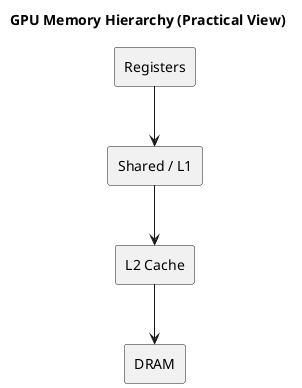

# 1. Executive Summary

- `GPU 시리즈 01`이 **누가 실행될 수 있는가**에 대한 글이었다면, 이 글은 **누가 제때 데이터를 받는가**에 대한 글이다.
- 실전 가설은 단순하다. 많은 GPU 커널은 연산 유닛 부족보다, 비싼 메모리 단계에서 데이터를 너무 자주 끌어오는 문제 때문에 느려진다.
- 그래서 올바른 최적화 질문은 보통 "이 GPU가 FLOPs를 얼마나 내는가?"가 아니라 "같은 바이트를 몇 번이나 멀리서 다시 가져오게 만들었는가?"다.

# 2. 왜 Scheduling 다음이 Memory인가

warp scheduling을 배우고 나면 다음 같은 생각을 하기 쉽다.

> warp만 충분히 많이 올려두면 하드웨어가 다 숨겨줄 것이다.

이건 절반만 맞다.

scheduler는 latency를 숨기는 데 도움을 주지만, 나쁜 access pattern의 비용 자체를 없애지는 못한다. 모든 warp가 멀리 있는 cold data를 계속 기다리고 있다면, scheduler는 결국 "모두가 기다리는 warp들" 사이를 돌려가며 선택하는 셈이 된다.

그래서 다음과 같은 안정적인 사고 모델이 필요하다.

- scheduling은 **무엇이 issue 가능한가**를 결정하고
- memory hierarchy는 **데이터가 얼마나 빨리 공급되는가**를 결정하며
- 실제 성능은 그 둘의 상호작용에서 나온다

# 3. 실전 메모리 계층

실무 관점에서 충분히 유용한 계층은 다음이다.

1. registers
2. shared memory / L1
3. L2
4. DRAM

세대별 세부 구현은 달라도, 대부분의 성능 해석은 이 순서만으로도 충분히 시작할 수 있다.

## 3.1 Registers

register는 실행과 가장 가까운 저장 공간이다. 빠르고, thread 문맥에 매우 밀접하며, 고성능 커널의 핵심 상태가 여기에 머문다.

register가 잘 맞는 것:

- accumulator
- 여러 번 재사용되는 임시값
- loop 내부 상태

하지만 register에도 숨은 비용이 있다.

바로 `register pressure`다. thread당 register를 너무 많이 쓰면 resident warp 수가 줄고, 그 결과 latency-hiding 능력도 같이 줄어든다.

즉 register는 가장 빠른 저장소지만 공짜는 아니다.

## 3.2 Shared Memory / L1

shared memory는 처음으로 "설계할 수 있는" 메모리 단계다.

왜 중요하냐면:

- 한 번 읽은 데이터를 여러 thread가 재사용할 수 있고
- staging을 프로그래머가 직접 설계할 수 있으며
- tiling이 이 단계부터 진짜 성능 전략이 되기 때문이다

shared memory를 단순히 "더 빠른 메모리"로만 보면 약하다. 더 좋은 모델은 이렇다.

> shared memory는 의도적으로 reuse를 만드는 버퍼다

그래서 최적화된 커널은 계산 전에 tile을 여기에 올려놓고 반복 재사용한다.

## 3.3 L2

L2는 SM 로컬 활동과 DRAM 사이에 있는 큰 on-chip cache다.

실전 역할:

- SM 간 반복 트래픽 일부 흡수
- locality가 있으면 DRAM 왕복 감소
- DRAM을 직접 맞기 전에 마지막으로 비용을 줄여주는 큰 단계

L2가 잘 맞아떨어지면 global load도 최악의 DRAM access보다 훨씬 싸게 보일 수 있다.

## 3.4 DRAM

DRAM은 장치 전체를 뒷받침하는 대용량 off-chip 메모리다.

문제는 단순히 bandwidth가 낮아서가 아니다. 현대 GPU의 DRAM bandwidth는 매우 크다. 진짜 문제는:

- on-chip 저장소에 비해 여전히 멀고
- 나쁜 access pattern은 transaction 낭비를 크게 만들며
- traffic가 DRAM으로 과하게 새기 시작하면 scheduler가 숨길 수 있는 범위가 줄어든다는 점이다

즉 DRAM은 "데이터가 결국 있는 곳"이지, 성능이 머물고 싶어하는 곳은 아니다.

# 4. Coalescing: 첫 번째 메모리 성능 증폭기

GPU 메모리에서 가장 먼저 체감되는 개념 중 하나가 `coalescing`이다.

직관은 이렇다.

- warp 안의 인접한 thread가 인접한 주소를 읽으면, 하드웨어는 그걸 더 적은 transaction으로 처리할 수 있다
- 반대로 주소가 흩어져 있으면, 같은 논리적 작업도 더 많은 메모리 transaction을 요구한다

그래서 "같은 계산량"처럼 보여도 layout과 access pattern에 따라 실제 메모리 비용은 크게 달라진다.

vector add 같은 단순 커널이 여전히 교육적으로 중요한 이유도 여기에 있다.

- contiguous access
- strided access
- scattered access

이 셋이 throughput에 어떤 차이를 만드는지 가장 쉽게 보여주기 때문이다.

## 4.1 최소 예제로 보는 Access Pattern 차이

```cpp
__global__ void coalesced_copy(const float* in, float* out, int n) {
  int idx = blockIdx.x * blockDim.x + threadIdx.x;
  if (idx < n) out[idx] = in[idx];
}

__global__ void strided_copy(const float* in, float* out, int n, int stride) {
  int idx = blockIdx.x * blockDim.x + threadIdx.x;
  int src = idx * stride;
  if (src < n) out[idx] = in[src];
}
```

요점은 모든 strided kernel이 나쁘다는 게 아니다. 인접한 thread가 인접한 주소를 읽지 않기 시작하면, 같은 논리적 데이터 양을 전달하는 데도 메모리 시스템은 더 많은 transaction을 요구하는 경우가 많다는 점을 보여주려는 예제다.

# 5. Shared Memory를 "빠른 메모리"보다 "재사용 도구"로 보기

shared memory를 처음 배울 때는 보통 "사용자 관리형 빠른 메모리"로 배운다. 틀리진 않지만 약하다.

더 강한 해석은 이렇다.

- global memory는 종종 같은 값을 nearby thread에게 여러 번 전달한다
- shared memory는 그 fetch를 한 번만 내고
- 여러 thread가 같은 tile을 locally reuse하게 만든다

이게 바로 아키텍처와 커널 설계가 연결되는 지점이다.

이 다리가 없으면:

- 각 thread가 자기 데이터를 따로 당겨오고
- DRAM/L2 traffic가 폭증하며
- arithmetic unit은 기다리게 된다

이 다리가 생기면:

- tile을 한 번 staging하고
- reuse가 늘고
- arithmetic intensity가 올라간다

이게 convolution과 matmul에서 shared memory가 핵심인 이유다.

## 5.1 "한 번 staging하고 여러 번 쓰기"의 전형적인 형태

```cpp
for (int tile = 0; tile < numTiles; ++tile) {
  smemA[threadIdx.x] = A[globalA(tile, threadIdx.x)];
  smemB[threadIdx.x] = B[globalB(tile, threadIdx.x)];
  __syncthreads();

  #pragma unroll
  for (int k = 0; k < TILE_K; ++k) {
    acc += smemA[rowOffset + k] * smemB[k * TILE_N + colOffset];
  }
  __syncthreads();
}
```

많은 optimized kernel의 핵심 모양은 결국 이렇다.

- global memory 비용은 한 번 내고
- tile을 on-chip에 두고
- 그 staged data에서 많은 arithmetic operation을 뽑아내는 것

# 6. Register Pressure와 Occupancy

여기엔 항상 tradeoff가 숨어 있다.

큰 tile이 매력적인 이유:

- reuse를 높일 수 있고
- 반복 load를 줄일 수 있기 때문이다

하지만 큰 tile은 동시에 다음도 늘린다.

- accumulator 수
- temporary value 수
- register 사용량

그 결과 occupancy가 떨어질 수 있다.

즉 "tile이 크면 무조건 좋다"는 법칙은 없다. 실전 질문은 이것이다.

> reuse 증가가 warp residency 감소와 scheduling 유연성 감소를 이겼는가?

이게 고성능 커널 튜닝이 한 개의 노브를 올리는 작업이 아니라, 여러 균형을 동시에 맞추는 작업처럼 느껴지는 이유다.

# 7. 이게 왜 Matmul로 이어지는가

여기서 memory hierarchy는 자연스럽게 `matmul`로 연결된다.

naive matmul이 GPU에서 나쁜 커널인 이유는 단순하다. 비싼 load를 많이 하면서도 reuse가 약하기 때문이다. 최적화된 matmul은 working set을 재구성한다.

- `A`, `B` tile을 읽고
- on-chip에 붙잡아두고
- 여러 MAC 단계에서 재사용하고
- 나중에 결과를 쓴다

이건 matmul 전용 트릭이 아니다.  
memory hierarchy를 잘 활용하는 트릭이 matmul 형태로 드러난 것이다.

그래서 matmul이 좋은 architecture lens다.

- reuse가 명확하고
- register pressure가 보이며
- shared memory staging이 필수로 등장한다

# 8. Nsight를 Memory Lens로 읽기

memory 관점을 잡으면 profiler도 훨씬 읽기 쉬워진다.

## 8.1 높은 occupancy가 memory 건강을 뜻하진 않는다

다음이 동시에 가능하다.

- occupancy 높음
- active warp 많음
- throughput 낮음

이유는 warp들이 memory나 dependency를 기다리고 있기 때문이다.

## 8.2 Long Scoreboard는 "데이터가 아직 안 왔다"로 읽는 게 실용적이다

`Long Scoreboard`가 높다는 건 보통:

- 어떤 연산이 아직 돌아오지 않은 데이터에 의존하고 있고
- 그 결과 issue eligibility가 떨어져 있다는 뜻으로 읽을 수 있다

## 8.3 Memory Dependency는 단순 cache 문제만은 아니다

그 안엔 다음이 다 섞여 있을 수 있다.

- locality 부족
- reuse 부족
- 과도한 DRAM traffic
- load-to-use distance 부족

그래서 해법도 단순히 "cache hit rate 올리기"만은 아니다.

- reuse 늘리기
- prefetch 앞당기기
- layout 바꾸기
- kernel retile하기

## 8.4 Nsight에서 자주 보는 패턴

| 패턴 | 실전 해석 | 첫 실험 |
|---|---|---|
| occupancy 높음 + long scoreboard 높음 | warp는 많은데 data가 늦게 온다 | locality나 staging 개선 |
| occupancy 낮음 + registers/thread 높음 | residency가 무너지고 있다 | tile 크기나 unroll 축소 |
| L2 hit 낮음 + DRAM traffic 높음 | working set이 on-chip에 머물지 못한다 | retile 또는 reuse 개선 |
| coalescing 양호 + 여전히 memory-bound | 실제 bandwidth 한계일 수 있다 | bytes moved 감소 또는 arithmetic intensity 증가 |

# 9. 실전 체크리스트

커널이 기대보다 느릴 때는 이 순서가 유용하다.

1. access pattern이 coalesced인가?
2. nearby thread들이 같은 데이터를 반복 fetch하고 있지 않은가?
3. tile을 shared memory에 staging해야 하지 않는가?
4. register usage가 너무 커서 occupancy가 무너졌는가?
5. working set이 의도한 on-chip 단계에 들어가지 않는가?
6. profiler stall이 scoreboard 또는 memory dependency 중심인가?

# 10. Diagram



# 11. Final Takeaway

- GPU memory hierarchy는 배경지식이 아니라, scheduler가 실제로 유용한 일을 할 수 있는지를 결정하는 핵심 구조다.
- shared memory가 중요한 이유는 expensive fetch를 local reuse로 바꾸기 때문이다.
- register가 중요한 이유는 hottest state를 붙잡아두기 때문이지만, 동시에 occupancy를 제한하기도 한다.
- 이 글 다음에 matmul로 넘어가는 이유도 여기에 있다. matmul은 이 tradeoff들을 가장 선명하게 드러내는 커널이기 때문이다.

# 12. References

- `General-Purpose Graphics Processor Architecture`
- CUDA C++ Programming Guide
- CUDA Best Practices Guide
- 블로그 내 관련 글:
  - `Worklog #05 - Memory Coalescing at SASS Level`
  - `GPU 시리즈 01 - GPU SM 구조와 워프 스케줄링 실전 정리`
