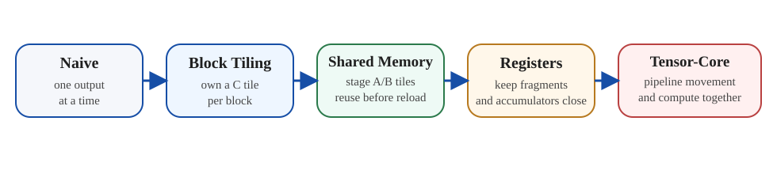
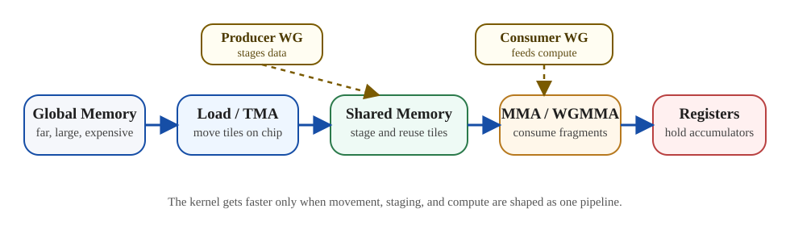

<div class="gpu-kicker">GPU Series 04 · Architecture Lens</div>

<div class="gpu-intro-grid">
  <p class="gpu-intro-copy">
    Matmul is where GPU architecture stops feeling like a list of components and starts behaving like a pipeline. Tiling, shared memory, registers, Tensor Cores, and scheduling overlap all become visible in one kernel family.
  </p>
  <div class="gpu-note-card">
    <p class="gpu-note-eyebrow">What To Watch</p>
    <ul>
      <li>Which storage layer owns the current tile</li>
      <li>How many times each loaded byte is reused</li>
      <li>How much register state the accumulator shape creates</li>
      <li>Whether compute and movement actually overlap</li>
    </ul>
  </div>
</div>

## Why This Kernel Matters

- Matmul is not important only because many workloads reduce to GEMM. It is important because it exposes almost every major GPU performance idea in one place.
- A good matmul kernel forces us to reason about tiling, reuse, shared memory, register pressure, occupancy, Tensor Cores, asynchronous movement, and scheduling overlap together.
- That is why matmul is one of the best architecture lenses after learning the execution model and memory hierarchy.

Some kernels teach one lesson cleanly. Vector add teaches coalescing. Reductions teach tree structure and synchronization. Elementwise kernels teach launch geometry.

Matmul is different. It forces almost every major architectural tension into one place. To make a kernel fast, we have to answer several questions at the same time:

1. How much data can stay on chip?
2. How many times can we reuse a loaded tile?
3. How much register state can we afford?
4. How should work be divided across block, warp, and thread ownership?
5. How much of data movement can be overlapped with compute?

That is why Aleksa Gordić's matmul article is so useful. It is not only a GEMM article. It is a guided tour through modern GPU kernel design.

<div class="gpu-compare-grid">
  <div class="gpu-compare-card">
    <p class="gpu-compare-label">Simple Kernels</p>
    <p>They usually expose one bottleneck clearly. That makes them good teaching tools, but they do not force us to reason about the whole machine.</p>
  </div>
  <div class="gpu-compare-card">
    <p class="gpu-compare-label">Matmul</p>
    <p>It exposes ownership, reuse, hierarchy, pipeline depth, and register cost at the same time, which is why it maps so well onto GPU architecture.</p>
  </div>
</div>

The useful thing about this progression is that the question changes as the kernel improves. At first we worry about arithmetic correctness. Very quickly that becomes the least interesting part. The real question becomes: where does data live, how long does it stay there, and how much work do we extract before paying another expensive trip down the hierarchy?



*The optimization path is a dataflow ladder: every rung keeps data closer and reuses it more aggressively.*

This is why matmul is such a strong teaching kernel. The optimization path is not a bag of unrelated tricks. It is a sequence of increasingly explicit decisions about dataflow.

## Why Naive Matmul Leaves the GPU Underfed

The textbook loop is straightforward:

```text
for m:
  for n:
    acc = 0
    for k:
      acc += A[m, k] * B[k, n]
```

It is easy to understand, but it fails the memory hierarchy test.

- There are too many expensive global loads.
- There is too little reuse before data is discarded.
- The on-chip working set is barely controlled.
- Arithmetic intensity stays far below what the hardware could sustain.

So naive matmul is useful mostly because it makes the optimization target obvious:

> Move less data from far memory, and reuse it more before letting it go.

### A Minimal Naive CUDA Shape

```cpp
__global__ void naive_gemm(const float* A, const float* B, float* C, int M, int N, int K) {
  int row = blockIdx.y * blockDim.y + threadIdx.y;
  int col = blockIdx.x * blockDim.x + threadIdx.x;
  if (row >= M || col >= N) return;

  float acc = 0.0f;
  for (int k = 0; k < K; ++k) {
    acc += A[row * K + k] * B[k * N + col];
  }
  C[row * N + col] = acc;
}
```

This is a great teaching kernel because it is readable. It is a weak performance kernel because every output element keeps reaching deep into memory with too little coordination or reuse.

## Tiling Is the First Real Architectural Move

Once we move beyond the naive kernel, the first major shift is tiling.

Instead of computing one scalar output in isolation, we compute a tile of outputs while reusing tiles of inputs. That changes the shape of the problem immediately.

### Block Tiling

A thread block owns a tile of `C`.

- The block repeatedly loads tiles of `A`.
- The block repeatedly loads tiles of `B`.
- The block accumulates into a block-sized output tile.

This is the first point where shared memory becomes central, because the loaded tiles must be reused across many threads.

### Warp Tiling

Inside the block, each warp owns a smaller tile of the output.

- Warp ownership defines how work is partitioned.
- It shapes shared-memory access patterns.
- It determines how much accumulator state each warp must hold.

### Register Tiling

At the innermost level, each thread holds a small fragment of the output tile in registers.

- More registers can increase local reuse.
- Too many registers reduce occupancy.

So tiling is never only geometry. It is geometry plus resource pressure.

### The Tiled Mental Model

```text
for each C_tile owned by a block:
  zero accumulators
  for each K_tile:
    load A_tile to shared memory
    load B_tile to shared memory
    synchronize
    accumulate many FMAs or MMAs
    synchronize
  store C_tile
```

This is the real turning point. The kernel stops behaving like many scalar dot products and starts behaving like a staged on-chip dataflow program.

<div class="gpu-callout">
  <p>
    This is also the moment where the code starts to read more like the hardware. Blocks own tiles, warps own subtiles, threads own fragments, and the memory hierarchy exists to keep that ownership fed.
  </p>
</div>

## Shared Memory Is the First Big Inflection Point

An optimized matmul kernel starts to look like a real GPU kernel the moment shared memory enters the story.

The basic pattern is stable:

1. Load a tile of `A` and `B` from global memory.
2. Place them in shared memory.
3. Reuse them across many threads or warps.
4. Perform many multiply-accumulate steps.
5. Repeat with the next tile.

The point is not only that shared memory is faster. The deeper point is that one expensive fetch can feed many arithmetic operations, and the kernel can shape reuse explicitly instead of hoping the cache hierarchy will do everything for it.

This is where the memory hierarchy stops being background knowledge and becomes an executable strategy.

## Register Footprint Is the Hidden Price of Better Kernels

As the kernel improves, another constraint takes over:

- Accumulator tiles get larger.
- `A` and `B` fragments stay live longer.
- Temporary state grows.

That means more registers per thread.

A better kernel often:

- uses more shared memory
- uses many more registers
- lowers occupancy somewhat
- still runs much faster

That sounds counterintuitive until we remember what improved: the extra on-chip reuse more than compensates for the lower warp residency.

The tuning question becomes:

> Did the larger tile improve reuse enough to justify the larger register footprint?

## Tensor Cores Do Not Eliminate the Memory Problem

Tensor Cores are sometimes described as if they solve matmul by themselves. They do not.

What they do solve:

- very high throughput for matrix-multiply fragments

What they do not solve automatically:

- feeding those fragments efficiently
- staging data correctly
- keeping the pipeline full
- choosing tile shapes that fit register and shared-memory constraints

This is why high-performance Tensor Core kernels are still mostly about memory discipline.

- How are tiles loaded?
- How are fragments distributed?
- How are pipeline stages overlapped?
- How is register pressure contained?

Tensor Core throughput is the reward, not the full design.

### A Stable Question Set for Tensor Kernels

When looking at a Tensor Core kernel, ask:

1. How are `A` and `B` fragments loaded?
2. Where are they staged?
3. How long do accumulator fragments stay live?
4. What is the cost of that live state in registers?
5. Is asynchronous movement actually hiding latency, or only increasing complexity?



*A modern matmul kernel is a pipeline diagram before it is a code listing.*

The diagram matters because the kernel is fundamentally spatial. A prose-only description can explain the sequence, but a visual makes it much easier to see that data is moving between storage layers while ownership is also moving between execution layers.

## Why Aleksa Gordić's Article Is a Strong Reference

The article does not stop at “use Tensor Cores.” It climbs the actual ladder:

- architecture basics
- PTX and SASS awareness
- synchronous tiling
- Tensor Core kernels
- deep asynchronous pipelines
- TMA
- persistent kernels
- clusters

That progression is the right one. It mirrors how a kernel becomes more hardware-aware step by step.

The strongest practical lesson is simple:

> Modern GPU performance is less about one magic instruction and more about building a coherent pipeline of data movement and compute.

## What Matmul Teaches About the GPU More Broadly

Even when the workload is not GEMM, matmul teaches reusable truths.

### Reuse Wins

The fastest kernels are not merely the ones doing more arithmetic. They are the ones getting more arithmetic out of each loaded byte.

### Hierarchy Matters More Than Flat Bandwidth Numbers

It is not enough to know that the GPU has high DRAM bandwidth. What matters is:

- how often the kernel escapes to DRAM
- whether shared memory and registers are used as intended

### Scheduling and Memory Cannot Be Separated

Good matmul kernels work because:

- data arrives in time
- warps are given work at the right granularity
- compute and memory stages overlap cleanly

That is architecture, not only library engineering.

## Practical Checklist

When looking at a matmul-like kernel, ask:

1. What output tile is owned by a block?
2. What subtile is owned by a warp?
3. What stays in shared memory?
4. What stays in registers?
5. How many reuse opportunities exist per loaded tile?
6. How much register pressure does the accumulator shape create?
7. Is the kernel limited by math throughput or by feeding the math?

## Final Takeaway

- Matmul is one of the best practical lenses for studying GPU architecture because it forces execution, memory, and resource tradeoffs into one kernel family.
- The core optimization is not “use Tensor Cores.” The core optimization is “shape data movement so the compute pipeline stays busy.”
- That is why the next step after this post is Hopper-specific matmul design, where the same ideas become even more explicit.

## References

- [Inside NVIDIA GPUs: Anatomy of high performance matmul kernels](https://www.aleksagordic.com/blog/matmul)
- `General-Purpose Graphics Processor Architecture`
- Existing related posts:
  - `GPU Series 02 - Systolic Array: From Fundamentals to Production Mapping`
  - `GPU Series 03 - GPU Memory Hierarchy and Data Movement`
