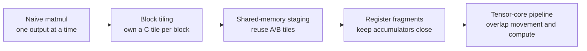
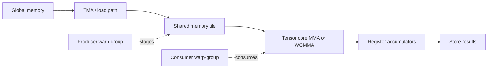
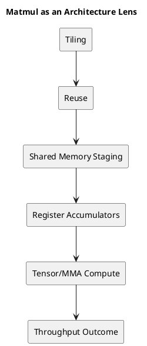

# 1. Executive Summary

- Matmul is not important only because many workloads reduce to GEMM. It is important because it exposes almost every major GPU performance idea in one place.
- A good matmul kernel forces us to reason about tiling, reuse, shared memory, register pressure, occupancy, Tensor Cores, asynchronous movement, and scheduling overlap together.
- That is why matmul is the best practical architecture lens after learning the execution model and memory hierarchy.

# 2. Why Matmul Is a Better Teacher Than Most Kernels

Some kernels expose one issue clearly:

- vector add exposes coalescing
- reductions expose synchronization and tree structure
- elementwise kernels expose launch geometry

Matmul is different. It exposes almost all of the main architectural tensions at once.

To build a high-performance matmul kernel, we must simultaneously answer:

1. how much data can stay on chip?
2. how many times can we reuse a loaded tile?
3. how much register state can we afford?
4. how much work belongs to each block, warp, and thread?
5. how do we overlap data movement with compute?

That is why a matmul article like Aleksa Gordic's is so valuable. It is not just about GEMM. It is about modern GPU kernel thinking.

The useful thing about this progression is that each optimization step changes the shape of the question. At first we ask whether the arithmetic is correct. Very quickly, that becomes the least interesting part. The real questions shift toward where data lives, how long it stays there, and how many times we can reuse it before we pay another expensive trip down the hierarchy.



This is the main reason matmul is such a good teaching kernel. The optimization path is not a bag of unrelated tricks. It is a sequence of increasingly explicit decisions about dataflow.

# 3. Why Naive Matmul Is a Bad GPU Kernel

The textbook matmul loop is easy to understand:

```text
for m:
  for n:
    acc = 0
    for k:
      acc += A[m, k] * B[k, n]
```

But this direct structure is poor for GPUs because it fails the memory hierarchy test.

The main problems:

- too many expensive global loads
- too little reuse before data is discarded
- weak control of on-chip working set
- low practical arithmetic intensity relative to what the hardware could sustain

So naive matmul is useful as a starting point only because it makes the optimization target obvious:

> move less data from far memory, and reuse it more before letting it go.

## 3.1 A Minimal Naive CUDA Shape

```cpp
__global__ void naive_gemm(const float* A, const float* B, float* C, int M, int N, int K) {
  int row = blockIdx.y * blockDim.y + threadIdx.y;
  int col = blockIdx.x * blockDim.x + threadIdx.x;
  if (row >= M || col >= N) return;

  float acc = 0.0f;
  for (int k = 0; k < K; ++k) {
    acc += A[row * K + k] * B[k * N + col];
  }
  C[row * N + col] = acc;
}
```

This is a great teaching kernel because it is easy to read. It is a weak performance kernel because each output element keeps reaching far into memory with too little coordination or reuse.

# 4. Tiling Is the First Real Optimization

Once we move beyond the naive kernel, the first major idea is `tiling`.

Instead of computing one scalar output in isolation, we compute a tile of outputs while reusing tiles of inputs.

This immediately changes the shape of the problem.

## 4.1 Block Tiling

A thread block owns a tile of `C`.

That means:

- a block repeatedly loads tiles of `A`
- repeatedly loads tiles of `B`
- accumulates into a block-sized output tile

This is the first place where shared memory becomes central, because the loaded tiles need to be reused across many threads.

## 4.2 Warp Tiling

Inside the block, each warp owns a smaller tile of the output.

This matters because:

- warp-level ownership defines how work is partitioned
- it shapes shared memory access patterns
- it determines how much accumulator state each warp must hold

## 4.3 Register Tiling

At the innermost level, each thread holds a small fragment of the output tile in registers.

This is where the architecture becomes very visible:

- more registers can mean more local reuse
- but too many registers reduce occupancy

So tiling is never only about geometry. It is always geometry plus resource pressure.

## 4.4 The Tiled Mental Model

```text
for each C_tile owned by a block:
  zero accumulators
  for each K_tile:
    load A_tile to shared memory
    load B_tile to shared memory
    synchronize
    accumulate many FMAs or MMAs
    synchronize
  store C_tile
```

This is the real turning point. The kernel stops behaving like many scalar dot products and starts behaving like a staged on-chip dataflow program.

That change in mental model matters for readability too. Once you start thinking in tiles instead of scalar outputs, the kernel becomes easier to explain at the same level the hardware is built for. Blocks own tiles, warps own subtiles, threads own fragments, and the memory system exists to keep that ownership fed.

# 5. Shared Memory Is the Turning Point

The optimized matmul kernel becomes a real GPU kernel only when shared memory enters the story.

The basic pattern is:

1. load a tile of `A` and `B` from global memory
2. place them in shared memory
3. have many threads or warps reuse them
4. perform many multiply-accumulate steps
5. repeat with the next tile

The point is not just that shared memory is faster. The point is:

- one expensive fetch can feed many arithmetic operations
- the kernel can shape reuse explicitly

This is the first place where the memory hierarchy stops being background knowledge and becomes executable strategy.

# 6. Register Footprint: The Hidden Price of Better Kernels

As the kernel improves, another constraint starts to dominate:

- accumulator tiles get larger
- fragments of `A` and `B` stay live longer
- temporary state grows

That means more registers per thread.

This is one of the reasons modern optimized kernels feel counterintuitive. A better kernel often:

- uses more shared memory
- uses many more registers
- lowers occupancy somewhat
- but still runs much faster

Why? Because the extra on-chip reuse more than compensates for the lower warp residency.

So one of the most important tuning questions becomes:

> did the larger tile improve reuse enough to justify the larger register footprint?

# 7. Tensor Cores Do Not Remove the Memory Problem

Tensor Cores are sometimes presented as if they solve matmul by themselves. They do not.

What Tensor Cores solve:

- very high throughput for matrix-multiply fragments

What they do not solve automatically:

- feeding those fragments efficiently
- staging data correctly
- keeping the pipeline full
- choosing tile shapes that match register and shared-memory constraints

This is why high-performance Tensor Core kernels are still mostly about memory discipline:

- how tiles are loaded
- how fragments are distributed
- how pipelines are overlapped
- how register pressure is contained

Tensor Core throughput is the reward, not the whole design.

## 7.1 A Stable Question Set for Tensor Kernels

When looking at a Tensor Core kernel, ask:

1. how are `A` and `B` fragments loaded?
2. where are they staged?
3. how long do accumulator fragments stay live?
4. what is the cost of that live state in registers?
5. is asynchronous movement actually hiding latency, or just increasing complexity?



The reason diagrams help here is that the kernel is fundamentally spatial. A prose-only description can explain the sequence, but a visual makes it easier to see that data is moving between storage layers while ownership is also moving between execution layers.

# 8. Why Aleksa Gordić's Article Matters

The value of the article is that it does not stop at "use Tensor Cores."

It moves through the actual ladder:

- architecture basics
- PTX/SASS awareness
- synchronous tiling
- Tensor Core kernels
- deep asynchronous pipelines
- TMA
- persistent kernels
- clusters

That is the right progression. It mirrors how a kernel becomes more hardware-aware step by step.

The strongest practical lesson is this:

> modern GPU performance is less about finding a single magic instruction and more about building a coherent pipeline of data movement and compute.

# 9. What Matmul Teaches About the GPU in General

Even if your real workload is not GEMM, matmul teaches several reusable truths.

## 9.1 Reuse Wins

The fastest kernels are usually not the ones that merely do more arithmetic. They are the ones that get more arithmetic out of each loaded byte.

## 9.2 Hierarchy Matters More Than Flat Bandwidth Numbers

It is not enough to know that the GPU has high DRAM bandwidth. What matters is:

- how often the kernel escapes to DRAM
- whether shared memory and registers are actually used as intended

## 9.3 Scheduling and Memory Cannot Be Separated

Good matmul kernels work because:

- data arrives in time
- warps are given work in the right granularity
- compute and memory stages overlap cleanly

That is architecture, not just library engineering.

# 10. Practical Checklist

When looking at a matmul-like kernel, ask:

1. what is the output tile owned by a block?
2. what is the sub-tile owned by a warp?
3. what stays in shared memory?
4. what stays in registers?
5. how many reuse opportunities exist per loaded tile?
6. how much register pressure does the current accumulator shape create?
7. is the kernel limited by math throughput or by feeding the math?

# 11. Diagram



# 12. Final Takeaway

- Matmul is the best practical lens for studying GPU architecture because it forces execution, memory, and resource tradeoffs into one kernel family.
- The core optimization is not "use Tensor Cores." The core optimization is "shape data movement so the compute pipeline can stay busy."
- That is why the next step after this post is Hopper-specific matmul design, where the same ideas become even more explicit.

# 13. References

- [Inside NVIDIA GPUs: Anatomy of high performance matmul kernels](https://www.aleksagordic.com/blog/matmul)
- `General-Purpose Graphics Processor Architecture`
- Existing related posts:
  - `GPU Series 02 - Systolic Array: From Fundamentals to Production Mapping`
  - `GPU Series 03 - GPU Memory Hierarchy and Data Movement`
