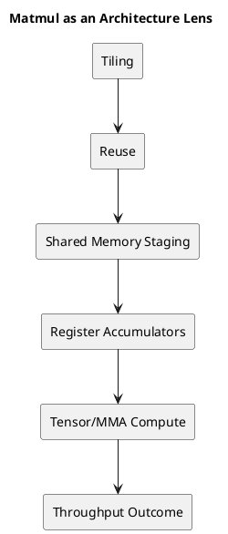

# 1. Executive Summary

- matmul이 중요한 이유는 많은 워크로드가 GEMM으로 환원되기 때문만이 아니다. matmul은 거의 모든 핵심 GPU 성능 개념을 한 번에 드러내기 때문이다.
- 좋은 matmul 커널을 만들려면 tiling, reuse, shared memory, register pressure, occupancy, Tensor Core, asynchronous movement, scheduling overlap을 동시에 생각해야 한다.
- 그래서 matmul은 실행 모델과 memory hierarchy를 배운 뒤 가장 좋은 실전 아키텍처 렌즈가 된다.

# 2. 왜 Matmul이 좋은 교재인가

어떤 커널은 한 가지 문제를 선명하게 보여준다.

- vector add는 coalescing
- reduction은 synchronization과 tree 구조
- elementwise kernel은 launch geometry

반면 matmul은 거의 모든 큰 긴장을 한 곳에 모아 보여준다.

고성능 matmul을 만들려면 동시에 다음에 답해야 한다.

1. 얼마나 많은 데이터를 on-chip에 붙잡아둘 수 있는가?
2. 한 번 불러온 tile을 몇 번 재사용할 수 있는가?
3. register 상태를 얼마나 감당할 수 있는가?
4. block, warp, thread 단위로 일을 어떻게 나눌 것인가?
5. data movement와 compute를 어떻게 겹칠 것인가?

그래서 Aleksa Gordić의 글은 단순한 GEMM 글이 아니라, 현대 GPU 커널 사고방식에 대한 글로 읽는 게 맞다.

이 흐름이 좋은 이유는 최적화 단계가 바뀔 때마다 질문 자체가 달라지기 때문이다. 처음에는 연산이 맞는지만 보면 되지만, 곧 그 질문은 가장 덜 흥미로운 문제가 된다. 실제로 중요한 건 데이터가 어디에 머무는지, 얼마나 오래 붙잡아 둘 수 있는지, 그리고 다시 먼 계층으로 내려가기 전에 몇 번이나 재사용할 수 있는지다.

<figure class="diagram-frame">
  <div class="diagram-surface">
    <svg viewBox="0 0 980 220" role="img" aria-label="Matmul optimization ladder" xmlns="http://www.w3.org/2000/svg">
      <defs>
        <marker id="arrow-a-ko" viewBox="0 0 10 10" refX="9" refY="5" markerWidth="8" markerHeight="8" orient="auto-start-reverse">
          <path d="M 0 0 L 10 5 L 0 10 z" fill="#164ea6"/>
        </marker>
      </defs>
      <rect x="20" y="56" width="160" height="92" rx="18" fill="#f5f7fb" stroke="#164ea6" stroke-width="2"/>
      <rect x="210" y="56" width="160" height="92" rx="18" fill="#eef6ff" stroke="#164ea6" stroke-width="2"/>
      <rect x="400" y="56" width="160" height="92" rx="18" fill="#eefaf5" stroke="#2b7a4b" stroke-width="2"/>
      <rect x="590" y="56" width="160" height="92" rx="18" fill="#fff7ea" stroke="#b7791f" stroke-width="2"/>
      <rect x="780" y="56" width="180" height="92" rx="18" fill="#fff0f0" stroke="#b94141" stroke-width="2"/>
      <path d="M 180 102 L 210 102" stroke="#164ea6" stroke-width="3" marker-end="url(#arrow-a-ko)"/>
      <path d="M 370 102 L 400 102" stroke="#164ea6" stroke-width="3" marker-end="url(#arrow-a-ko)"/>
      <path d="M 560 102 L 590 102" stroke="#164ea6" stroke-width="3" marker-end="url(#arrow-a-ko)"/>
      <path d="M 750 102 L 780 102" stroke="#164ea6" stroke-width="3" marker-end="url(#arrow-a-ko)"/>
      <text x="100" y="86" text-anchor="middle" font-size="20" font-weight="700" fill="#1f1f1f">Naive</text>
      <text x="100" y="112" text-anchor="middle" font-size="15" fill="#444">one output</text>
      <text x="100" y="132" text-anchor="middle" font-size="15" fill="#444">at a time</text>
      <text x="290" y="86" text-anchor="middle" font-size="20" font-weight="700" fill="#1f1f1f">Block Tiling</text>
      <text x="290" y="112" text-anchor="middle" font-size="15" fill="#444">own a C tile</text>
      <text x="290" y="132" text-anchor="middle" font-size="15" fill="#444">per block</text>
      <text x="480" y="84" text-anchor="middle" font-size="19" font-weight="700" fill="#1f1f1f">Shared Memory</text>
      <text x="480" y="108" text-anchor="middle" font-size="15" fill="#444">stage A/B tiles</text>
      <text x="480" y="128" text-anchor="middle" font-size="15" fill="#444">reuse before reload</text>
      <text x="670" y="86" text-anchor="middle" font-size="20" font-weight="700" fill="#1f1f1f">Registers</text>
      <text x="670" y="112" text-anchor="middle" font-size="15" fill="#444">keep fragments</text>
      <text x="670" y="132" text-anchor="middle" font-size="15" fill="#444">and accumulators close</text>
      <text x="870" y="84" text-anchor="middle" font-size="19" font-weight="700" fill="#1f1f1f">Tensor-Core</text>
      <text x="870" y="108" text-anchor="middle" font-size="15" fill="#444">pipeline movement</text>
      <text x="870" y="128" text-anchor="middle" font-size="15" fill="#444">and compute together</text>
    </svg>
  </div>
  <figcaption>최적화 경로는 데이터플로 사다리처럼 읽는 편이 좋다. 각 단계는 데이터를 더 가까운 계층에 오래 붙잡고 재사용한다.</figcaption>
</figure>

matmul이 좋은 교재인 이유도 여기 있다. 최적화 경로가 서로 unrelated한 트릭 모음이 아니라, 데이터플로를 점점 더 명시적으로 설계해 가는 과정으로 이어지기 때문이다.

# 3. 왜 naive matmul은 나쁜 GPU 커널인가

교과서식 matmul loop는 단순하다.

```text
for m:
  for n:
    acc = 0
    for k:
      acc += A[m, k] * B[k, n]
```

하지만 이 구조는 GPU 관점에서 보면 memory hierarchy 테스트를 통과하지 못한다.

핵심 문제:

- expensive global load가 너무 많고
- 데이터를 버리기 전에 reuse가 충분하지 않으며
- on-chip working set을 제어하지 못하고
- 하드웨어가 낼 수 있는 수준에 비해 실제 arithmetic intensity가 낮다

그래서 naive matmul은 시작점으로는 좋지만, 동시에 최적화 목표를 아주 분명하게 보여준다.

> 멀리 있는 메모리에서 가져오는 횟수를 줄이고, 한 번 가져온 뒤 더 많이 재사용하라.

## 3.1 최소 naive CUDA 형태

```cpp
__global__ void naive_gemm(const float* A, const float* B, float* C, int M, int N, int K) {
  int row = blockIdx.y * blockDim.y + threadIdx.y;
  int col = blockIdx.x * blockDim.x + threadIdx.x;
  if (row >= M || col >= N) return;

  float acc = 0.0f;
  for (int k = 0; k < K; ++k) {
    acc += A[row * K + k] * B[k * N + col];
  }
  C[row * N + col] = acc;
}
```

이 커널은 읽기 쉬워서 교육용으론 훌륭하다. 하지만 성능 관점에선 약하다. 각 output element가 메모리를 멀리까지 반복해서 건드리면서도 coordination과 reuse가 너무 약하기 때문이다.

# 4. 첫 번째 진짜 최적화는 Tiling이다

naive kernel을 넘어서면 가장 먼저 등장하는 큰 아이디어가 `tiling`이다.

스칼라 출력 하나를 고립해서 계산하는 대신, 출력의 tile을 계산하면서 입력 tile을 반복 재사용한다.

이 순간부터 문제가 완전히 달라진다.

## 4.1 Block Tiling

하나의 thread block이 `C`의 tile 하나를 맡는다.

그 말은 곧:

- block이 `A`의 tile을 반복해서 불러오고
- `B`의 tile도 반복해서 불러오며
- block 크기의 output tile에 누적한다는 뜻이다

여기서부터 shared memory가 필수가 된다. tile을 여러 thread가 같이 재사용해야 하기 때문이다.

## 4.2 Warp Tiling

block 내부에서는 각 warp가 더 작은 output tile을 맡는다.

이게 중요한 이유:

- warp 수준 ownership이 작업 분할을 결정하고
- shared memory access pattern을 결정하며
- warp가 들고 있어야 할 accumulator 상태의 크기를 결정하기 때문이다

## 4.3 Register Tiling

가장 안쪽 단계에서는 thread가 output tile의 작은 fragment를 register에 들고 간다.

여기서 아키텍처가 아주 직접적으로 드러난다.

- register를 더 쓰면 local reuse가 늘 수 있지만
- register를 너무 많이 쓰면 occupancy가 줄어든다

즉 tiling은 단순한 geometry 문제가 아니라, geometry와 resource pressure를 동시에 다루는 문제다.

## 4.4 Tiled Kernel의 기본 모양

```text
for each C_tile owned by a block:
  zero accumulators
  for each K_tile:
    load A_tile to shared memory
    load B_tile to shared memory
    synchronize
    accumulate many FMAs or MMAs
    synchronize
  store C_tile
```

이 지점이 진짜 전환점이다. 커널은 더 이상 많은 scalar dot product의 모음처럼 동작하지 않고, staged on-chip dataflow program처럼 동작하기 시작한다.

이 관점 전환은 글의 가독성에도 직접 도움이 된다. scalar output 단위로 생각하면 설명이 잘게 찢어지는데, tile 단위로 생각하면 하드웨어가 실제로 일하는 단위와 설명 단위가 맞아 떨어진다. block은 tile을 맡고, warp는 subtile을 맡고, thread는 fragment를 맡고, 메모리 계층은 그 ownership을 먹여 살리는 구조로 읽히기 시작한다.

# 5. Shared Memory가 Turning Point인 이유

optimized matmul이 진짜 GPU 커널이 되는 순간은 shared memory가 들어올 때다.

기본 패턴은 이렇다.

1. `A`와 `B`의 tile을 global memory에서 읽는다
2. shared memory에 배치한다
3. 여러 thread/warp가 그 tile을 재사용한다
4. 여러 번 multiply-accumulate를 수행한다
5. 다음 tile로 넘어간다

핵심은 단순히 shared memory가 빠르다는 데 있지 않다.

- 한 번의 expensive fetch가 여러 arithmetic operation을 먹여 살리고
- kernel이 reuse를 명시적으로 설계할 수 있다는 점이 본질이다

이 지점부터 memory hierarchy는 배경지식이 아니라 실행 전략이 된다.

# 6. 더 좋은 커널의 숨은 가격: Register Footprint

커널이 좋아질수록 다른 제약도 동시에 커진다.

- accumulator tile이 커지고
- `A`, `B` fragment가 더 오래 살아남고
- temporary state가 늘어난다

즉 thread당 register 수가 늘어난다.

현대 optimized kernel이 처음엔 직관에 안 맞는 이유도 여기에 있다. 더 좋은 커널은 종종:

- shared memory를 더 많이 쓰고
- register도 훨씬 많이 쓰며
- occupancy를 어느 정도 낮추지만
- 전체 성능은 훨씬 더 좋다

왜냐하면 늘어난 on-chip reuse가 줄어든 warp residency보다 더 큰 이득을 주기 때문이다.

그래서 가장 중요한 질문 중 하나는 결국 이것이다.

> 더 큰 tile이 만든 reuse 증가가, 더 큰 register footprint의 비용을 이겼는가?

# 7. Tensor Core가 메모리 문제를 없애주지는 않는다

Tensor Core는 종종 마치 matmul을 혼자 해결해주는 것처럼 소개된다. 그렇지 않다.

Tensor Core가 해결하는 것:

- 작은 matrix-multiply fragment에 대한 높은 연산 throughput

Tensor Core가 자동으로 해결하지 않는 것:

- fragment를 효율적으로 공급하는 문제
- 데이터를 올바르게 staging하는 문제
- 파이프라인을 계속 채워두는 문제
- register/shared memory 제약에 맞는 tile shape를 고르는 문제

그래서 고성능 Tensor Core kernel도 결국은 memory discipline 문제다.

- tile을 어떻게 읽는가
- fragment를 어떻게 배분하는가
- pipeline을 어떻게 overlap하는가
- register pressure를 어떻게 억제하는가

Tensor Core throughput은 보상이지, 설계 자체는 아니다.

## 7.1 Tensor Core kernel을 볼 때의 질문

Tensor Core kernel을 볼 때는 다음을 먼저 묻는 편이 좋다.

1. `A`, `B` fragment는 어떻게 load되는가?
2. 어디에 staging되는가?
3. accumulator fragment는 얼마나 오래 살아 있는가?
4. 그 live state가 register에 주는 비용은 어느 정도인가?
5. asynchronous movement가 latency를 정말 숨기고 있는가, 아니면 복잡성만 늘렸는가?

<figure class="diagram-frame">
  <div class="diagram-surface">
    <svg viewBox="0 0 980 300" role="img" aria-label="Hopper-style matmul pipeline" xmlns="http://www.w3.org/2000/svg">
      <defs>
        <marker id="arrow-b-ko" viewBox="0 0 10 10" refX="9" refY="5" markerWidth="8" markerHeight="8" orient="auto-start-reverse">
          <path d="M 0 0 L 10 5 L 0 10 z" fill="#164ea6"/>
        </marker>
        <marker id="arrow-c-ko" viewBox="0 0 10 10" refX="9" refY="5" markerWidth="8" markerHeight="8" orient="auto-start-reverse">
          <path d="M 0 0 L 10 5 L 0 10 z" fill="#7a5a00"/>
        </marker>
      </defs>
      <rect x="30" y="118" width="150" height="74" rx="18" fill="#f5f7fb" stroke="#164ea6" stroke-width="2"/>
      <rect x="220" y="118" width="150" height="74" rx="18" fill="#eef6ff" stroke="#164ea6" stroke-width="2"/>
      <rect x="410" y="118" width="170" height="74" rx="18" fill="#eefaf5" stroke="#2b7a4b" stroke-width="2"/>
      <rect x="620" y="118" width="150" height="74" rx="18" fill="#fff7ea" stroke="#b7791f" stroke-width="2"/>
      <rect x="810" y="118" width="140" height="74" rx="18" fill="#fff0f0" stroke="#b94141" stroke-width="2"/>
      <path d="M 180 155 L 220 155" stroke="#164ea6" stroke-width="3" marker-end="url(#arrow-b-ko)"/>
      <path d="M 370 155 L 410 155" stroke="#164ea6" stroke-width="3" marker-end="url(#arrow-b-ko)"/>
      <path d="M 580 155 L 620 155" stroke="#164ea6" stroke-width="3" marker-end="url(#arrow-b-ko)"/>
      <path d="M 770 155 L 810 155" stroke="#164ea6" stroke-width="3" marker-end="url(#arrow-b-ko)"/>
      <rect x="250" y="30" width="150" height="50" rx="14" fill="#fffdf2" stroke="#7a5a00" stroke-width="2"/>
      <rect x="590" y="30" width="170" height="50" rx="14" fill="#fffdf2" stroke="#7a5a00" stroke-width="2"/>
      <path d="M 325 80 L 470 118" stroke="#7a5a00" stroke-width="2.5" stroke-dasharray="6 6" marker-end="url(#arrow-c-ko)"/>
      <path d="M 675 80 L 675 118" stroke="#7a5a00" stroke-width="2.5" stroke-dasharray="6 6" marker-end="url(#arrow-c-ko)"/>
      <text x="105" y="147" text-anchor="middle" font-size="19" font-weight="700" fill="#1f1f1f">Global Memory</text>
      <text x="105" y="169" text-anchor="middle" font-size="15" fill="#444">far, large, expensive</text>
      <text x="295" y="147" text-anchor="middle" font-size="19" font-weight="700" fill="#1f1f1f">Load / TMA</text>
      <text x="295" y="169" text-anchor="middle" font-size="15" fill="#444">move tiles on chip</text>
      <text x="495" y="147" text-anchor="middle" font-size="19" font-weight="700" fill="#1f1f1f">Shared Memory</text>
      <text x="495" y="169" text-anchor="middle" font-size="15" fill="#444">stage and reuse tiles</text>
      <text x="695" y="147" text-anchor="middle" font-size="19" font-weight="700" fill="#1f1f1f">MMA / WGMMA</text>
      <text x="695" y="169" text-anchor="middle" font-size="15" fill="#444">consume fragments</text>
      <text x="880" y="147" text-anchor="middle" font-size="19" font-weight="700" fill="#1f1f1f">Registers</text>
      <text x="880" y="169" text-anchor="middle" font-size="15" fill="#444">hold accumulators</text>
      <text x="325" y="52" text-anchor="middle" font-size="17" font-weight="700" fill="#4d3a00">Producer WG</text>
      <text x="325" y="70" text-anchor="middle" font-size="14" fill="#5d4a10">stages data</text>
      <text x="675" y="52" text-anchor="middle" font-size="17" font-weight="700" fill="#4d3a00">Consumer WG</text>
      <text x="675" y="70" text-anchor="middle" font-size="14" fill="#5d4a10">feeds compute</text>
      <text x="490" y="255" text-anchor="middle" font-size="15" fill="#555">The kernel gets faster only when movement, staging, and compute are shaped as one pipeline.</text>
    </svg>
  </div>
  <figcaption>현대 matmul 커널은 코드 목록이기 전에 파이프라인 그림으로 먼저 이해하는 편이 좋다.</figcaption>
</figure>

여기서 도식이 특히 도움이 되는 이유는, 이 커널이 본질적으로 공간적인 구조를 갖고 있기 때문이다. 글만으로도 순서는 설명할 수 있지만, 그림으로 보면 데이터가 저장 계층 사이를 이동하는 흐름과 실행 단위의 ownership이 함께 바뀌는 모습을 한 번에 잡아낼 수 있다.

# 8. 왜 Aleksa Gordić의 글이 좋은가

이 글의 좋은 점은 "Tensor Core를 써라"에서 멈추지 않는다는 데 있다.

실제로는 다음 계단을 따라간다.

- architecture basics
- PTX/SASS awareness
- synchronous tiling
- Tensor Core kernel
- deep asynchronous pipeline
- TMA
- persistent kernel
- cluster

이건 아주 올바른 순서다. kernel이 하드웨어 인식을 점점 더 깊게 가져가는 순서를 그대로 반영한다.

실전적으로 가장 중요한 교훈은 이것이다.

> 현대 GPU 성능은 마법 같은 instruction 하나를 찾는 문제라기보다, data movement와 compute를 하나의 coherent pipeline으로 만드는 문제다.

# 9. Matmul이 GPU 일반론에 대해 가르쳐주는 것

실제 워크로드가 GEMM이 아니더라도 matmul은 재사용 가능한 진실을 몇 가지 가르쳐준다.

## 9.1 Reuse가 이긴다

가장 빠른 커널은 단순히 연산을 더 많이 하는 커널이 아니라, 같은 바이트당 더 많은 연산을 뽑아내는 커널이다.

## 9.2 Flat bandwidth 숫자보다 hierarchy가 중요하다

GPU가 높은 DRAM bandwidth를 가진다는 사실만으로는 충분하지 않다. 중요한 건:

- kernel이 DRAM으로 얼마나 자주 새는가
- shared memory와 register가 의도대로 쓰이고 있는가

## 9.3 Scheduling과 Memory는 분리되지 않는다

좋은 matmul 커널은:

- data가 제때 도착하고
- warp에 올바른 granularity로 일이 배정되며
- compute와 memory stage가 잘 겹치기 때문에 빠르다

이건 단순 라이브러리 트릭이 아니라 아키텍처 문제다.

# 10. Practical Checklist

matmul 계열 커널을 볼 때는 다음을 묻는 편이 좋다.

1. block이 소유하는 output tile은 무엇인가?
2. warp가 소유하는 sub-tile은 무엇인가?
3. shared memory에 남는 것은 무엇인가?
4. register에 남는 것은 무엇인가?
5. 한 번 읽은 tile당 몇 번의 reuse가 일어나는가?
6. 현재 accumulator shape가 만드는 register pressure는 어느 정도인가?
7. 병목이 math throughput인가, 아니면 그 math를 먹이는 문제인가?

# 11. Diagram



# 12. Final Takeaway

- matmul은 실행, 메모리, 자원 tradeoff를 하나의 커널군 안에 강제로 드러내기 때문에 GPU 아키텍처를 공부하는 데 가장 좋은 실전 렌즈다.
- 핵심 최적화는 "Tensor Core를 써라"가 아니라 "data movement를 잘 설계해서 compute pipeline이 계속 바쁘게 하라"다.
- 그래서 이 글 다음 단계는 Hopper 특화 matmul 설계다. 거기서는 같은 아이디어가 훨씬 더 노골적으로 드러난다.

# 13. References

- [Inside NVIDIA GPUs: Anatomy of high performance matmul kernels](https://www.aleksagordic.com/blog/matmul)
- `General-Purpose Graphics Processor Architecture`
- 블로그 내 관련 글:
  - `GPU 시리즈 02 - Systolic Array: 기초부터 실전 매핑까지`
  - `GPU 시리즈 03 - GPU 메모리 계층과 데이터 이동`
