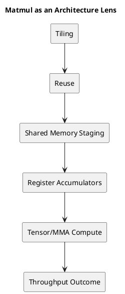

# 1. 핵심 요약

- matmul이 중요한 이유는 많은 워크로드가 GEMM으로 환원되기 때문만이 아니다. matmul은 GPU 성능을 결정하는 거의 모든 큰 개념을 한 번에 드러낸다.
- 좋은 matmul 커널을 만들려면 tiling, reuse, shared memory, register pressure, occupancy, Tensor Core, 비동기 데이터 이동, scheduling overlap을 함께 봐야 한다.
- 그래서 matmul은 실행 모델과 메모리 계층을 배운 뒤 GPU를 이해하는 가장 좋은 실전 렌즈가 된다.

# 2. 왜 Matmul이 좋은 교재인가

어떤 커널은 한 가지 문제를 선명하게 보여 준다.

- vector add는 coalescing을 드러낸다
- reduction은 synchronization과 tree 구조를 드러낸다
- elementwise kernel은 launch geometry를 드러낸다

반면 matmul은 거의 모든 핵심 긴장을 한 번에 드러낸다.

고성능 matmul 커널을 만들려면 동시에 다음을 답해야 한다.

1. 데이터를 얼마나 많이 on-chip에 붙잡아 둘 수 있는가?
2. 한 번 읽어 온 tile을 몇 번 재사용할 수 있는가?
3. register 상태를 얼마나 감당할 수 있는가?
4. block, warp, thread에 일을 어떻게 나눌 것인가?
5. data movement와 compute를 어떻게 겹칠 것인가?

그래서 Aleksa Gordić의 matmul 글은 단순한 GEMM 글이 아니라, 현대 GPU 커널 사고방식을 설명하는 글로 읽는 편이 맞다.

이 흐름이 특히 좋은 이유는 최적화 단계가 바뀔수록 질문 자체가 달라지기 때문이다. 처음에는 산술이 맞는지가 중요해 보이지만, 곧 그건 가장 덜 흥미로운 문제가 된다. 진짜 중요한 질문은 데이터가 어디에 머무는지, 얼마나 오래 붙잡혀 있는지, 다시 먼 계층으로 돌아가기 전에 몇 번 재사용할 수 있는지로 옮겨간다.


*최적화 경로를 사다리처럼 그려 보면, 각 단계가 데이터를 더 가까운 계층에 붙잡아 두고 더 많이 재사용한다는 점이 잘 보인다.*

이것이 matmul이 좋은 교재인 핵심 이유다. 최적화 경로는 서로 무관한 트릭의 묶음이 아니라, 데이터 흐름을 점점 더 명시적으로 설계해 가는 과정이다.

# 3. 왜 Naive Matmul은 좋지 않은 GPU 커널인가

교과서식 matmul loop는 이해하기 쉽다.

```text
for m:
  for n:
    acc = 0
    for k:
      acc += A[m, k] * B[k, n]
```

하지만 이 구조는 GPU 관점에서 보면 memory hierarchy 테스트를 통과하지 못한다.

핵심 문제는 다음과 같다.

- 비싼 global load가 너무 많다
- 데이터를 버리기 전에 reuse가 충분하지 않다
- on-chip working set을 명시적으로 통제하지 못한다
- 하드웨어가 낼 수 있는 수준에 비해 실제 arithmetic intensity가 낮다

그래서 naive matmul은 출발점으로는 좋지만, 최적화 목표를 분명히 보여 주는 용도에 가깝다.

> 먼 메모리에서 덜 가져오고, 한 번 가져온 데이터는 놓기 전에 더 많이 재사용하라.

## 3.1 최소한의 Naive CUDA 형태

```cpp
__global__ void naive_gemm(const float* A, const float* B, float* C, int M, int N, int K) {
  int row = blockIdx.y * blockDim.y + threadIdx.y;
  int col = blockIdx.x * blockDim.x + threadIdx.x;
  if (row >= M || col >= N) return;

  float acc = 0.0f;
  for (int k = 0; k < K; ++k) {
    acc += A[row * K + k] * B[k * N + col];
  }
  C[row * N + col] = acc;
}
```

이 커널은 읽기 쉬워서 교육용으로는 좋다. 하지만 각 output element가 거의 협조 없이 메모리 깊숙한 곳까지 반복해서 손을 뻗기 때문에 성능 커널로는 약하다.

# 4. 첫 번째 진짜 최적화는 Tiling이다

naive kernel을 넘어가면 가장 먼저 등장하는 큰 아이디어가 `tiling`이다.

이제는 스칼라 출력 하나를 따로 계산하지 않는다. 대신 출력 tile을 계산하면서 입력 tile을 반복해서 재사용한다.

이 순간부터 문제의 모양이 완전히 달라진다.

## 4.1 Block Tiling

하나의 thread block이 `C`의 tile 하나를 맡는다.

그 말은 곧

- block이 `A` tile을 반복해서 읽고
- `B` tile을 반복해서 읽고
- block 크기의 output tile에 누적한다는 뜻이다

이 지점부터 shared memory가 중심에 들어온다. 읽어 온 tile을 많은 thread가 함께 재사용해야 하기 때문이다.

## 4.2 Warp Tiling

block 내부에서는 각 warp가 더 작은 output tile을 맡는다.

이게 중요한 이유는:

- warp 단위 ownership이 작업 분할을 결정하고
- shared memory access pattern을 만들고
- warp가 들고 있어야 하는 accumulator 상태의 크기를 정하기 때문이다

## 4.3 Register Tiling

가장 안쪽 단계에서는 각 thread가 output tile의 작은 fragment를 register에 들고 간다.

이때 아키텍처 제약이 아주 직접적으로 드러난다.

- register가 많으면 local reuse가 늘어날 수 있지만
- register를 너무 많이 쓰면 occupancy가 줄어든다

즉 tiling은 단순한 geometry 문제가 아니다. geometry와 resource pressure를 함께 보는 문제다.

## 4.4 Tiled Kernel의 기본 모양

```text
for each C_tile owned by a block:
  zero accumulators
  for each K_tile:
    load A_tile to shared memory
    load B_tile to shared memory
    synchronize
    accumulate many FMAs or MMAs
    synchronize
  store C_tile
```

이 지점이 진짜 전환점이다. 커널은 더 이상 많은 scalar dot product의 묶음처럼 동작하지 않고, staged on-chip dataflow program처럼 동작하기 시작한다.

이 변화는 설명 방식에도 직접 영향을 준다. scalar output이 아니라 tile 단위로 사고하기 시작하면, 하드웨어가 실제로 일하는 단위와 설명 단위가 맞아떨어진다. block은 tile을 맡고, warp는 subtile을 맡고, thread는 fragment를 맡으며, 메모리 계층은 그 ownership을 먹여 살리는 구조가 된다.

# 5. Shared Memory가 Turning Point인 이유

optimized matmul이 진짜 GPU 커널처럼 보이기 시작하는 시점은 shared memory가 들어오는 순간이다.

기본 패턴은 이렇다.

1. `A`와 `B` tile을 global memory에서 읽는다
2. shared memory에 놓는다
3. 많은 thread와 warp가 그 tile을 재사용한다
4. 여러 번 multiply-accumulate를 수행한다
5. 다음 tile로 넘어간다

중요한 건 shared memory가 단순히 빠르다는 사실만이 아니다.

- 한 번의 비싼 fetch가 많은 arithmetic operation을 먹여 살리고
- 커널이 reuse를 명시적으로 설계할 수 있게 된다는 점이 본질이다

이 지점부터 memory hierarchy는 배경 지식이 아니라 실행 전략이 된다.

# 6. 더 좋은 커널의 숨은 비용: Register Footprint

커널이 좋아질수록 다른 제약이 빠르게 커진다.

- accumulator tile이 커지고
- `A`, `B` fragment가 더 오래 살아 있고
- temporary state가 늘어난다

즉 thread당 register 사용량이 늘어난다.

이 때문에 현대의 최적화된 커널은 직관과 다르게 보이는 경우가 많다. 더 좋은 커널은 보통:

- shared memory를 더 많이 쓰고
- register도 훨씬 많이 쓰고
- occupancy는 조금 낮추지만
- 전체 성능은 훨씬 좋아진다

왜냐하면 늘어난 on-chip reuse가 줄어든 warp residency보다 더 큰 이득을 주기 때문이다.

그래서 가장 중요한 튜닝 질문 중 하나는 결국 이것이 된다.

> 더 큰 tile이 만들어 낸 reuse 증가가, 더 큰 register footprint 비용을 정당화하는가?

# 7. Tensor Core는 메모리 문제를 없애 주지 않는다

Tensor Core는 종종 matmul을 알아서 해결해 주는 것처럼 소개되지만, 실제로는 그렇지 않다.

Tensor Core가 해결하는 것:

- matrix-multiply fragment에 대한 매우 높은 연산 throughput

Tensor Core가 자동으로 해결하지 않는 것:

- fragment를 효율적으로 공급하는 문제
- 데이터를 올바르게 staging하는 문제
- 파이프라인을 계속 채워 넣는 문제
- register/shared-memory 제약에 맞는 tile shape를 고르는 문제

그래서 고성능 Tensor Core kernel은 여전히 메모리 discipline 문제다.

- tile을 어떻게 읽을 것인가
- fragment를 어떻게 분배할 것인가
- pipeline을 어떻게 overlap할 것인가
- register pressure를 어떻게 억제할 것인가

Tensor Core throughput은 보상이지 설계 그 자체는 아니다.

## 7.1 Tensor Kernel을 볼 때의 질문

Tensor Core kernel을 볼 때는 다음을 먼저 물어보는 편이 좋다.

1. `A`, `B` fragment는 어떻게 load되는가?
2. 어디에 staging되는가?
3. accumulator fragment는 얼마나 오래 살아 있는가?
4. 그 live state가 register에 주는 비용은 얼마나 큰가?
5. asynchronous movement가 latency를 실제로 숨기고 있는가, 아니면 복잡도만 늘리고 있는가?


*현대 matmul 커널은 코드 목록이기 전에 먼저 파이프라인 그림으로 이해하는 편이 낫다.*

여기서 그림이 특히 도움이 되는 이유는, 이 커널이 본질적으로 공간적인 구조를 갖기 때문이다. 글만으로도 순서를 설명할 수는 있지만, 그림으로 보면 데이터가 저장 계층 사이를 이동하는 흐름과 실행 계층 사이에서 ownership이 넘어가는 흐름이 한 번에 보인다.

# 8. 왜 Aleksa Gordić의 글이 중요한가

그 글의 장점은 "Tensor Core를 써라"에서 멈추지 않는다는 데 있다.

실제로는 다음 계단을 차례로 올라간다.

- architecture basics
- PTX/SASS awareness
- synchronous tiling
- Tensor Core kernels
- deep asynchronous pipelines
- TMA
- persistent kernels
- clusters

이 순서는 아주 적절하다. 커널이 하드웨어를 점점 더 직접적으로 의식하게 되는 과정을 그대로 반영하기 때문이다.

실전적으로 가장 중요한 교훈은 이것이다.

> 현대 GPU 성능은 마법 같은 instruction 하나를 찾는 문제보다, data movement와 compute를 하나의 coherent pipeline으로 묶는 문제에 더 가깝다.

# 9. Matmul이 GPU 일반론에 대해 가르쳐 주는 것

실제 워크로드가 GEMM이 아니더라도 matmul은 여러 재사용 가능한 진실을 가르쳐 준다.

## 9.1 Reuse가 이긴다

가장 빠른 커널은 단순히 더 많은 연산을 하는 커널이 아니다. 같은 바이트를 읽고 더 많은 연산을 끌어내는 커널이다.

## 9.2 Flat Bandwidth 숫자보다 Hierarchy가 중요하다

GPU가 높은 DRAM bandwidth를 가진다는 사실만으로는 충분하지 않다. 중요한 것은:

- 커널이 DRAM까지 얼마나 자주 탈출하는가
- shared memory와 register가 의도한 방식대로 실제 활용되고 있는가

## 9.3 Scheduling과 Memory는 분리되지 않는다

좋은 matmul 커널은:

- data가 제때 도착하고
- warp가 올바른 granularity로 일을 배정받고
- compute 단계와 memory 단계가 깔끔하게 겹치기 때문에 빠르다

이건 단순 라이브러리 구현 문제가 아니라 아키텍처 문제다.

# 10. Practical Checklist

matmul 계열 커널을 볼 때는 다음을 묻는 편이 좋다.

1. block이 소유하는 output tile은 무엇인가?
2. warp가 소유하는 sub-tile은 무엇인가?
3. 무엇이 shared memory에 남는가?
4. 무엇이 register에 남는가?
5. load한 tile 하나당 몇 번의 reuse 기회가 존재하는가?
6. 현재 accumulator 모양이 얼마나 큰 register pressure를 만드는가?
7. 커널은 math throughput에 막히는가, 아니면 math를 먹여 살리는 경로에 막히는가?

# 11. Diagram



# 12. Final Takeaway

- matmul은 실행, 메모리, 자원 tradeoff를 하나의 커널 계열 안에 밀어 넣기 때문에 GPU 아키텍처를 공부하는 가장 좋은 실전 렌즈다.
- 핵심 최적화는 "Tensor Core를 써라"가 아니다. 핵심 최적화는 "compute pipeline이 계속 바쁘게 돌 수 있도록 data movement를 설계하라"다.
- 그래서 이 글 다음 단계는 Hopper 특화 matmul 설계다. 같은 아이디어가 그쪽에서는 훨씬 더 노골적으로 드러난다.

# 13. References

- [Inside NVIDIA GPUs: Anatomy of high performance matmul kernels](https://www.aleksagordic.com/blog/matmul)
- `General-Purpose Graphics Processor Architecture`
- 기존 관련 글:
  - `GPU 시리즈 02 - Systolic Array: 기초에서 실제 매핑까지`
  - `GPU 시리즈 03 - GPU Memory Hierarchy와 Data Movement`
