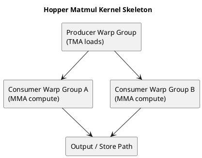

# 1. Executive Summary

- Hopper-era matmul kernels are useful because they make the next layer of GPU design visible: not just tiling, but explicit movement pipelines and role-specialized execution.
- The key ideas are `TMA`, producer/consumer warp-group specialization, persistent execution, and cluster-aware data movement.
- These ideas are not random tricks. They are the point where modern kernel design starts to align directly with hardware-supported movement and synchronization mechanisms.

# 2. Why This Needs a Separate Post

`GPU Series 04` already explained why matmul is a good architecture lens.

But Hopper changes the style of that lens.

Earlier optimized kernels still looked like:

- load data
- stage in shared memory
- compute
- repeat

Hopper makes the pipeline more explicit:

- one part of the kernel becomes more responsible for movement
- another part becomes more responsible for compute
- overlap becomes deeper and more structural

That is why Hopper deserves to be separated from general matmul discussion.

# 3. TMA as a Movement Primitive

`TMA` is one of the most important conceptual upgrades in Hopper-style kernels.

The useful mental model is:

> TMA is not just a faster load. It is a more explicit, hardware-assisted way to move structured tiles into the place where computation needs them.

Why that matters:

- tile movement becomes more deliberate
- the kernel can decouple movement from per-thread scalar load behavior
- deep pipelines become easier to organize

This is a major shift in style. The kernel starts to look less like many threads independently fetching fragments, and more like a coordinated movement-and-consumption pipeline.

# 4. Producer / Consumer Warp Specialization

Once movement becomes more structured, specialization becomes natural.

The pattern is:

- producer warps or warp-groups focus more on staging data
- consumer warps or warp-groups focus more on Tensor/MMA compute

This is important because it acknowledges a real fact:

- movement and compute have different timing needs
- forcing the same threads to do everything can make overlap weaker

Warp specialization is therefore not only a programming trick. It is a response to the architecture exposing stronger movement primitives.

# 5. WGMMA and Accumulator Pressure

On modern Tensor Core pipelines, the compute stage itself becomes very powerful.  
That shifts pressure elsewhere.

As compute throughput rises, the kernel must still handle:

- enough data delivery
- enough accumulator space
- enough register discipline to avoid collapse

So even when the compute primitive becomes stronger, the design problem does not become simpler. It becomes more unbalanced:

- the math is fast
- feeding the math becomes harder

This is one reason Hopper kernels are so instructive. They show what happens when compute throughput outruns naive movement strategy.

# 6. Persistent Kernels

Persistent execution is another idea that becomes much easier to appreciate in this context.

The core motivation is:

- avoid paying too much launch-like or wave-quantization style overhead
- keep useful workers resident
- let them pull work over time rather than repeatedly rebuilding the same execution pattern

That matters especially when:

- tiles are abundant
- the kernel has a long-running, structured workload
- keeping dataflow steady is more valuable than repeatedly relaunching equivalent work

So persistent kernels are not just a scheduler hack. They are a throughput-shaping technique.

# 7. Clusters and Multicast Thinking

Once kernels become movement-centric, the scope of coordination can also widen.

The important idea is not the exact hardware topology detail. The important idea is:

- can one movement feed more than one consumer region efficiently?
- can a coordinated group of execution resources behave like a larger logical unit?

This is why `cluster` and `multicast` ideas matter. They represent a shift from "optimize one block in isolation" toward "shape cooperation across a larger execution neighborhood."

# 8. What Is Hopper-Specific and What Is General

This distinction matters.

General lessons:

- reuse still dominates
- movement must overlap with compute
- register pressure still constrains design
- tile ownership still matters

Hopper-specific flavor:

- movement is more explicitly architected
- specialization is more deliberate
- deeper pipelines are more natural
- cluster-scale cooperation becomes a first-class design thought

So Hopper should not replace the basic architecture model. It should sit on top of it.

# 9. Why This Article Matters

Aleksa Gordić's article is especially strong here because it does not flatten Hopper into a generic "newer GPU."

Instead, it shows that once the hardware gives you:

- stronger movement machinery
- deeper asynchronous structure
- richer Tensor Core pipelines

the kernel design itself must evolve.  
That is the real lesson.

# 10. Diagram

# 11. Final Takeaway

- Hopper matmul kernels are worth studying because they make modern GPU design more explicit: movement is no longer a side detail, it is a first-class architectural path.
- TMA, specialization, persistence, and cluster thinking all point in the same direction: build a coherent pipeline where movement and compute are deliberately separated and overlapped.
- The next step after understanding this is not memorizing Hopper features. It is learning how to diagnose whether a kernel is failing on movement, compute, or coordination.
