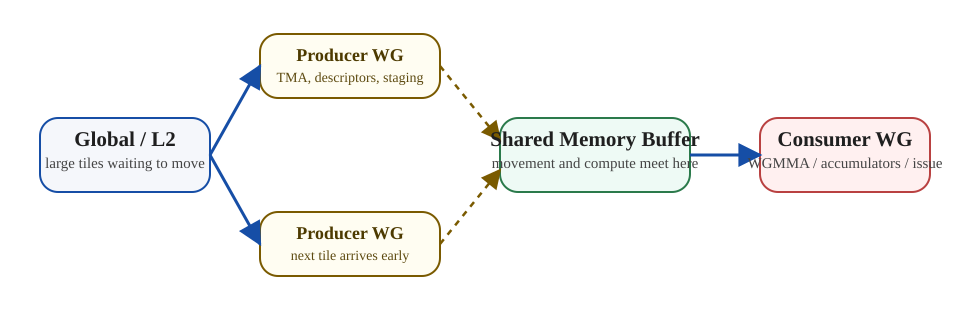
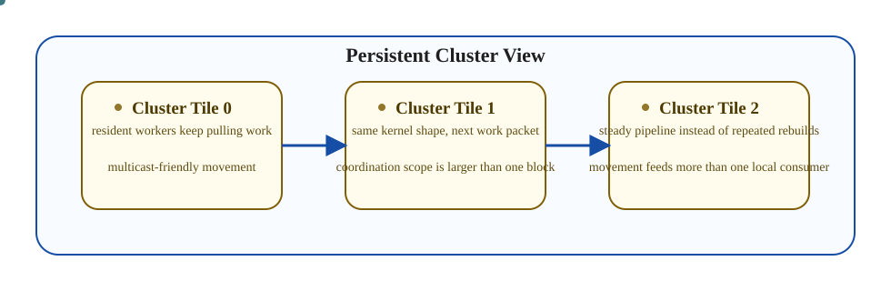

# 1. 핵심 요약

- Hopper 시대의 matmul 커널이 중요한 이유는 단순한 tiling을 넘어, **명시적인 이동 파이프라인**과 **역할 분화된 실행 구조**를 전면에 드러내기 때문이다.
- 핵심 키워드는 `TMA`, producer/consumer warp-group specialization, persistent execution, cluster-aware data movement다.
- 이 개념들은 뜬금없는 트릭이 아니라, 커널 설계가 하드웨어가 제공하는 movement와 synchronization 메커니즘에 더 직접적으로 맞춰지는 지점을 보여 준다.

# 2. 왜 이건 별도 글이어야 하는가

`GPU 시리즈 04`는 matmul이 좋은 architecture lens라는 점을 설명했다.

하지만 Hopper는 그 렌즈의 스타일 자체를 바꾼다.

이전의 최적화된 커널은 대체로 이렇게 읽혔다.

- data load
- shared memory staging
- compute
- repeat

Hopper에서는 파이프라인이 훨씬 더 명시적으로 보인다.

- 어떤 warp-group은 movement를 더 책임지고
- 다른 warp-group은 compute를 더 책임지며
- overlap은 더 깊고 구조적으로 설계된다

그래서 Hopper는 일반 matmul 글 속에 한 절로 넣기보다, 별도 글로 분리해서 보는 편이 낫다.

# 3. TMA를 Movement Primitive로 보기

`TMA`는 Hopper 스타일 커널에서 가장 중요한 개념 중 하나다.

실용적인 mental model은 이렇다.

> TMA는 단순한 "더 빠른 load"가 아니라, 계산이 필요한 위치로 구조화된 tile을 더 명시적으로 옮기는 하드웨어 보조 경로다.

이게 중요한 이유:

- tile movement가 더 의도적으로 설계되고
- kernel이 per-thread scalar load 패턴에서 조금 더 벗어날 수 있으며
- 깊은 pipeline overlap을 조직하기 쉬워지기 때문이다

이건 커널 스타일의 큰 변화다. 커널은 "각 thread가 fragment를 따로 가져오는 코드"에서 "이동과 소비가 분리된 coordinated pipeline"으로 가까워진다.

*Hopper 스타일 커널은 movement 역할과 compute 역할을 분리해서 그려 보면 훨씬 읽기 쉬워진다.*

# 4. Producer / Consumer Warp Specialization

movement가 더 구조화되면 specialization도 자연스럽게 따라온다.

패턴은 이렇다.

- producer warp 또는 warp-group은 data staging에 더 집중하고
- consumer warp 또는 warp-group은 Tensor/MMA compute에 더 집중한다

이게 중요한 이유는 아주 현실적이다.

- movement와 compute는 요구하는 타이밍이 다르고
- 같은 thread가 모든 일을 다 하게 만들면 overlap이 약해지기 쉽기 때문이다

그래서 warp specialization은 단순한 프로그래밍 트릭이 아니다. 하드웨어가 더 강한 movement primitive를 드러냈기 때문에 가능해진 설계 방식이다.

# 5. WGMMA와 Accumulator Pressure

현대 Tensor Core pipeline에서는 compute stage 자체가 매우 강해진다.  
그러면 압력은 다른 곳으로 이동한다.

compute throughput이 올라갈수록 커널은 여전히 다음을 감당해야 한다.

- 충분한 data delivery
- 충분한 accumulator 공간
- register discipline

즉 compute primitive가 더 강해져도 설계가 쉬워지지는 않는다. 오히려 더 불균형해진다.

- math는 매우 빠르고
- 그 math를 먹이는 일이 더 어려워진다

이 때문에 Hopper 커널은 교육적이다. compute throughput이 naive movement 전략을 앞질러 버리면 어떤 문제가 생기는지를 선명하게 보여 주기 때문이다.

# 6. Persistent Kernels

persistent execution은 이 맥락에서 훨씬 자연스럽게 보인다.

핵심 동기는 다음과 같다.

- launch 비슷한 오버헤드나 wave quantization 성격의 손실을 줄이고
- 유용한 worker를 계속 resident 상태로 두며
- 비슷한 execution pattern을 반복해서 다시 만드는 대신, 시간이 지나며 work를 계속 가져오게 만드는 것

이 방식은 다음 조건에서 특히 가치가 크다.

- tile이 매우 많고
- kernel이 구조화된 long-running workload이며
- steady한 dataflow를 유지하는 편이 반복 relaunch보다 더 중요할 때

즉 persistent kernel은 단순 scheduler 트릭이 아니라, throughput을 안정화하는 기법이다.

# 7. Cluster와 Multicast 관점

kernel이 movement 중심으로 바뀌면 coordination의 범위도 넓어진다.

여기서 중요한 건 구체적인 토폴로지 디테일 자체가 아니다. 더 중요한 질문은 다음과 같다.

- 한 번의 movement가 둘 이상의 consumer 영역을 효율적으로 먹일 수 있는가?
- 여러 execution resource를 더 큰 논리 단위처럼 묶어 볼 수 있는가?

그래서 `cluster`와 `multicast`가 중요하다. 이 개념들은 "블록 하나만 최적화하자"에서 "더 넓은 execution neighborhood를 함께 설계하자"로 관점이 이동하는 지점을 보여 준다.

# 8. Hopper 특화와 일반 GPU 설계를 구분하기

이 구분은 꼭 필요하다.

일반적인 교훈:

- reuse가 여전히 핵심이고
- movement는 compute와 overlap되어야 하며
- register pressure는 여전히 설계를 제한하고
- tile ownership도 여전히 중요하다

Hopper 특화의 색채:

- movement가 더 명시적인 하드웨어 경로로 드러나고
- specialization이 더 의도적으로 설계되며
- deeper asynchronous pipeline이 더 자연스럽고
- cluster 규모 협력이 1급 설계 개념으로 올라온다

즉 Hopper는 기본 아키텍처 모델을 대체하는 것이 아니라, 그 위에 올라가는 층으로 이해하는 편이 맞다.

# 9. 왜 이 글이 중요한가

Aleksa Gordić의 글이 강한 이유는 Hopper를 단순한 "더 최신 GPU"로 납작하게 만들지 않는다는 점에 있다.

하드웨어가 다음을 제공하기 시작하면:

- 더 강한 movement machinery
- 더 깊은 asynchronous structure
- 더 풍부한 Tensor Core pipeline

커널 설계 자체가 어떻게 달라져야 하는지를 보여 준다.  
그게 이 글의 진짜 가치다.

## CUTLASS 스타일 Hopper 커널을 읽는 순서

`explore-gemm` 같은 코드 저장소나 Kapil의 글을 따라가다 보면, Hopper 단계에서부터는 "코드가 길다"보다 "누가 movement를 책임지는지 보이지 않는다"가 더 큰 문제로 느껴진다.

이때는 구현 세부보다 다음 순서로 읽는 편이 좋다.

1. collective tile 또는 cluster tile이 무엇인지 먼저 찾는다.
2. producer와 consumer warp-group이 어디서 갈라지는지 본다.
3. `TMA` descriptor, barrier, stage count가 어떤 리듬을 만드는지 본다.
4. `WGMMA` issue와 accumulator lifetime이 register pressure를 어떻게 만들지 본다.
5. persistent work distribution과 epilogue ownership이 steady-state를 어떻게 유지하는지 본다.

이 순서로 보면 템플릿이나 helper 이름보다 pipeline 구조가 먼저 눈에 들어오고, 그러면 CUTLASS 같은 프레임워크도 훨씬 덜 추상적으로 읽힌다.

# 10. Diagram

*coordination 범위가 넓어지면 커널은 고립된 블록 하나라기보다, steady-state로 일하는 더 큰 worker neighborhood처럼 보이기 시작한다.*

# 11. Final Takeaway

- Hopper matmul kernel을 공부할 가치가 있는 이유는, 현대 GPU 설계가 movement를 얼마나 1급 경로로 끌어올렸는지를 보여 주기 때문이다.
- TMA, specialization, persistence, cluster 관점은 모두 같은 방향을 가리킨다. movement와 compute를 의도적으로 분리하고 겹치게 하라는 것이다.
- 다음 단계는 Hopper 기능 이름을 외우는 것이 아니라, 실제 커널이 movement, compute, coordination 중 어디에서 실패하고 있는지를 진단하는 것이다.

## References

- [Learning CUTLASS the hard way! 코드 저장소](https://github.com/gpusgobrr/explore-gemm)
- [Learn CUTLASS the hard way!](https://www.kapilsharma.dev/posts/learn-cutlass-the-hard-way/)
- [Inside NVIDIA GPUs: Anatomy of high performance matmul kernels](https://www.aleksagordic.com/blog/matmul)
