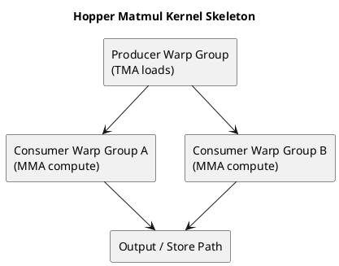

# 1. Executive Summary

- Hopper 세대 matmul 커널이 흥미로운 이유는, 단순한 tiling을 넘어서 **이동 파이프라인과 역할 분화된 실행**을 더 노골적으로 보여주기 때문이다.
- 핵심 키워드는 `TMA`, producer/consumer warp-group specialization, persistent execution, cluster-aware data movement다.
- 이 개념들은 뜬금없는 트릭이 아니라, 현대 커널 설계가 하드웨어가 제공하는 movement/synchronization 메커니즘에 더 직접적으로 맞춰지는 지점이다.

# 2. 왜 이걸 별도 글로 빼야 하는가

`GPU 시리즈 04`에서는 matmul이 좋은 architecture lens라는 점을 설명했다.

하지만 Hopper는 그 렌즈의 스타일 자체를 바꾼다.

이전의 최적화된 커널도 여전히 다음처럼 보였다.

- data load
- shared memory staging
- compute
- 반복

Hopper에서는 파이프라인이 더 분명해진다.

- 어떤 warp-group은 movement를 더 담당하고
- 다른 warp-group은 compute를 더 담당하며
- overlap이 더 깊고 구조적으로 설계된다

그래서 Hopper는 일반 matmul 글 속의 한 섹션으로 묻히기보다, 별도 글로 분리하는 편이 맞다.

# 3. TMA를 movement primitive로 보기

`TMA`는 Hopper 스타일 커널에서 가장 중요한 개념 중 하나다.

실용적인 mental model은 이렇다.

> TMA는 단순히 "더 빠른 load"가 아니라, 계산이 필요한 위치로 구조화된 tile을 더 명시적으로 이동시키는 하드웨어 보조 경로다.

왜 중요하냐면:

- tile movement가 더 의도적으로 설계되고
- kernel이 per-thread scalar load 패턴에서 조금 더 벗어날 수 있으며
- 깊은 pipeline overlap을 조직하기 쉬워지기 때문이다

이건 커널 스타일의 큰 변화다.  
kernel이 "각 thread가 fragment를 따로 가져오는 코드"에서, "이동과 소비가 분리된 coordinated pipeline"으로 더 가까워진다.

# 4. Producer / Consumer Warp Specialization

movement가 구조화되면 specialization도 자연스럽게 따라온다.

패턴은 이렇다.

- producer warp 또는 warp-group은 data staging에 더 집중하고
- consumer warp 또는 warp-group은 Tensor/MMA compute에 더 집중한다

이게 중요한 이유는 아주 현실적이다.

- movement와 compute는 요구하는 타이밍이 다르고
- 같은 thread가 모든 일을 다 하게 만들면 overlap이 약해지기 쉽다

그래서 warp specialization은 단순한 프로그래밍 기교가 아니라, 하드웨어가 더 강한 movement primitive를 드러냈기 때문에 가능한 대응 방식이다.

# 5. WGMMA와 Accumulator Pressure

현대 Tensor Core 파이프라인에서는 compute stage 자체가 매우 강해진다.  
그러면 압력은 다른 곳으로 이동한다.

compute throughput이 올라갈수록 커널은 여전히 다음을 감당해야 한다.

- 충분한 data delivery
- 충분한 accumulator 공간
- register discipline 유지

즉 compute primitive가 강해져도 설계는 쉬워지지 않는다. 오히려 더 불균형해진다.

- math는 매우 빠르고
- 그 math를 먹이는 일은 더 어려워진다

이 점 때문에 Hopper 커널은 특히 교육적이다.  
compute throughput이 naive movement 전략을 압도해버리면 어떤 일이 생기는지를 선명하게 보여주기 때문이다.

# 6. Persistent Kernel

persistent execution도 이 맥락에서 보면 훨씬 자연스럽다.

핵심 동기는 다음과 같다.

- launch-like overhead나 wave quantization 성격의 낭비를 줄이고
- 유용한 worker를 계속 resident 상태로 두고
- 비슷한 execution pattern을 반복 재구성하지 않게 만드는 것

특히 다음 조건에서 의미가 크다.

- tile이 매우 많고
- 구조화된 long-running workload이며
- steady dataflow를 유지하는 편이 반복 launch보다 더 가치가 큰 경우

즉 persistent kernel은 단순한 scheduler 트릭이 아니라, throughput을 안정화하는 기술이다.

# 7. Cluster와 Multicast 관점

kernel이 movement 중심이 되면 coordination의 범위도 넓어질 수 있다.

여기서 중요한 건 구체적 토폴로지 암기가 아니라, 다음 질문이다.

- 한 번의 movement가 둘 이상의 consumer 영역을 효율적으로 먹일 수 있는가?
- 여러 execution resource를 더 큰 논리 단위처럼 묶어 볼 수 있는가?

그래서 `cluster`, `multicast` 같은 개념이 중요하다.  
이건 "블록 하나만 잘 최적화하자"에서 "더 큰 execution neighborhood 차원에서 cooperation을 설계하자"로 사고가 옮겨가는 지점이다.

# 8. Hopper 특화와 일반 GPU 설계를 구분하기

이 구분은 꼭 필요하다.

일반적인 교훈:

- reuse가 여전히 핵심이고
- movement는 compute와 overlap되어야 하며
- register pressure는 여전히 설계를 제약하고
- tile ownership은 여전히 중요하다

Hopper 특화된 색채:

- movement가 더 명시적인 하드웨어 경로로 드러나고
- specialization이 더 의도적으로 설계되며
- deeper asynchronous pipeline이 더 자연스럽고
- cluster 규모의 협력이 1급 설계 개념으로 올라온다

즉 Hopper는 기본 아키텍처 모델을 대체하는 것이 아니라, 그 위에 올라가는 층으로 이해하는 편이 맞다.

# 9. 왜 이 글이 중요한가

Aleksa Gordić의 글은 Hopper를 단순히 "더 최신 GPU"로 평평하게 만들지 않는다는 점에서 좋다.

대신 하드웨어가 다음을 제공할 때:

- 더 강한 movement machinery
- 더 깊은 asynchronous structure
- 더 풍부한 Tensor Core pipeline

커널 설계 자체가 어떻게 바뀌어야 하는지를 보여준다.  
그게 이 글의 진짜 가치다.

# 10. Diagram

# 11. Final Takeaway

- Hopper matmul kernel이 공부할 가치가 큰 이유는, 현대 GPU 설계가 movement를 얼마나 1급 경로로 끌어올렸는지를 보여주기 때문이다.
- TMA, specialization, persistence, cluster 관점은 결국 같은 방향을 가리킨다. movement와 compute를 의도적으로 분리하고 겹쳐서 하나의 coherent pipeline을 만들라는 것이다.
- 이 글 다음 단계는 Hopper 기능을 외우는 것이 아니라, 실제 커널이 movement, compute, coordination 중 어디에서 실패하는지를 진단하는 것이다.
