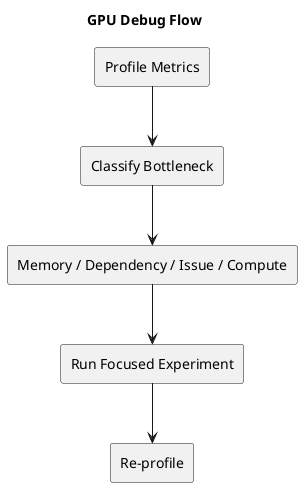

# 1. Executive Summary

- The point of this post is to turn the earlier architecture posts into a stable debugging workflow.
- Good GPU profiling is not "look at all metrics." It is a sequence of narrowing decisions.
- The useful habit is: classify the bottleneck family first, then pick one focused experiment that can falsify your current guess.

# 2. Start With the Smallest Useful Split

When a kernel underperforms, start with the simplest classification:

1. compute-limited
2. memory-limited
3. dependency-limited / issue-limited
4. synchronization / ordering limited

These are not perfectly disjoint, but they are good first buckets.

The main mistake is jumping directly to a micro-optimization without knowing which bucket dominates.

# 3. Active vs Eligible vs Selected

One of the most useful sanity checks is to separate three ideas:

- `active warps`
- `eligible warps`
- `selected warps`

Why this matters:

- high active warps means residency exists
- low eligible warps means dependencies or waits are blocking issue
- high eligible but low throughput may mean pipeline or structural limits

This is why occupancy alone is not a diagnosis.

# 4. Read Stall Reasons as Structural Clues

Profiler stalls are more useful if you treat them as clues to a mechanism.

## 4.1 Long Scoreboard

Practical reading:

- some instruction is waiting on data or a long-latency dependency

Common follow-up hypotheses:

- memory came back late
- load-to-use distance is too short
- too little independent work exists between dependent operations

## 4.2 Memory Dependency

Practical reading:

- the kernel is not feeding data smoothly enough

Common causes:

- poor coalescing
- poor reuse
- weak cache locality
- too much DRAM traffic

## 4.3 Not Selected

Practical reading:

- there are eligible warps, but the scheduler can only issue so much

This is not always bad by itself. It can mean:

- plenty of ready work exists
- the bottleneck has moved downstream into pipelines or throughput limits

# 5. Register Pressure and Occupancy

This is where many tuning sessions go wrong.

A kernel may slow down after an "optimization" because:

- tile sizes grew
- register usage grew
- resident warps fell
- latency hiding weakened

So if performance drops after increasing tile size or unrolling, always check:

- registers per thread
- achieved occupancy
- eligible warps per scheduler

The question is not "did I add more reuse?" alone. It is:

> did I add more reuse without collapsing scheduling flexibility?

# 6. Memory Diagnosis Checklist

If you suspect a memory bottleneck, use this order:

1. verify access pattern coalescing
2. check whether the same data is redundantly fetched
3. examine whether a shared-memory staging opportunity exists
4. check if L2/locality looks healthy enough
5. ask whether the working set is too large for the chosen tile shape

The key is to change one structural variable at a time.

# 7. Matmul / Tensor-Specific Checklist

For matmul-like kernels, add these questions:

1. is block tiling well chosen?
2. is warp ownership balanced?
3. is shared memory feeding Tensor/MMA compute efficiently?
4. is accumulator footprint too large?
5. is asynchronous copy / staging actually overlapping with compute?
6. is the kernel math-limited, or just poorly fed?

# 8. Synchronization / Ordering Checklist

If the kernel uses synchronization or atomics, ask:

1. is the chosen scope wider than necessary?
2. is the ordering stronger than necessary?
3. is contention concentrated on a small number of locations?
4. is a block-local design possible instead of device-wide coordination?

This is where the earlier synchronization article matters. A correctness mechanism can be valid and still unnecessarily expensive.

# 9. A Useful Optimization Order

In practice, a stable order is:

1. fix obviously bad memory access patterns
2. improve reuse and staging
3. retune tile shape and register footprint
4. revisit occupancy and eligibility
5. only then push micro-optimizations or ISA-level refinements

That order prevents a lot of wasted time.

# 10. Diagram

# 11. Final Takeaway

- The most useful profiler skill is classification, not memorization.
- Metrics only become valuable when they change what experiment you run next.
- A good GPU debugging workflow is iterative: classify, test one structural hypothesis, re-profile, repeat.
