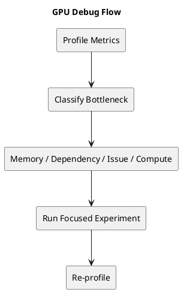

# 1. Executive Summary

- 이 글의 목적은 앞선 아키텍처 글들을 하나의 안정적인 디버깅 루프로 바꾸는 것이다.
- 좋은 GPU 프로파일링은 "지표를 많이 보는 것"이 아니라, 좁혀가는 순서를 갖는 것이다.
- 가장 유용한 습관은 병목 계열을 먼저 분류하고, 그다음 현재 가설을 깨뜨릴 수 있는 실험 하나를 고르는 것이다.

# 2. 가장 작은 분류부터 시작하기

커널이 기대보다 느릴 때는 먼저 아주 단순한 분류부터 한다.

1. compute-limited
2. memory-limited
3. dependency-limited / issue-limited
4. synchronization / ordering limited

이 분류는 완벽하게 분리되진 않지만, 첫 판단 기준으로는 충분히 강하다.

가장 흔한 실수는 이 분류 없이 바로 미세 최적화로 들어가는 것이다.

# 3. Active / Eligible / Selected를 분리해서 보기

가장 유용한 sanity check 중 하나는 다음 셋을 분리해서 보는 것이다.

- `active warps`
- `eligible warps`
- `selected warps`

왜 중요하냐면:

- active가 높다는 것은 resident 상태의 warp가 충분하다는 뜻이고
- eligible이 낮다는 것은 dependency나 wait 때문에 issue가 막히고 있다는 뜻이며
- eligible이 높은데 throughput이 낮다면 pipeline이나 구조적 한계를 의심해야 하기 때문이다

즉 occupancy만으로는 진단이 안 된다.

# 4. Stall Reason을 구조 힌트로 읽기

stall reason은 숫자 자체보다, 어떤 메커니즘을 가리키는지로 읽는 편이 좋다.

## 4.1 Long Scoreboard

실전 해석:

- 어떤 instruction이 아직 돌아오지 않은 데이터나 긴 지연의 dependency를 기다리고 있다

뒤따르는 가설:

- memory가 늦게 왔다
- load-to-use distance가 너무 짧다
- dependent chain 사이에 독립 작업이 너무 적다

## 4.2 Memory Dependency

실전 해석:

- kernel이 데이터를 충분히 매끄럽게 공급하지 못하고 있다

자주 나오는 원인:

- coalescing 불량
- reuse 부족
- cache locality 부족
- 과도한 DRAM traffic

## 4.3 Not Selected

실전 해석:

- eligible warp는 있는데 scheduler가 issue할 수 있는 양에는 한계가 있다

이 수치 자체가 항상 나쁘다는 뜻은 아니다. 오히려:

- ready work는 충분하고
- 병목이 더 아래쪽 pipeline이나 throughput limit으로 이동했다

는 신호일 수 있다.

# 5. Register Pressure와 Occupancy

여기서 많은 튜닝이 꼬인다.

어떤 "최적화" 이후 오히려 느려지는 이유는 종종 다음과 같다.

- tile size가 커졌고
- register 사용량이 늘었고
- resident warp 수가 줄었고
- latency-hiding 능력이 약해졌다

그래서 tile을 키우거나 unroll을 늘린 뒤 성능이 떨어지면 반드시 봐야 할 것은:

- registers per thread
- achieved occupancy
- eligible warps per scheduler

질문은 "reuse를 늘렸는가?" 하나가 아니라

> reuse를 늘리되 scheduling flexibility를 무너뜨리진 않았는가?

이다.

# 6. Memory 진단 체크리스트

memory bottleneck이 의심되면 이 순서가 좋다.

1. access pattern이 coalesced인가
2. 같은 데이터를 redundant fetch하고 있지 않은가
3. shared-memory staging 기회가 있는가
4. L2/locality 상태가 충분히 건강한가
5. working set이 현재 tile shape에 비해 너무 크지 않은가

핵심은 구조 변수 하나씩만 바꾸는 것이다.

# 7. Matmul / Tensor 특화 체크리스트

matmul 계열 커널에서는 다음을 추가로 묻는다.

1. block tiling은 적절한가
2. warp ownership은 균형 잡혔는가
3. shared memory가 Tensor/MMA compute를 충분히 잘 먹이고 있는가
4. accumulator footprint가 너무 크지 않은가
5. asynchronous copy / staging이 실제로 compute와 overlap되는가
6. 병목이 math throughput인가, 아니면 feeding 문제인가

# 8. Synchronization / Ordering 체크리스트

커널이 synchronization이나 atomics를 쓰면 다음을 묻는다.

1. 선택한 scope가 필요 이상으로 넓지 않은가
2. ordering이 필요 이상으로 강하지 않은가
3. contention이 소수 location에 집중되어 있지 않은가
4. device-wide coordination 대신 block-local 설계가 가능한가

앞선 synchronization 글이 여기서 중요해진다. correctness 메커니즘은 맞더라도, 필요 이상으로 비싸게 썼을 수 있다.

# 9. 유용한 최적화 순서

실전에서는 다음 순서가 안정적이다.

1. 명백히 나쁜 memory access pattern을 먼저 고친다
2. reuse와 staging을 개선한다
3. tile shape와 register footprint를 다시 맞춘다
4. occupancy와 eligibility를 다시 본다
5. 그다음에야 micro-optimization이나 ISA-level refinement로 간다

이 순서를 지키면 시행착오를 많이 줄일 수 있다.

# 10. Diagram

# 11. Final Takeaway

- 가장 유용한 profiler 능력은 암기가 아니라 분류다.
- 지표는 다음 실험을 바꿀 때만 진짜 가치가 생긴다.
- 좋은 GPU 디버깅 워크플로는 반복적이다. 분류하고, 구조 가설 하나를 시험하고, 다시 프로파일링하고, 반복한다.
