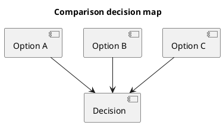

# 1. Decision Summary

- Recommended option:
- One-line reason:
- When this recommendation does NOT apply:
- Confidence level:

# 2. Scope and Constraints

- Comparison target:
- Workload domain:
- Constraints (latency, portability, tooling, team capacity):
- Out of scope:

# 3. Options Under Evaluation

| Option | Description | Version/Stack | Notes |
|---|---|---|---|
| A |  |  |  |
| B |  |  |  |
| C |  |  |  |

# 4. Evaluation Criteria

| Criterion | Weight (1-5) | Why it matters |
|---|---:|---|
| Performance |  |  |
| Engineering velocity |  |  |
| Debuggability |  |  |
| Portability |  |  |
| Operational risk |  |  |

# 5. Conceptual Model Mapping

| Axis | Option A | Option B | Option C | Implication for vAI |
|---|---|---|---|---|
| Execution model |  |  |  |  |
| Memory model |  |  |  |  |
| Synchronization |  |  |  |  |
| Scheduling/occupancy |  |  |  |  |
| Tooling |  |  |  |  |
| Failure modes |  |  |  |  |

# 6. Performance Characteristics

| Scenario | Option A | Option B | Option C | Winner | Reason |
|---|---:|---:|---:|---|
| Small workloads |  |  |  |  |
| Large dense workloads |  |  |  |  |
| Memory-bound kernels |  |  |  |  |
| Control-heavy workloads |  |  |  |  |
| Dev velocity |  |  |  |  |  |

# 7. Engineering and Operations View

| Topic | Option A | Option B | Option C | Risk |
|---|---|---|---|---|
| Build complexity |  |  |  |  |
| Debug/profiling workflow |  |  |  |  |
| CI/CD integration |  |  |  |  |
| Runtime observability |  |  |  |  |
| Team learning curve |  |  |  |  |

# 8. Risk and Migration Cost

- Migration effort estimate:
- Breaking changes:
- Compatibility concerns:
- Rollback strategy:

# 9. vAI Case Notes

- Case 1 (where Option A wins):
- Case 2 (where Option B wins):
- Case 3 (long-term architecture implication):

# 10. Code to Inspect

- Repo:
- Branch/Commit:
- Paths:
  - ``
- Key symbols:
  - ``

# 11. Reference Materials

| Type | Title | Link | Why it matters |
|---|---|---|---|
| spec |  |  |  |
| doc |  |  |  |
| article |  |  |  |
| profiler-guide |  |  |  |

# 12. Evidence Mapping

| Claim | Backing code path | Reference |
|---|---|---|
|  |  |  |

# 13. Recommendation and Rollout

- Near-term choice:
- Mid-term direction:
- Explicit anti-patterns to avoid:
- Validation plan after rollout:

# 14. Diagram (Optional)

# 15. Appendix (Optional)

## 15.1 Benchmark Setup Details

## 15.2 Raw Data Tables
