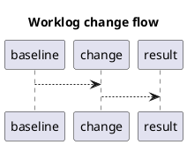

# 1. Executive Summary

- Claim in one sentence:
- Baseline -> current (main metric):
- Confidence level (high/medium/low):
- Main constraint or caveat:

# 2. Problem Statement

- What concrete bottleneck or behavior are we investigating?
- Why this matters for product goals (latency, throughput, cost, stability)?
- Success criteria (numeric target):

# 3. Hypothesis

- Primary hypothesis:
- Secondary hypothesis:
- Why this should work (architecture/compiler/runtime reasoning):

# 4. Environment and Reproducibility

| Item | Value |
|---|---|
| GPU |  |
| Driver |  |
| OS |  |
| API/Language |  |
| Compiler/Toolchain |  |
| Build flags |  |
| Input/workload size |  |
| Repetitions/warmup |  |
| Measurement method |  |

# 5. Baseline

## 5.1 Baseline behavior

- What does the baseline do?
- Known constraints:

## 5.2 Baseline metrics

| Metric | Baseline | Unit | Note |
|---|---:|---:|---:|
| kernel time |  | ms |  |
| throughput |  | ops/s |  |
| memory bandwidth |  | GB/s |  |
| occupancy / utilization |  | % |  |

# 6. Change Introduced

- What changed exactly?
- Why this change is expected to move the target metric?
- Code paths touched:
  - ``
- Risk and assumption list:

# 7. Experiment Matrix

| Case ID | Variant | Input | Expected outcome |
|---|---|---|---|
| A | baseline |  |  |
| B | new-change |  |  |
| C | sensitivity-check |  |  |

# 8. Results

| Metric | Baseline | Current | Delta | Delta % |
|---|---:|---:|---:|---:|
| kernel time (ms) |  |  |  |  |
| throughput (ops/s) |  |  |  |  |
| memory BW (GB/s) |  |  |  |  |
| launch overhead (us) |  |  |  |  |

- Reproduction runs (N):
- Variance and outlier notes:

# 9. Evidence

## 9.1 Profiler / Counter Evidence

- Key counters and why they matter:
- Captured artifact paths:
  - ``

## 9.2 IR / ISA / Shader Evidence

- Relevant compiler output or disassembly:
- What changed and what did not:

## 9.3 Correctness Validation

- Validation method:
- Pass/fail summary:
- Edge cases tested:

# 10. Analysis

- Why the metric moved (or did not move):
- Tradeoffs introduced:
- Remaining bottleneck:
- Generalization limits:

# 11. Decision

- Adopt / reject / hold:
- Rollout condition:
- Fallback plan:

# 12. Next Actions

1. Next experiment with explicit objective.
2. Guardrail test to prevent regression.
3. Documentation or automation follow-up.

# 13. Code to Inspect

- Repo:
- Branch/Commit:
- Paths:
  - ``
- Key symbols:
  - ``

# 14. Reference Materials

| Type | Title | Link | Why it matters |
|---|---|---|---|
| spec |  |  |  |
| doc |  |  |  |
| article |  |  |  |
| profiler-guide |  |  |  |

# 15. Diagram (Optional)



# 16. Appendix (Optional)

## 16.1 Commands

```bash
# build

# run

# profile
```

## 16.2 Raw Logs

```text
paste key raw output here
```
